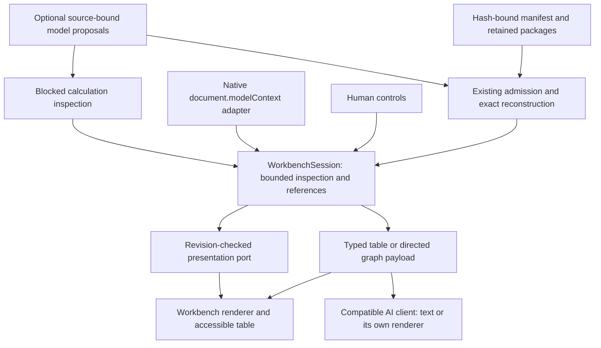

# ADR: shared evidence inspection and page tools

Date: 24 September 2026. Status: implemented candidate; deployment and host
acceptance are recorded separately in the [verification record](workbench-tools-verification.md).

## Starting point and design review

The proposal in `research/evidence-workbench-webmcp-codex-handover.md` was reviewed
against Explorer `e6084059f9b09633cfb8385be20099b952915e82` and DWP
`f94ecfc8110562dfb7214795dd9d6f82387f8825`. The older local Explorer checkout
at `72626cb7` did not contain the released workbench. Implementation uses an
isolated worktree from the released revision and preserves that checkout.

The released `/evidence/` route already admitted hash-bound manifests and
reconstructed retained packages. It displayed source, extraction, passage,
ontology, definitions, trace and local review proposals. It registered no page
tools. Existing Ask OKF tools in `src/lib/context/webmcp.ts` assemble fresh
contexts on the Reader route; they are not a retained-question workbench API.
The existing remote MCP service is a third, separately deployed adapter.

The proposal's shared services, progressive disclosure and explicit host tests
fit this architecture. We retain these principles and implement seven small
workbench operations, without replacing Ask OKF or creating another application.
We implement calculation **inspection**. The DWP calculation requirements brief
does not supply reviewed rules, dated rates or a validated formula.

## Decision

`WorkbenchSession` owns bounded references, cursors, retained views and package
reads. The Svelte route owns human state, browser history and rendering. Its
presentation port checks the expected revision after loading and before one
coherent update, then awaits rendering. A manual edit or navigation invalidates
an older tool presentation. Abort signals cancel reads and pending presentation.
An admitted manifest digest is the snapshot identity. Changing it discards
references and retained results. Opaque references are local to this page
session, not transferable identities or permanent links.

The page and tools consume the same `okf-workbench-view.v1` values. Approved
fields contain text, numbers, booleans, unknown values and evidence references.
They cannot contain executable render instructions, HTML or remote data loaders.
Directed graphs have a table equivalent; matrix rows retain qualifications.
Source instructions remain inert. The existing local review export is a
proposal; page tools cannot write files, amend a bundle or publish a review.

Only `okf_show_view` changes state, reversibly. The adapter registers tools using
the current draft's asynchronous `registerTool` and a lifetime abort signal.
It does not add an MCP envelope, `outputSchema` or an obsolete unregister method
to native registrations. Schema validation is enforced by application code,
independently of the browser's input checks or advisory annotations.

## Tool catalogue and limits

See the [page tools guide](workbench-page-tools.md), executable
`src/lib/evidence/toolContracts.ts`, and versioned fixtures under
`profiles/evidence-workbench-tools/v1/`. The seven tools are diagnostic state,
scoped search, section reads, relationships, view data, presentation and blocked
model inspection. Simulation and calculation explanation are deliberately absent
because no executable model is admitted.

The initial default is three whole result rows and 4,096 UTF-8 bytes per reply,
with an explicit ceiling of 32,768 bytes. This exceeds Chrome's approximate
1,500-character guidance where necessary to preserve qualifications and
provenance. Callers can request fewer rows. Evidence text which exceeds the cap
is segmented into ordered exact ranges with its complete-text hash; no fragment
is labelled a complete passage. The source's own completeness status remains
independent of whether its retained text has all been delivered.

Limits per snapshot session are 128 admitted calls, 1 MiB successful response
bodies, 512 evidence
references, 32 cursors and 32 retained view results. References expire after ten
minutes. Three packages are cached; eviction causes a verified reload. Graphs
allow depth one or two, at most 20 nodes and 40 edges, with omitted assertions
reported. A graph view is one bounded value, not disconnected partial geometry.
Table pages carry explicit row coverage and a continuation. Presenting a retained
page never claims the other pages were shown. Explicitly reloading a manifest
starts a new session; these are resource limits, not an authentication boundary.
Each pending call reserves its requested byte ceiling until it finishes, so
parallel reads cannot bypass the cumulative budget. Small error responses are
bounded individually and excluded from the successful-body total.

Bodies report encoded bytes, JavaScript character count and a token estimate
(`ceil(characters / 4)`). This is not measured model billing. Journey metrics
also record calls and elapsed time. Descriptor size has a regression ceiling of
13 KiB. Measurement must compare the same questions and source snapshot with
whole-package delivery, retain failures and separate source sufficiency from
delivery success.

## Compatibility and acceptance

| Surface | Implemented behaviour | Acceptance boundary |
| --- | --- | --- |
| Ordinary browser | All manual views and source links | Browser journeys and accessibility checks |
| Native WebMCP browser | Seven optional page tools | Real registration and invocation; mocks are separate |
| Existing Reader Ask OKF | Existing assembly tools unchanged | Existing context tests |
| Remote Ask OKF MCP | Existing independent service | No new remote tool or release implied |
| AI host or assistant panel | Receives data only if it exposes these page tools | Actual host invocation must be observed |
| Panel visualisation | Typed data, text fallback and workbench link | Host renderer must be tested separately |
| Calculation execution | Unavailable; blocked model inspection | Reviewed rules and source-derived tests required |

Primary sources were checked on 24 September 2026: the
[17 September WebMCP draft](https://webmachinelearning.github.io/webmcp/),
[Chrome tool design](https://developer.chrome.com/docs/ai/webmcp/build-tools),
[best practices](https://developer.chrome.com/docs/ai/webmcp/best-practices),
[security guidance](https://developer.chrome.com/docs/ai/webmcp/secure-tools),
[WebMCP/MCP distinction](https://developer.chrome.com/docs/ai/webmcp/compare-mcp)
and [OpenAI Site tools guidance](https://learn.chatgpt.com/docs/webmcp).
The draft is not a final W3C standard. Host support, settings and rollout remain
host-specific. A native `getTools()` result or CDP call is not proof that an
assistant can discover or invoke tools. No account setting is changed here.

## Calculation destination and traceability

DWP's supplied `research/overview-of-how-guarantee-credit-is-calculated.md` is a
requirements brief. The candidate model links the source passages for Pension
Credit's Guarantee Credit and Savings Credit components and separates them from
State Pension. Its jurisdiction, effective period, complete exceptions and
reviewed rates remain unknown. DWP's source-bound producer validates the model's
citations against frozen question packages before emitting an additive manifest.

| Brief requirement | Present implementation | Next acceptance gate |
| --- | --- | --- |
| Source and rule provenance | Inspect stages, inputs and exact source references | Specialist reviews proposition, applicability and complete dependencies |
| Java rule engine | No executable rules | Versioned pure Java component using decimal or integer minor-unit arithmetic; reviewed rounding and precedence |
| Versioned rates and amendments | Unknown rates remain empty and visibly unavailable | Typed rate table with jurisdiction, valid period and official evidence |
| Testable calculations | Blocked readiness result | Source worked examples; numerical/date boundaries, missing inputs, exceptions and historical rates |
| Explanation | Stage, gap and source inspection | Retained result binds each intermediate value to formula, inputs and source version |
| MongoDB persistence and querying | No database or claimant data | Separate authenticated service; immutable rule IDs and access-controlled event storage |
| Retrospective circumstance changes | Design only | Separate valid time (when a fact applied) and recorded time (when it was known); reproducible as-of recalculation |
| Projections without persistence | Design only | Pure calculation endpoint with explicit no-write mode; no silent event or personal-input logging |

The next calculation ADR should authorise only synthetic households or published
worked examples, explicitly forbid operational entitlement decisions, and require
reviewed scope, dates, dependencies, exceptions and expected results. Keep DWP's
existing prohibition on real awards and claimant personal data. No unsupported
scenario, unknown applicability or missing rate may become zero or false.

## Sequenced backlog

1. Implement and test admitted inspection, shared state, bounded delivery and
   optional native registration (this change).
2. Review the additive DWP source-bound interaction and model proposals; retain
   all 40 existing evidence packages unchanged (paired producer change).
3. Observe native-browser, real AI-host and panel journeys separately. Record
   unavailable gates; do not replace them with mock passes.
4. Resolve model dependencies and dated rates, obtain specialist review, and
   approve the narrowly scoped synthetic-calculation ADR.
5. Implement the first deterministic component and explanation API with source
   worked examples and boundary tests; only then consider authenticated Java and
   MongoDB services for the broader brief.

This implementation improves inspection and delivery. It does not certify that
the 40 questions have complete answers, improve their evidence status, or measure
AI answer quality.
