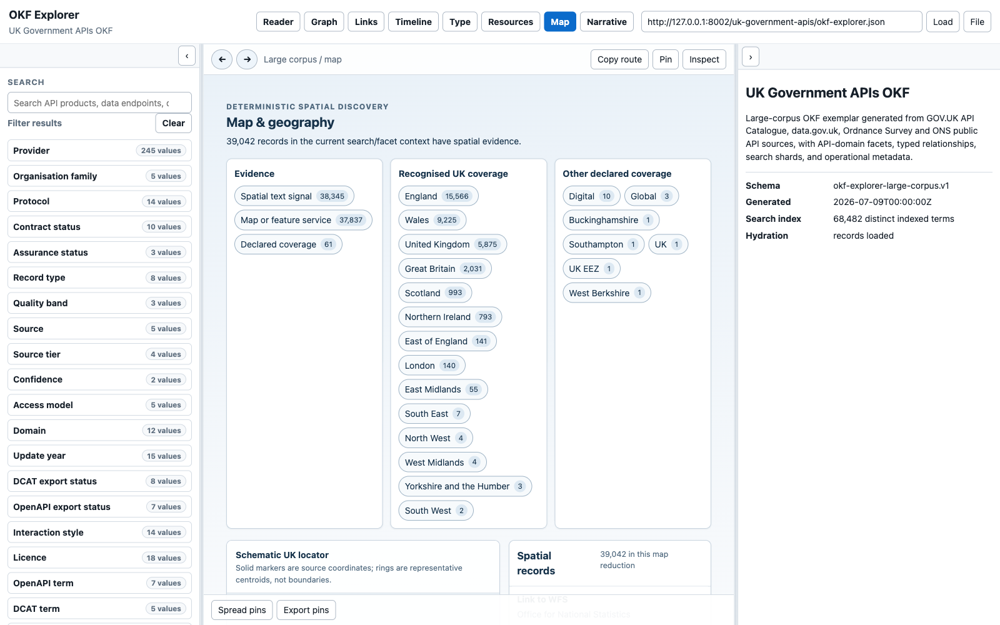
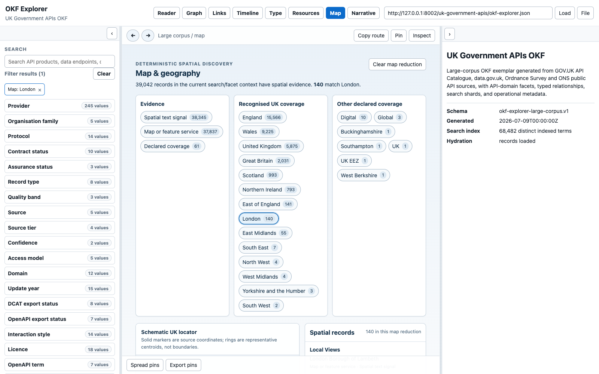
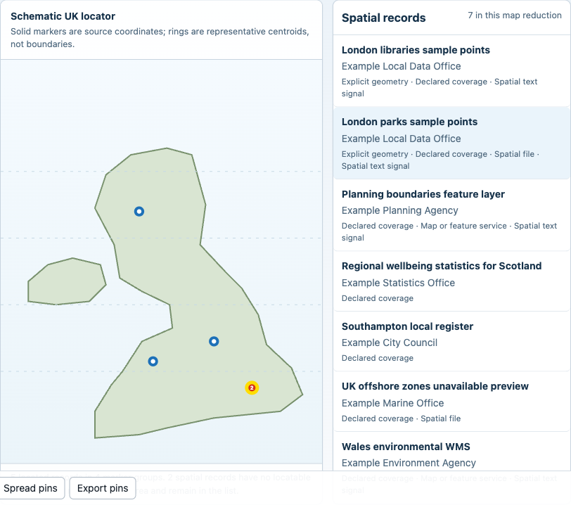
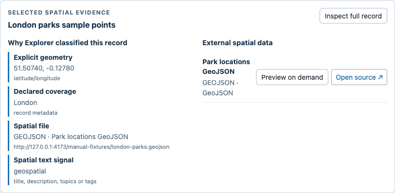
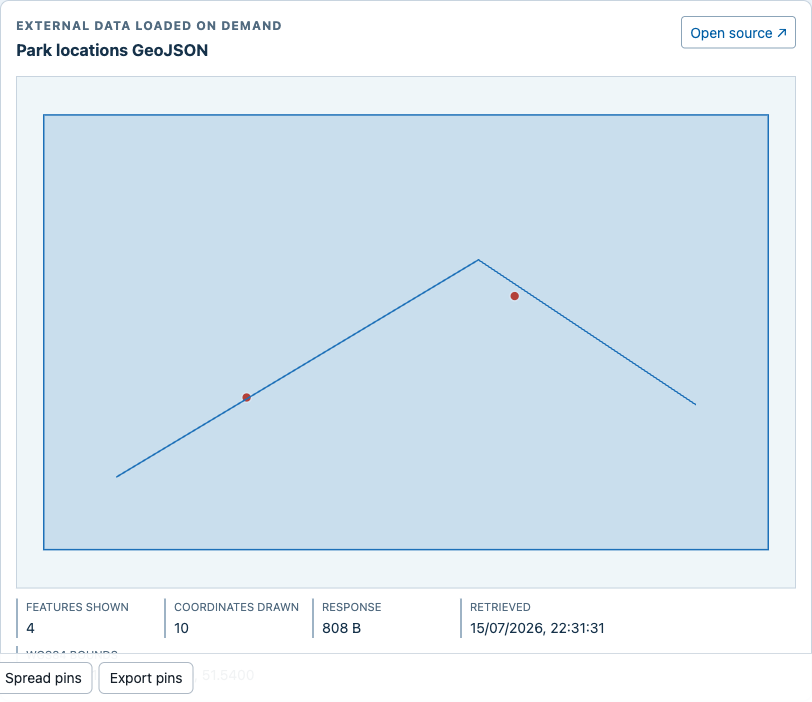
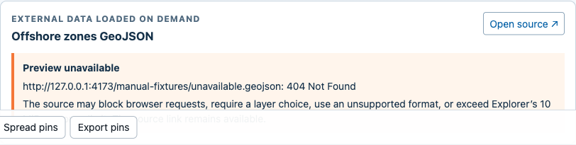

# Illustrated Geospatial Map Manual

This manual explains the Map canvas introduced on the `geospatial` branch. It
is for people browsing area-based reports, statistics, spatial datasets and
ArcGIS/OGC services, and for pack builders deciding which geography metadata
to supply.

Explorer remains a static browser application. Opening Map does not call an
AI, geocoder, tile provider or application server. External geometry is loaded
only when a user selects **Preview on demand**.

The first screenshots use the local Pages build and the real 41,520-record UK
Government APIs bundle. Preview screenshots use a deterministic demonstration
bundle so success, failure and linked-only states can be reproduced without
depending on a third-party service. The demonstration geometry is UI evidence,
not an authoritative dataset.

Related guidance:

- [Map personas and user stories](geospatial-map-personas-and-user-stories.md)
- [Map design and progressive-recovery contract](geospatial-map-exploration.md)
- [Use Explorer with your own bundle](use-okf-explorer.md#use-the-map-canvas)
- [Author geospatial metadata](okf-bundle-authoring.md#geospatial-metadata-and-map-recovery)
- [Generated overview and Map context](explorer-overview-context.md#map)
- [Broader illustrated Explorer persona manual](okf-explorer-persona-manual.md)

## 1. Open Map In The Current Context

Start with search and ordinary facets when you already know a subject or
provider, then select **Map** from the canvas tabs. Map classifies the same
active records rather than starting a parallel search.



The three reduction groups mean different things:

- **Evidence** describes why a record is spatial: supplied geometry, declared
  coverage, a map/feature service, a spatial file or a bounded text signal.
- **Recognised UK coverage** is a deterministic match against the UK, Great
  Britain, nations and English regions.
- **Other declared coverage** retains pack-supplied values that Explorer does
  not map to its small UK vocabulary.

A record can have more than one signal. The counts therefore overlap; they are
not intended to sum to the total.

## 2. Reduce The Shared Result Set By Area

Select a place such as **London**. The Map summary, spatial-record list and the
ordinary left-hand result list all reduce together.



The URL contains `geo=area:london`. That state:

- survives reload and Back/Forward;
- remains active when switching to Reader, Graph, Links, Timeline, Type or
  Resources;
- can be cleared by selecting the active chip again, using **Clear map
  reduction**, or removing the active Map chip from the left panel; and
- describes only this loaded pack, not every London dataset in existence.

Evidence reductions use values such as `geo=signal:service`; other declared
coverage uses an encoded `geo=coverage:...` value.

## 3. Read The Locator Without Inventing Boundaries

The locator is deliberately schematic. It provides spatial orientation and
selection without fetching basemap tiles.



- A solid marker represents a source coordinate, point geometry or supplied
  bounding-box centroid.
- A ring represents a labelled representative centroid for a recognised area.
  It is not the area's boundary and does not prove record coverage at that
  point.
- Coincident points are clustered and show a count.
- Records with spatial evidence but no locatable coordinate or recognised area
  remain in the list and are counted explicitly.
- Marker and list-row selection open the same Explorer route. The usual detail
  card, provenance, pinning and copy-route tools remain available.

Markers are keyboard focusable. Press Enter or Space to select one.

## 4. Inspect Why A Record Was Classified

The **Selected spatial evidence** panel lists every rule that matched, the
specific detail and the source field. This makes classification reviewable:
`ARCGIS · Feature service`, `GeoJSON`, a declared area, coordinates, or a text
term such as `boundaries` are visible rather than hidden in a score.



Use this panel to distinguish:

- discovery evidence from authority or fitness for use;
- an exact point from an area navigation centroid;
- a previewable JSON/ArcGIS resource from a linked-only spatial format; and
- local pack metadata from a remote response retrieved later.

If there is no machine-readable spatial URL, Explorer says so and retains the
record because area/text evidence can still be useful.

## 5. Preview Direct GeoJSON On Demand

For direct GeoJSON or JSON resources, select **Preview on demand**. Nothing is
fetched before that action.



The preview reports:

- features shown and whether the feature cap was reached;
- coordinates drawn and whether the drawing cap was reached;
- response size and retrieval time;
- discovered ArcGIS layer name when applicable; and
- WGS84 bounds calculated from the rendered coordinates.

Explorer accepts supported GeoJSON point, line, polygon, multi-geometry and
geometry-collection shapes. It renders remote properties only as data and
retains the source link alongside the preview.

## 6. Recover When A Preview Is Unavailable

Browser CORS rules, availability, authentication, unsupported formats and
response limits can prevent a preview. That is an expected progressive-
recovery state, not a reason to discard the record.



Explorer keeps:

- the local title, publisher, route and classification evidence;
- a visible explanation of the failure;
- the original **Open source** link in a new tab; and
- the active search, facets and Map reduction.

WMS, WFS, WMTS, WCS, KML, GML, Shapefile and GeoPackage are currently
discoverable and filterable but linked rather than parsed. Pack builders should
not disguise credentials in resource URLs; Explorer removes common secret-like
query parameters before displaying or requesting a geospatial resource.

## 7. Understand Empty And Bounded States

If the current search/facet context has no spatial evidence, Map explains how
to widen the context or improve the pack. While a large record/resource index
is loading, Map exposes a status message instead of presenting an empty result
as final.

The spatial record list shows at most 160 rows and says when more exist. The
locator groups coincident markers. Remote preview limits are 10 MiB, 100
features and 12,000 drawn coordinates. These bounds keep browser memory and
interaction predictable; they are not statements about source completeness.

On a narrow screen, the locator, record list and evidence panels become a
single column while retaining their headings and controls.

## 8. Improve A Pack For Map

Legacy coverage fields and resource formats work immediately, but generated
packs should prefer explicit, source-backed fields:

```json
{
  "spatial": {
    "geographies": [
      {
        "code": "E12000007",
        "name": "London",
        "level": "region",
        "source": "ONS",
        "vintage": "2025"
      }
    ],
    "bbox": [-0.5103, 51.2868, 0.334, 51.6919],
    "crs": "EPSG:4326",
    "derivation": "source-declared"
  }
}
```

Preserve the geography-code family, source release or epoch, exact/best-fit
derivation, boundary variant and CRS. Map display uses WGS84; a pack may retain
British National Grid as the analysis CRS. Never convert an Explorer text
match or representative centroid into source-declared geometry.

## Test And Review The Feature

The browser suite traces each state back to the story IDs in
[Map personas and user stories](geospatial-map-personas-and-user-stories.md):

```sh
cd apps/okf-explorer
pnpm test:e2e
```

Run `pnpm test` as well for classifier, URL sanitisation, preview URL, cap and
geometry-projection coverage. The broader publication gates are listed in
[Use the OKF Explorer](use-okf-explorer.md#3-validate-locally).
