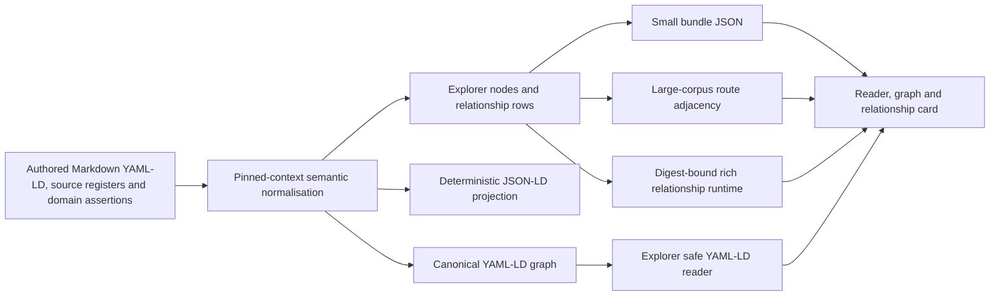

# OKF 0.2 and YAML-LD semantic authoring

Status: Explorer v0.6.3 and Land Registry v0.3.0 are released immutably and
publicly verified. Land Registry retains Explorer v0.6.2 as its governed
acceptance dependency; v0.6.3 is the separate post-G9 presentation correction.
The final cache-isolated receipt verifies 2,203 records, 14 dataset groupings,
2,203 resources and 22,267 relationships, 12 August 2026.

This document is the common authoring, generation and Reader contract for the
`okf-*` repositories. It explains the two layers that must remain distinct:

1. **OKF 0.2 core** is the deliberately small, forward-compatible Markdown
   format. A concept needs parseable YAML frontmatter and a non-empty `type`;
   a bundle root can declare `okf_version: "0.2"`.
2. **The OKF Bundle Wiki semantic profile v1** is an additive application
   profile. It supplies stable semantic identity, YAML-LD/JSON-LD,
   evidence-bearing directed assertions, governed predicates, safe Explorer
   routes and deterministic runtime projections.

Semantic requirements in this document are profile requirements, not claims
about the upstream OKF core specification. The upstream specification allows
unknown fields and deliberately defers a general semantic-layer template.

## Rollout progress

This is the live dependency-ordered implementation ledger. **Current state**
records what has already happened; **next action** records work still to do.
`Local migration present` never means committed, released, deployed or
publicly verified.

| Repository or gate | Current state | Next action |
| --- | --- | --- |
| `okf-explorer` contract and plugin | Complete. [PR #75](https://github.com/chris-page-gov/okf-explorer/pull/75) was squash-merged as `596deb28` after every required CI gate passed, including the full Chrome, Firefox and WebKit suite. | Preserve this merged contract as the dependency baseline for every producer. |
| `okf-explorer` v0.6.0 | Complete. [PR #78](https://github.com/chris-page-gov/okf-explorer/pull/78) passed every required gate, including the full Chrome, Firefox and WebKit suite, and was squash-merged as `4bb7b92a`. The exact merge-SHA Pages deployment, 16-file application tree, semantic projections and 155-entity/579-assertion counts passed public byte-identity checks. A genuine Google Chrome 151 journey then passed search, record, graph, directed-relationship and keyboard-resize checks without console errors. Annotated tag and [release v0.6.0](https://github.com/chris-page-gov/okf-explorer/releases/tag/v0.6.0) point to the verified merge commit. | Preserve v0.6.0 as the frozen producer dependency; make later Explorer changes independently. |
| `okf-explorer` v0.6.3 | Complete. [PR #91](https://github.com/chris-page-gov/okf-explorer/pull/91) corrected Reader and Timeline record-count presentation, passed exact-head CI, and was squash-merged as `c6c8ccd9`. Pages run 31549668889 deployed the exact merge, and immutable [release v0.6.3](https://github.com/chris-page-gov/okf-explorer/releases/tag/v0.6.3) is the public Reader used for the final Land Registry journey. | Preserve Land Registry's v0.6.2 governed acceptance claim; record v0.6.3 only as its post-G9 presentation observation. Issue #92 retains the non-blocking search-rank diagnostic. |
| `okf-explorer` locked Python toolchain | Complete. [PR #97](https://github.com/chris-page-gov/okf-explorer/pull/97) passed every gate in exact-head run [31582284103](https://github.com/chris-page-gov/okf-explorer/actions/runs/31582284103), then was squash-merged on 12 August 2026 as `da5cbc5362a35ba822765901ab0304c2b9da7185`. Explorer-owned Python execution now uses the locked Python 3.12.11 and uv 0.12.2 baseline. | Preserve this locked baseline for Explorer-owned Python execution. Keep frozen historical evidence unchanged, and migrate each producer's tooling only through its own reviewed contract and evidence boundary. |
| Canonical Bundle Wiki v1 vendoring | Complete. [PR #80](https://github.com/chris-page-gov/okf-explorer/pull/80) passed every required gate and was squash-merged as `50078164`. The 16 regular files in `profiles/bundle-wiki/v1/` remain the opaque, byte-exact v0.6.0 tree `d26ae9a818041ff74c469e653ec714632ddbfc2a`. The adjacent `profiles/bundle-wiki/v1.vendor-lock.json` records the canonical URI, release commit, tree, each sorted file size and SHA-256, and one aggregate identity. Reconciliation fails closed on a missing, extra or drifted mirror, checks every declared relationship-schema output, and provides explicit symlink-safe sync with opt-in replacement. A schema retaining the canonical `$id` must retain the canonical bytes; an intentional extension needs its own absolute `$id`, and multiple outputs may share an `$id` only when their bytes are identical. The 27-case focused adversarial suite, the 86-test related Python suite and strict reconciliation audit passed before merge. | Use the merged reconciler and lock as the producer baseline. Keep later Explorer/profile changes independent of the frozen v0.6.0 bytes. |
| British English editorial gate | Global and repository guidance now require British English, `en-GB` conventions and GOV.UK plain English style, with compatibility exceptions for exact identifiers, quotations and official titles. Authored release pages, semantic profiles, plugin guidance, CI labels and visible Explorer copy have passed a contextual review. The separate beginner documentation draft has also passed all-page editorial, fragment, history-navigation and accessibility checks and is available for user review; it remains uncommitted. | Incorporate review feedback, commit the beginner documentation independently, retain its repeatable editorial check and apply the same rule to every producer repository as it is migrated. |
| External source representations | Tracked separately as [issue #76](https://github.com/chris-page-gov/okf-explorer/issues/76); it is deliberately outside the v0.6.0 contract release. | After v0.6.0, route typed CLML/XML resources to format-aware inspection and make the linked producer correction independently. |
| Semantic roadmap review | Scheduled in [issue #77](https://github.com/chris-page-gov/okf-explorer/issues/77). The issue now records the explicit documentation guardrail that the current Svelte Explorer provides predicate-aware focus-graph presentation and label-only compatibility, but loading a bundle does not make it an ontology and the browser does not perform unbounded OWL inference. | Reconcile issues #49–#54, preserving that current-versus-roadmap boundary while recording completed foundations, remaining acceptance criteria and explicit dependencies. |
| Explore OKF authoring method | Reviewed and implemented in Explorer v0.7.0. The [methodology review](okf-authoring-methodology-review-2026-08-12.md) applies the Land Registry retrospective without reopening that pack. Authoring Profile v1, the strict [Explore OKF profile](../profiles/explore-okf/v1/index.md), tooling, prompts and beginner guidance require graph-reachable label coverage, a compact integrity-bound label index, eligible-entity semantic-link denominators and a persistent, explicitly non-release feedback stage. Explorer consumes governed labels without full-record hydration, exposes identifiers through Inspect, preserves routes in feedback and fails malformed exploratory intent visibly with `noindex`. The [open-data shortlist](../research/explore-okf-open-data-test-candidates.md) recommends a bounded Coventry everyday-services pilot. | Use the bounded pilot to prove the method against real producer bytes and actual-consumer journeys, then apply the findings as the precondition for reviewing `okf-uk-living`. |
| `okf-ai-infrastructure` | Complete. The retrospective annotated [v0.5.0 release](https://github.com/chris-page-gov/okf-ai-infrastructure/releases/tag/v0.5.0) records the exact historical OKF 0.2 milestone. [PR #4](https://github.com/chris-page-gov/okf-ai-infrastructure/pull/4) then passed both hosted validation runs and was squash-merged as `ee86ff66` with the exact independently reviewed tree. Main and tag CI passed all six declared checks and all 56 tests. The exact-merge Pages deployment passed publication validation; a real-browser journey loaded the public bundle in Explorer, followed a directed `references` relationship and rendered its `normalized`/`real-world` focus graph without console errors. The deployed 1,823,113-byte bundle is byte-identical to the release tree at SHA-256 `f2e0060feeba21a6665435ee3fca8c6f06ae1fe9d99b8ff3f3550a36189ef8c4`. Annotated tag object `0a33ee90` and [release v0.6.0](https://github.com/chris-page-gov/okf-ai-infrastructure/releases/tag/v0.6.0) point to the verified merge commit. | Preserve v0.6.0 as the completed first-producer baseline and review `okf-LandRegistry` independently. |
| `okf-LandRegistry` | Complete. Builds 13 and 14 produced and reproduced exact root `6a29e38e...`; G1–G9 evidence ends at `1d708e39...`; PR #3, required workflows and Pages passed; immutable [release v0.3.0](https://github.com/chris-page-gov/okf-LandRegistry/releases/tag/v0.3.0) publishes the unchanged seven governed assets. The final public receipt `3511e132...` passed with 2,203 records and 22,267 relationships. | Use the completed [delivery retrospective](postmortems/land-registry-v0.3.0-delivery-retrospective.md) before promoting the next producer. Preserve its explicit official-SHACL, inference, legal and completeness limitations. |
| `okf-govuk-content` | Local migration present on work that must be moved onto current `origin/main`; not yet committed or released. Its sample remains explicitly not publication-ready. | Rebuild a clean branch, validate without promoting the sample's readiness, then open an independent PR. |
| `okf-ons` | Earlier baseline work is merged; additional local semantic hardening is not yet committed or released. | Review only the new hardening, exclude unrelated local files, validate and publish independently. |
| `okf-uk-government-apis` | Earlier baseline work is merged; the larger local semantic migration is not yet committed or released. | Review generated-artefact scope and size, validate, then publish independently. |
| `okf-uk-legislation` | Local migration present; not yet committed or released. The external-source producer correction is a related but separable change. | Rebase the semantic migration onto current `origin/main`, validate and publish it; deliver the issue #76 producer correction in its own linked change. |
| `okf-uk-living` | Local migration present; not yet committed or released. The current `release_grade: false` assessment and warnings remain authoritative. | First apply the reviewed Explore OKF method to a bounded Coventry everyday-services slice: prove readable labels, denominator-based external linking, CPSV-AP/SKOS mappings and exploratory feedback. Use those findings to review the full pack without overstating readiness, then create the candidate, freeze and publication sequence independently. |
| `okf-testing` | Local conformance workspace; intentionally not a Git repository or release unit. | Update the repository copy of the shared schema and use it for cross-repository conformance only. |

The producer order above is deliberately serial at the publication boundary:
each repository gets its own review history, checks, commit, release decision
and public verification. Analysis and bounded validation may run in parallel,
but one producer's local success is never evidence that another was released.

## The one-source model



YAML-LD or Markdown YAML-LD is the semantic authoring boundary. JSON-LD is an
interchange projection. Explorer JSON and adjacency shards are delivery
projections. A repository must not maintain all three as independent truths.

Large collections still use manifests, locators and hash-sharded adjacency so
the browser can start with a bounded overview. Semantic authority does not
require the browser to download an entire RDF graph.

## A rich directed relationship

A relationship is not just two routes and a label. It has three identities:

- the source entity IRI;
- the predicate IRI; and
- the target entity IRI.

It also has an assertion identity and evidence about why this repository is
entitled to make or project that statement. The canonical authored pattern is
a direct triple plus one reified `okf:RelationshipAssertion`:

```yaml
---
"@context":
  - https://chris-page-gov.github.io/okf-explorer/profile/bundle-wiki/v1/context.jsonld
  - https://chris-page-gov.github.io/okf-explorer/profile/bundle-wiki/v1/semantic-context.jsonld
  - life: https://example.org/uk-life#
    provided_by:
      "@id": life:providedBy
      "@type": "@id"
"@id": https://example.org/services/register-a-birth
"@type": life:PublicService
route: service/register-a-birth
type: Public service
title: Register a birth
description: Educational service example; follow the current authority for a real case.
generated: {by: process:life-course-build, at: "2026-08-09T00:00:00Z"}
provided_by:
  "@id": https://example.org/organisations/register-office
  "@type": life:PublicBody
  route: organisation/register-office
  type: Public body
  title: Register office
assertions:
  - "@id": https://example.org/assertions/register-a-birth-provided-by
    "@type": [rdf:Statement, okf:RelationshipAssertion]
    source: https://example.org/services/register-a-birth
    predicate: life:providedBy
    target: https://example.org/organisations/register-office
    kind: provided by
    label: is provided by
    inverse_label: provides
    assertion_status: normalized
    assertion_scope: real-world
    authority:
      class: derived
      label: Deterministic projection of the reviewed service register
      source: https://example.org/source/service-register
    derivation: https://example.org/rules/provider-field-v1
    observed_at: "2026-08-09T00:00:00Z"
    evidence:
      - "@id": https://example.org/evidence/register-a-birth-provider
        type: source-metadata
        url: https://example.org/source/service-register
        source_field: provider
        source_value_sha256: aaaaaaaaaaaaaaaaaaaaaaaaaaaaaaaaaaaaaaaaaaaaaaaaaaaaaaaaaaaaaaaa
        retrieved_at: "2026-08-09T00:00:00Z"
    rights:
      source: https://www.nationalarchives.gov.uk/doc/open-government-licence/version/3/
      assertion: source-derived-metadata
---
```

The direct triple makes the graph useful to ordinary RDF tooling. The
assertion node carries provenance, authority, freshness, review and rights.
The build fails when only one side exists, when two assertions reify the same
triple in one assertion plane, or when the IRI-to-route registry cannot map an
internal endpoint safely.

## Identity and routes

Semantic identity and browser navigation are intentionally separate:

| Concern | Required representation |
| --- | --- |
| Entity identity | Absolute `@id` IRI |
| Predicate identity | Absolute IRI, normally compacted through a pinned context |
| Assertion identity | Absolute `@id` IRI |
| Explorer navigation | Relative, validated `route` without query, fragment, dot segment or Markdown suffix |
| Runtime endpoint | Local `source`/`target` route plus preserved `source_iri`/`target_iri` |

Never manufacture an absolute semantic IRI by pretending an Explorer route is
already global. Never guess a local route from an external IRI in the browser.
The generator owns the integrity-bound IRI-to-route registry.

## Status, scope and authority

These axes are independent:

| Axis | Governed values |
| --- | --- |
| Assertion status | `official`, `normalized`, `inferred`, `model-derived` |
| Assertion scope | `real-world`, `synthetic-fixture` |
| Authority class | `official`, `derived`, `model-assisted`, `synthetic`, `unclassified` |

For real-world assertions, `official` maps to official authority;
`normalized` and `inferred` map to derived authority; and `model-derived` maps
to model-assisted authority. A synthetic fixture always has synthetic
authority. Editorial examples belong in a separately labelled synthetic
fixture or narrative plane; they must not be smuggled into a real-world
assertion by inventing another authority level.

Confidence, strength and count are also different. Confidence estimates an
assertion; strength is a domain-defined magnitude; count is multiplicity. None
of them changes authority.

Authority, evidence/resource and rights source links are canonical,
credential-free HTTP(S) URLs. Producers percent-encode query values and reject
literal whitespace, quotes, invalid escapes, credentials and non-web schemes;
the Reader never turns an unsafe provenance string into a clickable link.

## What the generator must produce

For a governed semantic bundle the normal build order is:

1. parse UTF-8 YAML 1.2 without executable tags, duplicate keys, cyclic
   aliases, non-string mapping keys or non-finite numbers;
2. resolve only the pinned, reviewed local context set;
3. validate OKF 0.2 concept metadata and profile requirements separately;
4. expand/normalise semantic identity and reconcile direct triples with
   assertion nodes;
5. validate evidence, authority/status compatibility and predicate policy;
6. build the IRI-to-route and predicate registries;
7. emit deterministic YAML-LD and JSON-LD from the same normalised graph;
8. compile `okf-relationship-assertion.v2` rows with local routes and retained
   IRIs;
9. produce small-bundle JSON or large-corpus adjacency, search and locator
   artefacts; and
10. bind the release snapshot, counts and output digests before publication.

The schema gate covers the complete generated assertion population before a
producer writes a conformant receipt. The family-wide reconciler samples
shards as a fast regression check; it deliberately does not replace exhaustive
producer validation.

Claiming the canonical Bundle Wiki v1 URI also claims the complete v0.6.0
profile byte identity. The 16 regular files are governed as an opaque unit by
[`v1.vendor-lock.json`](../profiles/bundle-wiki/v1.vendor-lock.json), which
binds annotated tag `v0.6.0` and tag object
`d256a74419c2593c2bf2f3f5749c606fad5daf9d`, release commit
`4bb7b92a64b7ba69bde9b1e86786217338cd166d`, Git tree
`d26ae9a818041ff74c469e653ec714632ddbfc2a`, sorted file sizes and SHA-256
digests, and their aggregate identity. Repositories must not retain that URI
while publishing a partial or customised mirror. The reconciler can install
the exact mirror explicitly with `--sync-profile`; it refuses divergent or
extra files unless `--replace-profile` is also supplied and never follows a
destination symlink.

The reusable implementation is in
[`scripts/okf_semantic.py`](../scripts/okf_semantic.py). The profile schemas are
under [`profiles/bundle-wiki/v1/`](../profiles/bundle-wiki/v1/). Repository
builders may use domain-specific generators, but their
[`okf.semantic.json`](../okf.semantic.json) contract must make the same
boundaries and commands discoverable.

## What the Reader understands

The Reader supports five bounded delivery paths:

- generated small-bundle JSON;
- a large-corpus relationship plane split into bounded chunks whose declared
  total remains below the whole-plane hard cap;
- large-corpus JSON descriptors plus route-scoped adjacency;
- a digest-bound large-corpus rich relationship runtime with active/default
planes, gzip chunks and a SHA-256 route locator whose per-plane assertion-ID
commitments prove the selected route was hydrated completely; and
- an explicit YAML-LD/JSON-LD `@graph` containing route-bearing entity nodes
and reified `RelationshipAssertion` nodes.

Relationship adjacency and rich-runtime locators are valid targeted entry
points independently of a record locator. The Reader chooses them before any
whole-plane relationship fallback, including for aggregate/topic routes that
are not dataset records.

For a direct YAML-LD graph, the Reader parses the representation safely but
does not fetch remote contexts, run OWL inference or guess RDF meaning. Each
internal entity therefore needs an explicit `route`, and each relationship
needs the complete governed assertion fields: stable identity, explicit
source/predicate/target IRIs, kind, preferred/inverse labels, status, scope,
authority, derivation, observation time, evidence and rights. A missing,
duplicate, unsafe or inconsistent identity/route/assertion makes the explicit
graph fail closed. The build remains responsible for semantic expansion,
direct-triple reconciliation and exhaustive producer validation.

The rich runtime is intentionally not an instruction to download an arbitrary
hub. If a route's committed incident set would exceed the aggregate chunk or
row ceiling—or its selected chunks exceed the 64 MiB compressed fan-out
budget—the Reader reports the exact fan-out and fails before fetching
relationship shards. Rich chunks decode sequentially under the 64 MiB
per-resource cap, discard undeclared row properties, limit evidence/support
arrays and enforce 32 Ki UTF-16 text units per retained row plus 32 Mi text
units per hydration/cache. The assertion population remains represented in
the digest-bound semantic/runtime planes; high-degree aggregate topics require
a separate paginated or analytical query surface rather than an unbounded
graph render.

The graph keeps arrow direction. The relationship card exposes source,
relationship and target separately and preserves assertion ID, predicate,
inverse label, semantic IRIs, status, scope, authority, derivation, supporting
assertions, confidence, observation/freshness, evidence and rights. Reverse
navigation uses the inverse label only for presentation; it does not create a
second asserted triple.

## Repository-local contract

Every `okf-*` repository has one `okf.semantic.json`, validated by
[`repository-contract.schema.json`](../profiles/bundle-wiki/v1/repository-contract.schema.json).
It records:

- the root OKF 0.2 index and repository role;
- authoritative semantic inputs and generated outputs;
- current semantic migration state and limitations;
- assertion, identity, predicate and context policy;
- exact build and check commands; and
- the Reader delivery path and preserved fields.

Run the cross-repository audit with:

```sh
uv run --locked python scripts/reconcile_okf_repositories.py
```

Use `--strict` when selecting a release candidate. The default mode separates
hard contract/core errors from explicit migration warnings so legacy local
predicate names or descriptor-only YAML-LD remain visible rather than being
silently treated as complete.

## Selective CPSV-AP 3.2.0 adoption

The [Core Public Service Vocabulary Application Profile (CPSV-AP) 3.2.0](https://semiceu.github.io/CPSV-AP/releases/3.2.0/)
is the shared application profile for records that genuinely describe a public
service, its competent authority, channel, cost, evidence or other input,
output, requirement, rule, legal resource, location, life or business event,
or dependency on another service. Version 3.2.0 is a SEMIC Recommendation,
published on 6 May 2024; the
[maintained SEMIC repository](https://semiceu.github.io/CPSV-AP/) identifies it
as the current version at this policy date.

Adoption is selective because the repositories contain datasets, APIs,
legislation, statistical products, research concepts and editorial journeys as
well as public services. Reusing a CPSV-AP class or predicate does not turn the
whole bundle into a CPSV-AP catalogue. It does not imply endorsement,
certification or legal authority by the European Union, SEMIC, the UK
Government or the source organisation. The implementation ledger below records
delivery state; this matrix records the required design and must not be read as
a claim that every mapping is already released.

| Repository | CPSV-AP application | Primary model and boundary |
| --- | --- | --- |
| `okf-LandRegistry` | Describe genuine HM Land Registry public-service records as `cpsv:PublicService`; identify an evidenced competent authority and map supported channels, rules, legal resources, requirements, evidence, outputs and service dependencies. | Use DCAT/DCAT-AP for datasets and data services. Do not recast registers, titles, ownership, interests, boundaries, charges, legislation or guidance as public services, and do not infer legal effect. |
| `okf-govuk-content` | Add a service-discovery projection only where a GOV.UK content item describes or transacts a genuine public service. Map supported life or business events and service links without inferring them from navigation labels. | GOV.UK content models and source taxonomies remain authoritative for content. Guidance, news and general information do not become services merely because they mention one; DCAT/DCAT-AP remains primary for datasets. |
| `okf-ons` | Use CPSV-AP only for genuine public-facing services, such as an evidenced dissemination or support service, and for explicit links from those services to their inputs or outputs. | Statistical and SDMX models remain primary for observations, datasets, structures and releases; DCAT/DCAT-AP remains primary for catalogue discovery. A dataset, bulletin or API is not automatically a public service. |
| `okf-uk-government-apis` | Link an API or data service to a genuine public service when the source evidence identifies that relationship. Model the service and technical interface as distinct resources. | DCAT/DCAT-AP is primary for datasets, distributions and data services. An API is not automatically the public service it supports, and an organisation publishing an API is not automatically its competent authority. |
| `okf-uk-legislation` | Expose identified ELI legal resources as the rules or legal resources of an independently evidenced public-service record. | ELI remains primary for legislation and its work, expression, format and lifecycle identities. Never classify legislation itself as a service or infer service eligibility, legal effect or obligation from a citation. |
| `okf-uk-living` | Use CPSV-AP as the primary interoperability profile for evidenced citizen-facing services and for supported life events, business events, channels, requirements, evidence, outputs, authorities and service dependencies across the life course. | Keep editorial journey stages, educational examples and official service records distinct. Do not infer entitlement, eligibility, availability, legal advice or competent authority from prose or graph proximity. |
| `okf-ai-infrastructure` | Add CPSV-AP only if the corpus later includes a source-backed public-service record or an explicit relationship to one. | Research concepts, organisations, standards and infrastructure remain in their existing research and domain models; no retrospective service classification is required. |
| `okf-testing` | Provide version-bound positive fixtures for supported mappings and isolated negative fixtures for class misuse, missing evidence, unsafe contexts, version drift and over-claimed conformance. | This repository tests the OKF/profile/Reader contract. It is not a public-service catalogue and does not turn a fixture pass into a producer conformance claim. |

### Normative mapping boundaries

1. Apply `cpsv:PublicService` only when source evidence supports the resource as
   a public service. Keep the service, dataset, distribution, API, guidance,
   legal resource, statistical product and organisation as separate identified
   resources even when one record links them.
2. Generate only predicates whose source fields and mapping rules are declared
   in the producer's versioned predicate registry. Life and business events,
   competent authority, service dependency, eligibility, channel,
   requirement, evidence, output, cost and spatial availability must not be
   inferred from titles, Markdown links, page position or shared vocabulary.
3. Preserve the OKF relationship contract for every material CPSV-AP edge:
   stable assertion identity, direct/reified parity, local routes, absolute
   subject/predicate/object IRIs, labels, status, scope, authority, derivation,
   observation time, evidence and rights. A CPSV-AP term never weakens those
   provenance requirements.
4. Keep domain primacy explicit in the semantic model and predicate registry:
   [DCAT 3](https://www.w3.org/TR/vocab-dcat-3/) and
   [DCAT-AP](https://semiceu.github.io/DCAT-AP/) for data catalogues, datasets,
   distributions and data services; the
   [ELI ontology](https://op.europa.eu/en/web/eu-vocabularies/model/-/resource/dataset/eli)
   for legislation; and the applicable
   [SDMX standard](https://sdmx.org/standards-2/) and statistical model for
   official statistics. CPSV-AP links these resources to public services where
   evidence warrants it; it does not replace their native semantics.
5. Treat a competent-authority statement as a specific, evidence-bearing
   service relationship. It does not assert ownership of data, statutory
   jurisdiction, legal priority, endorsement, current operational
   availability or responsibility beyond the mapped source statement.
6. Resolve CPSV-AP only through reviewed local assets during a deterministic
   build. Each producer that emits CPSV-AP terms must pin the exact release,
   upstream tag and immutable commit/tree identity where available, file path,
   media type, byte size, SHA-256 digest, retrieval date, licence and official
   release URL. Pin the JSON-LD context, RDF vocabulary and any SHACL shapes
   actually used; do not fetch a mutable remote context at build or Reader
   time.
7. Record CPSV-AP 3.2.0 as the source vocabulary for each adopted class or
   predicate. A later release requires an explicit mapping review, regenerated
   artefacts and receipts, and producer/Reader regression tests; a namespace
   that happens to remain stable is not a version lock.

### Validation and claims

The following evidence proves different things and must be reported
separately:

- exhaustive validation against the shared JSON Schema proves that the
  generated OKF relationship rows satisfy the pinned relationship contract;
- direct/reified/runtime parity and digest receipts prove that the declared
  projections contain the same identified assertions;
- producer mapping checks prove the declared CPSV-AP subset was generated from
  the stated source fields and rules;
- running the official version-pinned CPSV-AP 3.2.0 SHACL shapes against the
  exact candidate graph can support a technical CPSV-AP conformance statement
  for that graph and validation scope; and
- factual, legal, policy, organisational and operational assurance still
  depends on source authority and specialist review.

A locally vendored context or vocabulary does not prove CPSV-AP conformance.
Passing an OKF schema or a producer-specific subset of shapes must be labelled
as subset validation, not full CPSV-AP conformance. Even an official SHACL
report covers only the constraints encoded by the pinned shapes and the graph
that was tested; it is not OWL inference, proof of factual truth, legal review,
service availability, EU certification or endorsement. The candidate receipt
must identify the graph digest, shape digest, validator and result counts so a
Reader can distinguish an executed check from a proposed roadmap item.

### CPSV-AP delivery tracking

The applicability matrix is now part of the shared authoring contract. Delivery
still proceeds independently in dependency order:

| Repository or contract | State on 12 August 2026 | Next evidence required |
| --- | --- | --- |
| `okf-explorer` shared authoring contract | Reader and acceptance contract v0.6.2 remains the governed Land Registry dependency. Immutable v0.6.3 release 368930730 supplies the separately recorded post-G9 presentation correction and final public-browser observation. | Preserve those independent version identities for later producer migrations; do not retrospectively widen the Land Registry governed compatibility claim. |
| `okf-LandRegistry` | Immutable v0.3.0 release 368931199 maps seven evidenced public services, four explicit exclusions and 19 CPSV evidence rows against pinned CPSV-AP 3.2.0 resources. Official SHACL and inference remain honestly `not-run`. Final receipt `3511e132...` verifies 2,203 records, 14 groupings, 2,203 resources and 22,267 relationships. | Migration and release are complete. Retain the official-SHACL, inference, legal, completeness and specialist-review limitations. |
| `okf-ai-infrastructure` | Governed `not applicable` for the released research corpus unless a later source-backed public-service record is added. | Preserve the decision; no retrospective CPSV-AP remodelling is required. |
| `okf-govuk-content` | Selective CPSV-AP mapping not yet implemented. | Apply the service/content boundary during its independent producer turn. |
| `okf-ons` | Selective CPSV-AP mapping not yet implemented. | Apply it only to genuine services while retaining SDMX/statistical and DCAT primacy. |
| `okf-uk-government-apis` | Selective CPSV-AP mapping not yet implemented. | Separate public services from their APIs and data services during its independent producer turn. |
| `okf-uk-legislation` | Selective CPSV-AP mapping not yet implemented. | Keep ELI primary and add only evidenced service-to-legal-resource links. |
| `okf-uk-living` | Selective CPSV-AP mapping not yet implemented. | Use CPSV-AP for evidenced citizen-facing services while keeping editorial life-course stages distinct. |
| `okf-testing` | CPSV-AP conformance and misuse fixtures not yet implemented. | Add positive and isolated negative fixtures after the first producer mapping is independently reviewed. |

## Local implementation and release ledger

**Completed locally** means the authored controls, generators, generated
working-tree artefacts and stated deterministic checks implement the migration.
It does **not** mean the changes are committed, tagged, released, deployed or
verified at a public URL. Those are deliberately separate columns and gates.

| Repository | Local implementation state | Semantic/runtime result | Remaining non-migration gate |
| --- | --- | --- | --- |
| `okf-explorer` | Contract and canonical vendoring complete; v0.6.3 released immutably through PR #91, merge `c6c8ccd9` and Pages run 31549668889 | The public Reader presents the Land Registry bundle as 2,203 records, 2,203 resources and 22,267 relationships; Reader and Timeline use the authoritative record count, and the governed semantic deep link renders 15 relationships | Issue #92 records non-blocking identical-byte search-rank variation; it does not change the completed Land Registry release |
| `okf-ai-infrastructure` | Complete and released as v0.6.0 through independently reviewed PR #4, exact-merge Pages deployment, live browser verification and annotated tag | 155 route-bearing records, including 142 production concepts and 13 reserved navigation records, with 579 exact-schema-valid direct/reified/runtime relationships; the semantic receipt, closed publication, dependency lock, British-English gate and byte-exact 16-file canonical profile mirror all passed local, hosted and tag validation | No CPSV-AP retrofit unless the corpus later gains a genuine public-service record |
| `okf-LandRegistry` | Complete and released immutably as v0.3.0. Final evidence commit `1d708e39...` binds candidate `751b6c1e...` and release root `6a29e38e...`; release 368931199 publishes the unchanged seven governed assets | 2,203 records, 14 dataset groupings, 2,203 resources and 22,267 rich directed relationships. The final public receipt `3511e132...` passed through Explorer v0.6.3 without rebuilding or repackaging Land Registry bytes | Migration and release are complete. The retrospective records 14 numbered producer attempts, three CI reconstructions, three verifier-definition failures, partial measured times and unavailable per-attempt token figures |
| `okf-govuk-content` | Completed locally | 1,106 nodes and 392 direct/reified/runtime relationships exhaustively validated against the exact shared schema in digest-bound compressed shards | Full-corpus hydration, closing reconciliation and release promotion beyond the governed demonstrator |
| `okf-ons` | Completed locally | 5,097 entities and 19,735 exact-schema-valid assertions: 19,452 inferred discovery relationships and 283 `normalized` cross-source representations, delivered through compact roots and digest-bound deterministic-gzip shards | Review and deploy the new r6 candidate; no statistical equivalence or certification is implied |
| `okf-uk-government-apis` | Completed locally | 81,181 route-bearing entities and 277,449 exact-schema-valid assertions across 73 semantic shards; unsafe provenance URLs were canonicalised while legacy protocol labels remain only as aliases of 18 canonical routes | Assign a fresh candidate version/time, run the existing release gates and deploy exact bytes |
| `okf-uk-legislation` | Completed locally | 929,053 exact-schema-valid rich assertions across separately governed active and historical lifecycle planes; 906,754 are active and 22,299 historical, with direct/reified/runtime parity. Ordinary record routes hydrate through committed bounded shards; aggregate hubs that exceed the browser ceiling fail closed and remain available to offline/paginated query tooling | Freeze and assure a new candidate; the immutable published v0.3.0 predates this projection |
| `okf-uk-living` | Completed locally under the earlier method; not yet reviewed against Explore OKF | 9,757 life-course concepts and 15,810 rich directed assertions in YAML-LD, JSON-LD and Explorer runtime projections; all semantic and runtime assertions pass the pinned shared schema exhaustively, but those counts do not establish citizen-readable labels or useful external-link coverage | Run the bounded Coventry pilot, review the full pack against the revised label/linkability/exploration controls, then seek specialist review, release authorisation, deployment and public journey verification |
| `okf-testing` | Completed locally | Eleven digest-bound expectations: a rich semantic/runtime parity pair, one explicitly scoped sparse-OKF Reader compatibility case, and eight isolated negative cases; its dependency-free validator executes every keyword used by the exact shared schema | No publication target; extend fixtures when the shared contract gains a new governed feature |

## Standards status

The current YAML-LD 1.0 document is a W3C Working Draft, not a Recommendation.
The profile uses its YAML-to-JSON-LD data-model approach while pinning the
processor inputs needed for deterministic static publication. YAML comments,
mapping order and anchor names never carry semantic meaning.
