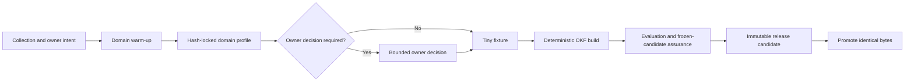

# OKF Foundry Prompt Kit

Anyone responsible for a collection of documents or records can use this kit
to turn it into an evidence-bearing OKF publication. It transfers the reusable
method developed across legislation, ONS data discovery, GOV.UK content,
government APIs, CKAN and the OKF Explorer without transferring their domain
assumptions or their very large working transcripts.

## Use Two Prompts, Not One Giant Prompt

1. [Compile the domain profile](prompts/okf-domain-warm-up.md). This read-only
   warm-up researches the collection, people/tasks, terminology, authority,
   rights, identifiers, versions, relationships and applicable standards.
2. Review any genuinely blocking owner decisions and approve the checksummed
   `okf-domain-profile.v1` handoff.
3. [Build, validate and publish](prompts/okf-bundle-build.md). The builder
   consumes that exact handoff and implements the smallest justified bundle.

The handoff is validated by the
[`okf-domain-profile.v1` schema](../profiles/authoring/v1/domain-profile.schema.json).
Start from the complete
[YAML template](../profiles/authoring/v1/domain-profile.template.yaml).



The profile—not the chat history—is the durable interface between research and
implementation.

## What Is Fixed And What Is Researched

The portable core is fixed:

- OKF 0.2 Markdown;
- stable source-native identity;
- provenance and clear derivation;
- scope/coverage and any completeness denominator;
- rights, access and privacy decisions;
- lifecycle and freshness;
- deterministic, integrity-bound generation;
- traceability and evidence-bearing evaluation.

Semantic publication normally assesses YAML 1.2.2, YAML-LD 1.0, JSON-LD 1.1,
RDF 1.1, RDF Dataset Canonicalization 1.0, JSON Schema 2020-12 and SHACL.
YAML-LD remains a version-pinned W3C Working Draft and must be described as
such.

The warm-up researches the domain layer. Examples include ELI/CLML for UK
legislation, SDMX/DDI and statistical classifications for official statistics,
DCAT/CSVW for data catalogues, Schema.org and GOV.UK publishing models for
web content, GeoSPARQL/INSPIRE for spatial collections, or IIIF/PREMIS for
cultural and preservation collections. A named standard is adopted only when
its scope and conformance artefact are justified and testable.

Every standard is classified:

| Applicability | Build effect |
|---|---|
| Normative | Emit and validate a conforming artefact. |
| Projection | Generate a mapped view while retaining source meaning. |
| Source-native | Preserve the form already used by the source. |
| Conditional | Apply only when its recorded condition is met. |
| Reference-only | Inform design but create no production assertion. |
| Not applicable | Record why it was assessed and excluded. |

## Choose The Smallest Useful Product

| Level | Use when | Main output |
|---|---|---|
| Inventory only | Scope, rights or identity are not yet safe to decide | Evidence-bearing inventory and gaps |
| Minimal OKF | A bounded collection needs human/machine discovery | OKF 0.2 Markdown plus small Explorer bundle |
| Governed semantic | Tasks require explicit shared meaning | YAML-LD source, JSON-LD/Turtle, vocabulary and SHACL |
| Large corpus | Full records cannot load safely at startup | Descriptor, compact facets, search and lazy shards |
| Federation | Collections have independent owners or release/access boundaries | Overview-first federation plus real child bundles |
| Enriched | A declared semantic gap justifies bounded inference | A preceding level plus separately labelled candidates |

Scale alone does not require an ontology. A sophisticated domain does not
automatically require model enrichment. Federation describes independent
governance; it must not make planned sources look implemented.

## Evidence Has More Than One Axis

Keep these separate:

- source/assertion authority;
- derivation;
- OKF verification trust;
- freshness;
- source availability;
- coverage and denominator;
- research-claim state;
- concept lifecycle; and
- release lifecycle.

An official source can be stale. A deterministic normalization can be accurate
without becoming an official statement. A model candidate can have strong
evidence without becoming source-native. A high confidence number cannot fix
any of those category errors.

## The Expensive-Failure Controls

The build prompt encodes the operational lessons that matter most:

- one visible outcome goal, with security/enrichment/release as phases;
- no more than three stable workstreams;
- one small positive/negative fixture before corpus, network or paid work;
- immutable acquisition attempts and explicit denominators;
- build identity keyed by profile, source snapshot, builder, dependencies and
  configuration;
- content-addressed reuse instead of unchanged rebuilds;
- checkpoints containing digests and receipts rather than full transcripts;
- early security-tool compatibility testing, with substantive security only
  against the frozen candidate;
- stop using a helper after one confirmed repeatable crash;
- no retry without new evidence or a changed condition;
- clean build and semantic equivalence before release;
- one RC build, followed by byte-identical promotion; and
- post-freeze public observations stored outside the frozen tree.

These controls are deliberately part of the reusable prompt because they are
what prevent a sound semantic design from becoming an unbounded and
irreproducible implementation.

## Domain Comparisons

[Three worked mappings](prompts/domain-profile-examples.md) show how the same
protocol produces different decisions for UK legislation, ONS discovery and
GOV.UK content. They demonstrate that:

- source-native identity and temporal semantics differ;
- domain standards are conditional rather than universal;
- a catalogue timestamp is not data currency;
- a website route is not necessarily a persistent content identity;
- relationship predicates require domain evidence; and
- a federation can describe a broader source universe without fabricating
  unimplemented children.

## Version And Distribution

The canonical kit belongs with OKF Explorer's application profiles and
validators:

```text
docs/okf-authoring-prompt-kit.md
docs/prompts/okf-domain-warm-up.md
docs/prompts/okf-bundle-build.md
profiles/authoring/v1/
```

Each domain bundle should link to and pin a released profile URI plus digest.
It should not copy and silently edit the prompts. A breaking handoff/schema
change creates `v2`; prompt clarifications that preserve the contract can ship
with an Explorer patch release.

The original OKF 0.2 specification remains independently owned upstream. This
Foundry profile is additive and must not be represented as a change to OKF
core.

## Quick Start

1. Copy the warm-up prompt and fill in its run inputs.
2. Validate its `domain-profile.json`:

   ```sh
   python3 scripts/check_domain_profile.py \
     domain-profile/domain-profile.json \
     --equivalent domain-profile/domain-profile.yaml
   ```

3. Review only decisions where `blocking_for_build` is `true`.
4. Record the approved pack SHA-256 in the build prompt.
5. Run the build. Do not bypass the tiny-fixture gate.
6. Review its gate table and public route receipts before treating the bundle
   as published.

For the concrete record, facet, hierarchy, relationship, source and Explorer
contracts, continue with [Create OKF bundles](okf-bundle-authoring.md).

## Primary Specifications

- [OKF 0.2 pinned specification][okf]
- [YAML 1.2.2][yaml]
- [YAML-LD 1.0][yaml-ld]
- [JSON-LD 1.1][json-ld]
- [JSON-LD 1.1 API][json-ld-api]
- [RDF Dataset Canonicalization 1.0][rdf-canon]
- [JSON Schema 2020-12][json-schema]

[okf]: https://github.com/GoogleCloudPlatform/knowledge-catalog/blob/3fcbb9f828c2f23d109c855ee403c3a4c81f3a96/okf/SPEC.md
[yaml]: https://yaml.org/spec/1.2.2/
[yaml-ld]: https://www.w3.org/TR/yaml-ld-10/
[json-ld]: https://www.w3.org/TR/json-ld11/
[json-ld-api]: https://www.w3.org/TR/json-ld11-api/
[rdf-canon]: https://www.w3.org/TR/rdf-canon/
[json-schema]: https://json-schema.org/draft/2020-12
