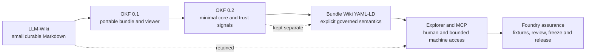
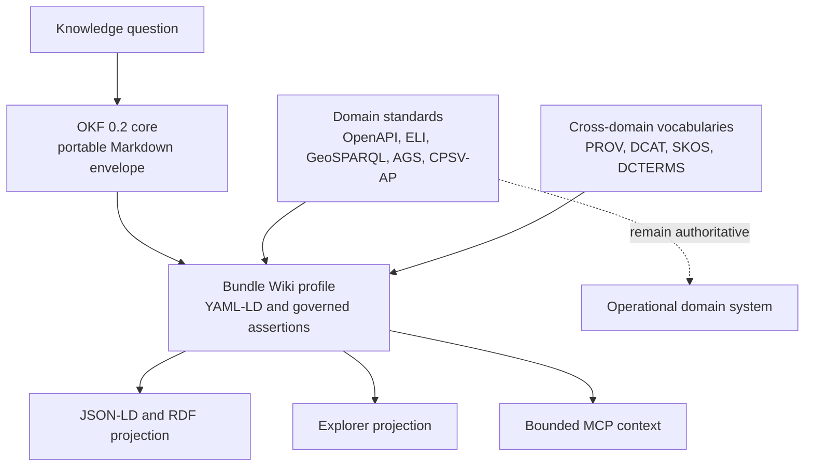
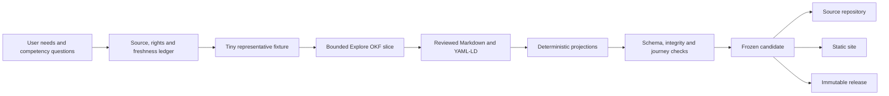
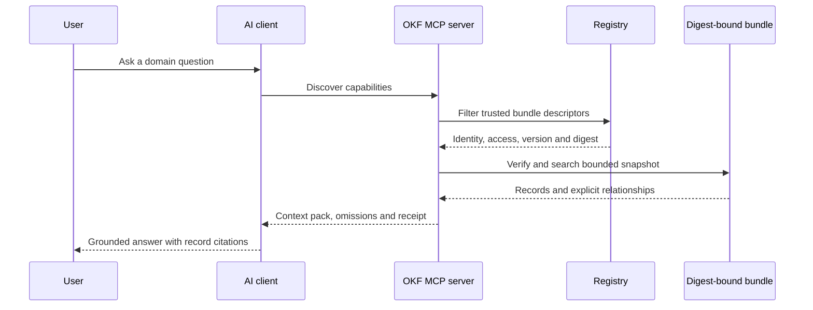

# From LLM-Wiki to governed OKF bundle wikis

Status: completed evidence review and local implementation, 17 August 2026.

## Technical summary

This review reconstructs a 123-day journey from the first located direct
LLM-Wiki request on 16 April 2026 to the present OKF 0.2, YAML-LD, Explorer and
assurance method. It uses Git history, repository artefacts, curated
conversation records, generated evidence and official standards sources. A
bounded scan inspected 138 local repositories and selected 26 candidates;
human review then separated substantial bundle producers from historical
wikis, viewers, compatibility layers, fixtures, standards repositories and
mere mentions.

The central finding is that the project did not replace one format with
another. It accumulated distinct layers in response to observed failures:

- LLM-Wiki supplied durable, small Markdown pages and progressive disclosure;
- OKF 0.1 supplied a portable bundle envelope and simple static display;
- OKF 0.2 supplied a deliberately minimal core and stronger trust direction;
- the Bundle Wiki YAML-LD profile supplied explicit identity, predicates,
  authority, evidence, rights, federation and scale contracts;
- Explorer supplied human search, facets, Reader, Graph, Links, Timeline,
  Resources and Inspect views; and
- Foundry methods supplied source governance, fixtures, early user review,
  validation, frozen candidates and publication evidence.

Those additions have improved auditability and safe machine retrieval, but
they have also increased authoring cost, migration work and the risk of
mistaking a local profile for universal OKF. The current best practice is
therefore a small interoperable core, optional named profiles, deterministic
projections, explicit limitations and progressive validation.

This review also delivers a working review bundle in
`research/okf-evolution-review/`, an interactive route through the existing
Explorer, and a bounded read-only MCP retrieval prototype in `mcp/`. On seven
authored development questions, the expected record appeared in the top-three
context every time. Mean context size was 8,433 bytes against a 1,902,109-byte
bundle, a 99.56% byte reduction. Mean reciprocal rank at five was 0.833. This
is evidence of compact deterministic retrieval, not evidence that a language
model will always answer correctly.

## Key findings

The diagram is cumulative. Markdown remains the authored human layer; OKF
core remains intentionally small; YAML-LD is an additive semantic authority;
and the display and access products are generated consumers. Treating the
arrows as replacements would lose the principal lesson of the work.

The strongest conclusions are:

1. **Small files were the enduring idea.** They made human review, Git history,
   selective context and repair possible before formal semantics existed.
2. **Identity became more important than clever retrieval.** The most
   informative Copilot error selected a plausible near-neighbour but the wrong
   governed family. Stable IDs and inspectable ranking exposed it.
3. **Links are not automatically semantics.** A Markdown link helps a reader;
   a governed assertion must also state direction, predicate, authority,
   evidence, time, rights and scope.
4. **A profile needs an honest name.** The rich Bundle Wiki contract is useful
   precisely because it is not misrepresented as the universal OKF 0.2 core.
5. **Human display is part of data quality.** Opaque graph identifiers and late
   presentation defects showed that schema validity alone does not make a
   knowledge product understandable.
6. **Simple access remains a serious baseline.** Direct prompts and SharePoint
   links performed strongly in the development trial. MCP must earn its added
   operational cost through measurable control, compactness or observability.
7. **A registry is preferable to one enormous meta-bundle.** Discovery is a
   compact control-plane problem; content authority remains with digest-bound
   child bundles.

## Scope, evidence and beginner definitions

### What is an LLM-Wiki?

A large language model (LLM) answers from patterns learned during training and
from information supplied at question time. An LLM-Wiki is a directory of
small, linked, usually Markdown text files designed so both people and an AI
assistant can navigate the relevant knowledge without loading everything.
The project's cited methodology source is the
[Karpathy LLM Wiki gist](https://gist.github.com/karpathy/442a6bf555914893e9891c11519de94f).
Because no explicit redistribution licence was recorded, this project retained
citation metadata and private integrity evidence rather than republishing its
full body.

### What is OKF?

The Open Knowledge Format (OKF) is a portable convention for packaging
knowledge as human-readable Markdown with small machine-readable metadata. It
is designed for progressive disclosure: start with an index or summary, then
open only the relevant pages. Google's
[OKF specification](https://github.com/GoogleCloudPlatform/knowledge-catalog/blob/main/okf/SPEC.md)
keeps version 0.2 deliberately minimal: `type` is the only required front
matter field, unknown fields are tolerated and broken links do not invalidate
the core bundle. The original
[OKF 0.1 announcement](https://cloud.google.com/blog/products/data-analytics/how-the-open-knowledge-format-can-improve-data-sharing/)
presented three example bundles and a static visualiser as a starting point,
not a finished universal ontology.

### What are YAML-LD, JSON-LD and RDF?

Linked data gives things stable web identifiers called IRIs and describes a
relationship as a triple: subject, predicate and object. RDF is the underlying
graph model. JSON-LD expresses it in JSON. YAML-LD expresses compatible linked
data in the more author-friendly YAML syntax. The
[W3C YAML-LD 1.0 specification](https://www.w3.org/TR/yaml-ld-10/) was a
Working Draft dated 28 July 2026, based on JSON-LD 1.1; it was not yet a W3C
Recommendation. This maturity is why the project pins local contexts,
generates JSON-LD deterministically and labels the profile experimental.

### What is MCP?

The Model Context Protocol (MCP) is a way for an AI client to discover and use
resources, prompts and tools supplied by a server. Instead of pasting an
entire bundle into a prompt, a client can ask for a search result or bounded
context pack. MCP is an access protocol, not a truth engine. The
[28 July 2026 MCP update](https://blog.modelcontextprotocol.io/posts/2026-07-28/)
introduced a stateless core and `server/discover`; production clients and SDKs
may support different revisions, so this review tests the retrieval core
separately from transport claims.

### Evidence hierarchy

This review gives most weight to an immutable or content-addressed source,
then a Git commit, generated receipt and test, then a curated conversation
record, and finally retrospective recollection. Commit time, author time,
standards publication time, deployment time and later observation time are not
treated as interchangeable.

The repository scan is reproducible with
`scripts/build_okf_evolution_evidence.py`. It examines tracked files at two
repository levels and records commit identities and observable markers. Its
26 candidates are discovery evidence only. The curated
[bundle inventory](../research/okf-evolution-review/bundle-inventory.md)
prevents a viewer, fixture or keyword mention from being counted as a
conformant bundle.

Private conversations were not copied into this report. The
[conversation register](../research/okf-evolution-review/conversation-register.md)
records stable task identifiers and bounded decisions. Implementation claims
need corroborating files, commits, tests or releases. The app census screened
12 pinned, 50 recent non-pinned and 50 archived task summaries; the archived
cursor had crossed back before the first located LLM-Wiki event. The public
Challenge 2 postmortem separately indexes all five original project
conversations and 53 prompt/response exchanges.

## The journey in evidence

### Phase 1: prove that a small linked knowledge base is useful

At 08:51:25Z on 16 April 2026, the user asked the Challenge 2 work to use the
Karpathy Wiki method to translate all supplied documents and metadata into a
knowledge base navigable in Obsidian. By 10:15 local Git history recorded the
first knowledge-base commit. During the day, all 43 supplied documents were
represented through immutable raw inputs and generated Markdown, with indexes,
front matter, a source register, hashes, links, linting, architecture and an
evaluation harness.

The important discovery was not “Obsidian works”. It was that a model and a
person could share a durable working memory made of ordinary files. The files
could be reviewed, versioned, linked, regenerated and supplied selectively.
MCP and Copilot prompt work followed on 19–20 April, establishing two access
paths early: give a client links/files, or give it a retrieval tool.

The method spread in May and June to geospatial, assertion, software-paper,
discourse and mapping repositories. Reuse exposed inconsistent metadata,
viewer behaviour, licences and naming. That pressure created the need for a
portable convention.

### Phase 2: adopt OKF 0.1 without losing the wiki

The June transition combined Google's OKF envelope with the working LLM-Wiki
practice. On 18 June, the WCC repositories recorded “Adopt OKF wiki standard”.
On 23 June, `api-mcp-wiki` recorded an initial publication-ready OKF bundle.
By 30 June, static viewers and an OKF 0.1 viewer existed in several projects.

OKF 0.1 helped producers agree what to exchange and gave consumers a simple
entry point. It did not settle how to express a relationship, prove where a
fact came from, federate multiple publishers, serve a very large corpus, or
keep display behaviour consistent. The project therefore retained the wiki
indexes and provenance conventions rather than reducing the corpus to a flat
manifest.

### Phase 3: build Explorer for people and large corpora

The first OKF Explorer commit is dated 4 July 2026 at 12:48. By that evening,
large-corpus views and review changes were recorded. The application evolved
from a single embedded viewer into a static progressive web application with
search, filtering, Reader, Graph, Links, Timeline, Resources and Inspect
surfaces, query-level state and durable record routes.

This display work influenced the data contract. Facets require consistent
fields. A graph requires stable endpoint identities. Timeline claims require
unambiguous dates. Inspect needs provenance and raw metadata. Large corpora
need overview-first descriptors and shards. Back and forward navigation need
stable URL state. The UI was therefore not decoration: it exposed missing
contracts.

### Phase 4: add federation and YAML-LD

Commit `28331c9f` at 13:47 on 11 July added the YAML-LD Bundle Wiki profile
foundation. Later that day, independent legislation, API and AI-infrastructure
bundles and a compatibility repository were recorded. This established a
federated model: each publisher owns its bundle and version; a registry helps
discovery; compatibility projections preserve old consumers.

YAML-LD addressed a problem that ordinary links could not. The same link may
mean “defines”, “cites”, “is provided by”, “is part of” or merely “see also”.
Inferring that meaning from section names or prose is useful for presentation
but unsafe as semantic authority. The additive profile therefore introduced
absolute IRIs and explicit predicates while leaving OKF core documents valid.

### Phase 5: move to OKF 0.2 and make trust executable

Google's
[OKF v0.2 trust-signal announcement](https://cloud.google.com/blog/products/data-analytics/okf-v0-2-adds-trust-signals)
and specification strengthened provenance, lifecycle and attestation while
preserving a tolerant core. Planning and GOV.UK content producers migrated
around 25 July. The local project adopted that core and deliberately placed
its stronger requirements in the Bundle Wiki profile.

The initial profile still left gaps. Real producer work showed that a relation
needed more than a predicate. It needed a stable assertion ID, authority,
derivation, evidence, rights, observation time, review status and scope. On 10
August, Explorer v0.6.0 and the cross-repository semantic contract made those
requirements enforceable. Producers claiming the canonical profile must
vendor all profile files byte for byte with a lock; a changed schema needs a
different absolute identity.

### Phase 6: learn from delivery failures

Land Registry and heritage work recorded the difficult parts rather than
erasing them. Problems included opaque machine identifiers shown as labels,
late rights and platform questions, semantic and presentation defects found
after expensive builds, and repeated end-to-end reruns when only one plane had
changed. A citizen-journey task also stalled after a platform safety error and
had to resume with stronger exact-record provenance checks.

The response was procedural as well as technical:

- Evaluation Foundry evaluates functionality with source-backed, tiny and
  synthetic fixtures;
- Explore OKF publishes a visibly bounded learning slice for early feedback;
- Publication Foundry builds and assures one real candidate;
- every graph-reachable entity needs a human label at the same loading
  granularity as its link;
- link coverage uses an explicit denominator and competency questions;
- validation is organised by dependency plane during development; and
- one frozen candidate is promoted byte for byte after complete gates.

The detailed dated sequence is preserved in the
[chronology](../research/okf-evolution-review/chronology.md).

## Standards: incorporation without standards theatre

The complete decision ledger is in
[standards decisions](../research/okf-evolution-review/standards-decisions.md).
The governing rule is simple: reuse a standard for the job it actually does,
retain its exact vocabulary and validation requirements, and state when a
mapping is only alignable.

The arrows into Bundle Wiki mean “reference or map where evidenced”, not
“replace”. OpenAPI remains the executable HTTP API contract. ELI remains the
legislation vocabulary. AGS, GeoSciML and GeoSPARQL remain richer domain
contracts for ground and spatial data. SHACL or JSON Schema validates shapes;
it does not prove the source fact true.

Notable decisions include:

- browser-compatible Markdown links replaced Obsidian-only wikilinks;
- YAML-LD contexts are pinned locally; the Reader never fetches arbitrary
  contexts or performs unbounded reasoning;
- direct RDF triples and reified evidence-bearing assertions are generated
  from one source so they cannot drift independently;
- `owl:sameAs` is not inferred from a label or similar URL;
- SKOS mapping strength preserves exact, close, broader, narrower and related
  distinctions;
- DCAT and DCAT-AP mappings are called “alignable” until RDF and cardinality
  validation ship;
- OKF links to OpenAPI, AsyncAPI and Arazzo rather than inventing missing
  operations or workflows;
- CPSV-AP is selective: an editorial life stage is not automatically a public
  service; and
- semantic link quality is measured against eligible candidates, not rewarded
  by raw triple count.

This restraint helps interoperability. It also creates documentation burden:
readers must understand which layer makes which promise. The profile URI,
machine contract and generated receipts are the control against ambiguity.

## How bundles are built and displayed

### Authoring flow

The process begins with people and questions, not a schema. Sources are
inventoried with licence, access, observation time and gaps. A tiny fixture
tests the contract cheaply. A bounded exploratory slice exposes modelling and
display failures before a full release is expensive. Only then is a complete
candidate generated and frozen.

In this repository Markdown is the source of truth. The stricter YAML-LD front
matter or assertion graph is semantic authority. `okf-bundle.json`,
`okf-bundle.yamlld`, `okf-bundle.jsonld`, Explorer descriptors, shards,
adjacency, checksums, `viewer.html` and `_site/` are projections and must not be
hand-edited.

### Reproducible environment

The repository pins CPython 3.12.11 and all Python dependencies through
`uv.lock` and requires `uv` 0.12.2. The supported setup is `uv sync --locked`;
Python runs as `uv run --locked python`. This avoids host-Python and ad hoc
environment drift. `okf.semantic.json` records the authored roots, generated
outputs, delivery mode, context policy and exact build/check commands.

The semantic context is local and pinned. Credential-bearing or malformed
evidence and rights URLs are rejected. Large relationship graphs publish a
digest-bound runtime manifest and route locator with per-plane counts and
assertion-ID digests. Reader limits bound chunks, rows, compressed bytes and
retained text. Declared setup/build/check strings inside an external bundle are
treated as untrusted data and inspected before execution.

The complete publication gates rebuild/check the bundle and legacy viewer,
validate OKF and semantics, check British English and build the site. Browser
journeys and the exact deployed identity are separate gates. GitHub provides
three distinct surfaces: the repository is the canonical source and review
history; Pages is the static public site; Releases are frozen snapshots.

### Display methods

The original static HTML viewer made OKF immediately inspectable and remains a
valuable zero-service fallback. The Svelte Explorer adds:

- overview and bundle identity before individual records;
- deterministic search, filters, sort and match explanation;
- Reader for the human document;
- Links and Graph for explicit relationships and direction;
- Timeline for dated evidence;
- Resources for source material;
- Inspect for raw metadata, identity and provenance;
- Maps where spatial evidence supports them; and
- durable query and record state for links, back and forward navigation.

The review bundle is integrated rather than given a second bespoke dashboard.
Its Markdown pages are in the generated corpus and are available through all
existing Explorer views. This tests the proposition that an OKF review should
be inspectable using the same consumer it evaluates.

## Alignment with the original aims

| Aim | Current alignment | Helpful variation | Hindrance or remaining risk |
| --- | --- | --- | --- |
| Durable human-and-AI knowledge | Strong | Plain Markdown remains authoritative and Git-reviewable. | Rich front matter can intimidate beginners. |
| Progressive disclosure and low context | Strong | Indexes, routes, shards and byte-limited packs avoid whole-corpus prompts. | Poor search or missing aliases can still select a near-neighbour. |
| Portability | Strong at the core | OKF 0.2 tolerance, static files and compatibility projections support multiple consumers. | Profile proliferation and custom fields can create practical lock-in. |
| Easy authoring | Mixed | YAML is readable and deterministic tooling catches errors. | Evidence-bearing assertions are substantially harder than ordinary links. |
| Trust and provenance | Stronger than the starting aims | Stable identities, source hashes, authority, rights and observation time make claims inspectable. | Metadata may be complete but wrong; provenance does not guarantee truth. |
| Open ecosystem | Partial | Published profile, registry, crosswalks and static hosting support federation. | Most interoperability is currently among related repositories and needs independent producer testing. |
| Useful human display | Strong but learned late | Explorer and label contracts expose meaning and limitations. | Earlier graph views leaked opaque IDs; accessibility and usability need continuing user evidence. |
| Simple deployment | Strong for static bundles | No server is required for the core site or prompt-plus-link access. | Rich MCP, sharding and signed discovery add operations and security work. |

The variations helped most where real projects exceeded a small example:
thousands of records, multiple publishers, legal/spatial domains, changing
sources and governed evidence. They hindered when local assurance detail was
treated as necessary for every tiny bundle. The remedy is progressive
conformance: make a valid small core easy, then add named profiles only when a
use case needs their guarantees.

## Grounding language models and reducing context

Grounding is successful only if retrieval selects the right evidence and the
model's answer is faithful to it. Token reduction is valuable because it lowers
cost and distraction, but a small wrong context is worse than a larger correct
one.

### Existing Copilot evidence

The SharePoint and Microsoft 365 Copilot development trial assessed 293
governed families. All 293 responses stayed inside the defined safety boundary
and 292 selected the exact expected family, giving 99.6587% strict selection
accuracy. The exception chose a plausible general Universal Credit family
instead of the more specific unemployment family. Service protection also
interrupted a burst run; paced continuation completed it.

This is strong development evidence for stable identity, compact facts and
ordinary enterprise access. It is not an independent holdout, not a comparison
against an unstructured corpus, and not proof of answer correctness across
domains. Raw transcripts remain private. A negative permission case, OneNote
route and independent question set remain to be completed.

### MCP prototype result

The review's read-only core supports list, search, exact record retrieval,
relationship traversal and context packing. It returns bundle and record IDs,
a SHA-256 bundle digest, explicit relations and a receipt. It rejects empty or
oversized requests and never executes bundle commands or fetches remote
contexts.

The fixed development set contains seven questions, one for each review topic.
Against the generated 1,902,109-byte bundle:

| Measure | Result |
| --- | ---: |
| Expected record in top-three context | 7 of 7 (100%) |
| Mean reciprocal rank at five | 0.8333 |
| Mean returned content | 8,433.0 bytes |
| Mean byte reduction from whole bundle | 99.5567% |
| Maximum configured context | 12,000 bytes |

The expected chronology record ranked third for one question and the standards
decision record ranked second for another. This is useful evidence against
overclaiming: top-three recall was perfect on an authored set, but lexical
ranking was not perfect. The token estimate uses `ceil(characters / 4)` and is
only a repeatable proxy. The full receipt is in
`research/okf-evolution-review/evidence/mcp-context-evaluation.json`.

### Required empirical comparison

The next experiment should freeze one bundle snapshot, access-control policy
and independent question set, then compare:

1. direct prompt plus bundle or SharePoint links;
2. MCP deterministic lexical retrieval;
3. MCP lexical plus an optional semantic/vector ranker; and
4. a conventional website/search baseline.

Measure top-k retrieval, answer support, exact correctness, material omissions,
citation identity, input/output tokens, latency, cost, throttle errors and
permission leakage. Score near-neighbour and unanswerable questions
separately. The assessor should not be the question author. This isolates
whether MCP improves outcomes rather than merely changing architecture.

## MCP server design

The optimal service has a small trusted retrieval core and separate adapters
for protocol/transport. Its tools should include bundle discovery, search,
exact record retrieval, relationship traversal, source/provenance retrieval and
context packing. Each call needs explicit limits. The service should return
structured content plus a human-readable representation, preserve exact IDs
and digests, and make truncation and ambiguity visible.

Production additions are authentication, per-bundle authorisation, tenant
isolation, signed registry policy, audit, cache control, rate limiting,
monitoring and client-version compatibility tests. Write tools should be a
different, explicitly authorised service. The data-bearing bundle must never
be allowed to supply executable shell commands merely because it has a
`tooling` field.

The direct prompt-and-link route remains the baseline. It has lower integration
cost and can inherit SharePoint permissions and indexing. MCP is justified
where a data owner needs deterministic retrieval, inspectable ranking, hard
budgets, explicit relationship traversal, multiple bundle discovery or
portable access across AI clients.

## Discovering available bundles

Discovery should use a compact, digest-bound registry rather than crawling
every child or copying all content into one meta-bundle. A registry entry needs
stable bundle IRI, title, publisher, OKF/profile versions, descriptor and
landing URLs, media types, licence/access class, themes, jurisdiction,
spatial/temporal coverage, language, issued/modified/observed/stale times,
counts, sharding capabilities, snapshot digest, attestation, health,
deprecation and replacement.

The registry may itself be rendered as an OKF bundle so people and agents can
read its explanation and provenance. That makes it a *meta-OKF view*, not the
authority for child facts. Child descriptors and immutable digests remain the
content authority. Multiple registries can federate; duplicates resolve by
stable identity and digest rather than title.

DCAT provides useful catalogue concepts, but the OKF delivery registry also
needs projection, sharding, integrity and access capability fields. The honest
claim is “DCAT-inspired and crosswalkable” until an actual DCAT-AP RDF export
and validator exist.

## User-controlled AI, owner-operated AI and the Web

There are two different product choices hidden in “AI over our data”.

### Give the user's AI reliable knowledge

The data owner publishes static, signed or digest-bound OKF bundles and a
registry. The user selects their own AI client, pays its cost and grants it
access. The owner pays mainly for curation and static publication.

Advantages are portability, user choice, low marginal query cost for the
publisher, offline or local use, inspectability and reduced dependency on one
model vendor. The user can combine several owners' bundles. The static bundle
also remains useful without AI.

Risks are uneven client quality, uncertain prompt obedience, uncontrolled
secondary combination, varied token windows, stale local copies and difficulty
supporting or auditing every client. A public bundle cannot revoke facts that
have already been downloaded. Confidential bundles still require a real
authorisation and delivery system.

### Provide an AI designed and operated by the data owner

The owner chooses the model, retrieval, prompts, safety policy, interface and
integrations, and pays to operate them. Users access the answer service rather
than the raw knowledge product.

Advantages are consistent behaviour, controlled evaluation, integrated
permissions, central fixes, observability and task-specific workflows. The
owner can refuse unsafe operations and combine live operational systems with
curated knowledge.

Risks are ongoing cost, vendor and architecture lock-in, a larger security and
privacy surface, service availability obligations and reduced user agency. A
single owner AI is also harder to combine with knowledge from other owners.

### The preferred hybrid

Publish the governed knowledge interface where rights permit, then operate an
optional reference AI over exactly the same versioned bundles. The portable
bundle prevents the hosted AI becoming the only route to knowledge. The
reference service demonstrates supported behaviour and supplies an empirical
baseline. Sensitive or transactional operations remain behind authorised APIs
and tools.

| Concern | User's AI plus OKF | Owner-operated AI | Hybrid recommendation |
| --- | --- | --- | --- |
| Query cost | User/client bears it | Owner bears it | Static access plus priced managed option |
| Behaviour control | Limited | Stronger | Publish tests and reference answers |
| Portability | High | Often low | Keep bundle and protocol open |
| Permissions | Client-dependent | Centrally enforceable | Public bundle; protected gateway for restricted records |
| Audit | Local/client-dependent | Central | Context receipts portable to both |
| Integration/write actions | Weak and risky | Strong with authorised tools | Separate read knowledge from write tools |

### Compared with websites today

Websites are excellent human interfaces, distribution channels and stable
public references. They are often poor machine context because meaning is
mixed with navigation, visual layout, scripts, duplicate pages and changing
templates. Search snippets omit provenance and relationships. Scraping is
fragile and may breach terms or overload services.

OKF should augment, not replace, the Web. A good website remains the human
canonical view. It can additionally publish:

- `<link rel="alternate">` entries for OKF, YAML-LD and JSON-LD descriptors;
- a well-known discovery document such as `/.well-known/okf` pointing to the
  bundle registry and current immutable snapshot;
- HTTP `Link` relations for canonical, described-by, provenance, licence,
  version, successor and integrity information;
- content negotiation for human HTML and machine JSON-LD/YAML-LD;
- sitemaps or feeds carrying stable IDs, modified times and bundle membership;
- robots/access policy that distinguishes ordinary indexing from authorised
  AI retrieval without pretending robots.txt is access control;
- digest and signature metadata for downloaded snapshots;
- schema.org/DCAT/PROV markup where it accurately maps; and
- an MCP endpoint advertisement for clients that need bounded query access.

Any new standard should be small and composable. The minimum useful
`/.well-known/okf` contract is a stable registry URL, publisher identity,
supported formats, authentication class, current snapshot digest and
deprecation policy. It should reuse Web Linking, media types, HTTP caching,
DCAT, PROV and JSON-LD rather than inventing a parallel Web. Rights and
permissions remain enforceable server-side; a metadata declaration is not an
access-control mechanism.

## Current best practice and why it ended here

The present method is the accumulated answer to specific evidence:

1. define users, questions, decisions and non-goals;
2. inventory source authority, rights, access, freshness and gaps;
3. preserve native identity and immutable evidence where lawful;
4. start with a tiny fixture and a bounded Explore OKF slice;
5. author small browser-compatible Markdown pages;
6. keep OKF 0.2 core separate from named additive profiles;
7. give every visible entity a stable IRI and human label;
8. publish only evidenced relationships that answer competency questions;
9. generate all semantic, search, graph, shard and display projections from
   one authority;
10. enforce byte, row, URL, context and route limits;
11. test source, schema, semantics, UI, retrieval, accessibility and adverse
   cases by dependency plane;
12. freeze one candidate, promote the same bytes, and verify the exact public
   identity; and
13. preserve limitations, rejected mappings, failures and unresolved cases in
   the release evidence.

It ended here because each additional control answered a real observed
failure: source ambiguity, near-neighbour identity, opaque labels, untyped
links, scale, unsafe URLs, drift, late user feedback, platform limits or
publication uncertainty. Controls that did not earn that justification were
kept optional or deferred.

## Limitations and robustness

This is exhaustive within a declared local boundary, not globally exhaustive.
The scan excludes deeper nesting, remote-only state, deleted work and material
not available in the current workspace. Keyword discovery can miss an
unlabelled predecessor and over-select a passing mention; human classification
mitigates but does not eliminate judgement.

Git commit timestamps preserve repository sequence, not all thinking time.
Rebases, imports and copied files can alter apparent chronology. Conversation
summaries preserve decisions while protecting private text, but they cannot be
independently audited like a public transcript. The report therefore avoids
using recollection as the sole basis for implementation claims.

The Copilot and MCP tests are authored development evaluations. They establish
that the current structures can support highly accurate selection and compact
retrieval under their conditions. They do not establish general answer
accuracy, safety across all models, permission enforcement or comparative
superiority. The next robust step is a blinded holdout with expert answer
scoring and the same bundle snapshot across access methods.

YAML-LD and the newer MCP core are moving specifications. Pinned versions,
local contexts and compatibility adapters reduce change risk but do not remove
it. The Bundle Wiki profile has mostly been tested within related repositories;
independent external producer and consumer implementations remain important.

## Next steps

1. Run the frozen, independent prompt-plus-link versus MCP experiment and
   publish question, scoring and context receipts where rights permit.
2. Add the negative permission and unanswerable-question suites before making
   stronger grounding claims.
3. Publish and validate a minimal registry schema, then implement one
   federated registry consumer without loading child bundles during discovery.
4. Wrap the tested retrieval core in the official MCP SDK revision required by
   the first target client, keeping the core and transport tests separate.
5. Recruit an independent bundle producer to test OKF core plus the optional
   profile from the published documentation alone.
6. Continue Explore OKF user testing for labels, graph meaning, mobile and
   assistive-technology journeys before expanding corpus scope.
7. Propose the smallest Web discovery experiment using `/.well-known/okf` and
   HTTP `Link` relations, then test it with both a crawler and an AI client.

## Further questions

- What minimum evidence makes a relationship worth its authoring cost?
- Which trust signals do users and AI clients actually use, rather than merely
  display?
- Can a registry federation remain decentralised while preventing stale or
  impersonated entries?
- At what corpus size and change rate does static OKF need a query service?
- How should corrections propagate to downloaded user-controlled AI without
  creating central control over lawful local use?
- Which parts of answer assurance belong to the bundle producer, MCP service,
  model provider and end user?
- Can independent implementations preserve Bundle Wiki meaning without
  sharing Explorer's code?

## Review artefacts

- [Review bundle index](../research/okf-evolution-review/index.md)
- [Chronology](../research/okf-evolution-review/chronology.md)
- [Bundle inventory](../research/okf-evolution-review/bundle-inventory.md)
- [Standards decision ledger](../research/okf-evolution-review/standards-decisions.md)
- [Conversation register](../research/okf-evolution-review/conversation-register.md)
- [Grounding evidence](../research/okf-evolution-review/grounding-and-retrieval.md)
- [MCP and discovery design](../research/okf-evolution-review/mcp-and-discovery.md)
- [Current best practice](../research/okf-evolution-review/best-practice.md)
- `research/okf-evolution-review/evidence/repository-scan.json`
- `research/okf-evolution-review/evidence/mcp-context-evaluation.json`
- `mcp/okf_mcp_core.py` and `mcp/okf_mcp_server.py`
