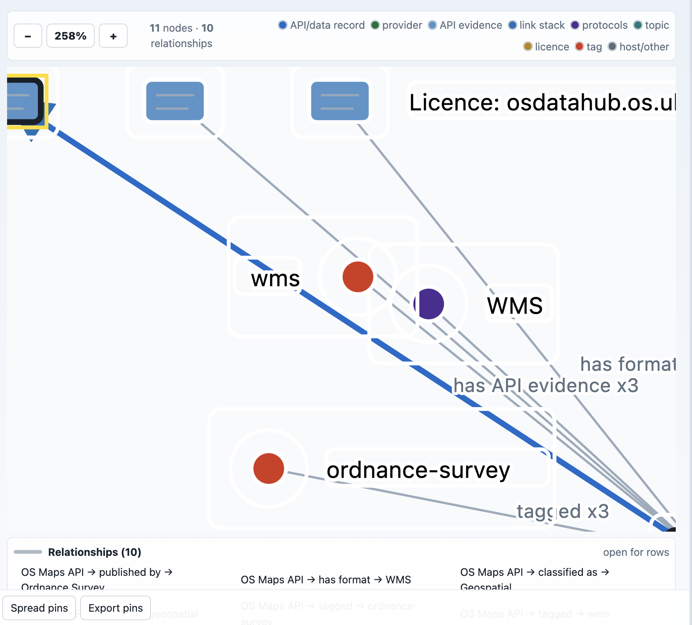

# OKF Explorer Evaluation Harness

This repository now carries a repeatable browser evaluation suite for the UK
Government APIs OKF pack and future large OKF bundles.

The suite evaluates three publication goals:

- Can a person browse efficiently, find an API or data source, and evaluate it?
- Does the display convey record, provenance, licence, access and quality
  information clearly?
- Are terms such as confidence, licence basis, API evidence and metadata quality
  defined in the UI instead of being unexplained percentages?

## Assets

- `evaluation/okf-explorer/questions.json` contains 100 retrieval and
  inspection tasks.
- `evaluation/okf-explorer/visual-regressions.json` records known visual
  clarity issues that must not be lost during redesign.
- `evaluation/okf-explorer/evidence/graph-layering-overlap-2026-07-08.png`
  captures the current graph readability problem:



The review note for that image is retained verbatim in the manifest:
"See how messy this display is due to layering and overlapping white boxes and
the arrow location (should be up to the start of the icon)".

## Rubric

The score is additive and totals 100 points:

- Retrieval, 35 points: result visibility, expected terms/routes, result count,
  stale-context reset, and core metadata discoverability.
- Display, 25 points: detail card title/summary/route, licence/access/contract
  visibility, clean metadata-gap wording, follow-on exploration controls,
  loading/search clarity, and graph readability.
- Accessibility, 20 points: accessible names, live status regions, keyboard
  focus targets, landmarks, and absence of obvious overlap at the tested
  viewport.
- GOV.UK-aligned publication quality, 20 points: plain language, provenance,
  licence/access clarity, predictable service-style actions, metadata-quality
  explanations, and no displayed secrets.

This is not an assurance score for the source APIs. It scores how well the OKF
Explorer helps a reader inspect the available public metadata.

## Running Locally

Build the static site first:

```sh
python3 scripts/build_site.py
```

Serve the repository root:

```sh
python3 -m http.server 8002 --bind 127.0.0.1
```

Run the full 100-question browser suite:

```sh
node scripts/evaluate_okf_explorer.mjs \
  --base-url http://127.0.0.1:8002/_site/next/ \
  --bundle ../uk-government-apis/okf-explorer.json \
  --limit 100 \
  --out evaluation/okf-explorer/results/latest
```

If Playwright is installed outside the repo, point the script at that module:

```sh
PLAYWRIGHT_PACKAGE=/Users/crpage/tmp/okf-playwright/node_modules/playwright \
  node scripts/evaluate_okf_explorer.mjs \
  --base-url http://127.0.0.1:8002/_site/next/ \
  --bundle ../uk-government-apis/okf-explorer.json \
  --limit 100
```

Generated reports are written to `evaluation/okf-explorer/results/`, which is
ignored by Git. The committed suite, rubric, screenshot evidence and harness
are the source of truth.

## Corpus Boundary Note

Question `Q071` checks the user's Rugby search concern. In the current UK
Government APIs OKF bundle, Rugby has one indexed match:
`Scarborough Borough Council New Local Plan Former Rugby Club Site`. If future
harvests add more Rugby records, the expected minimum can be raised without
changing the harness.
