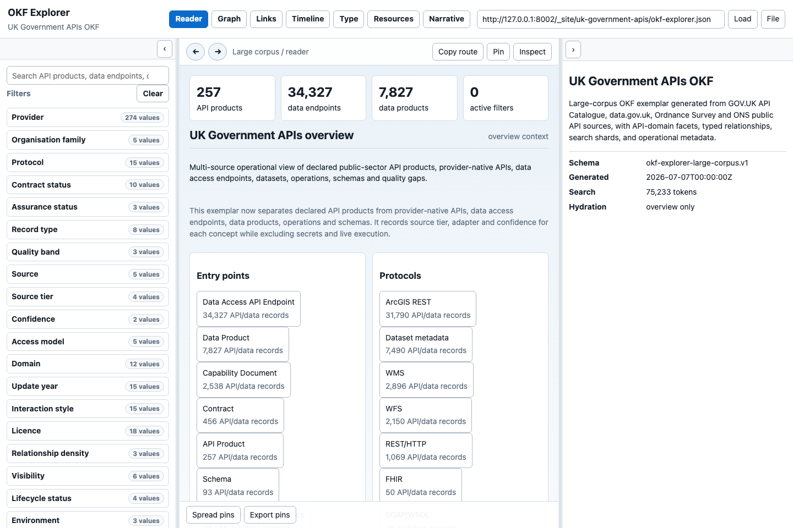
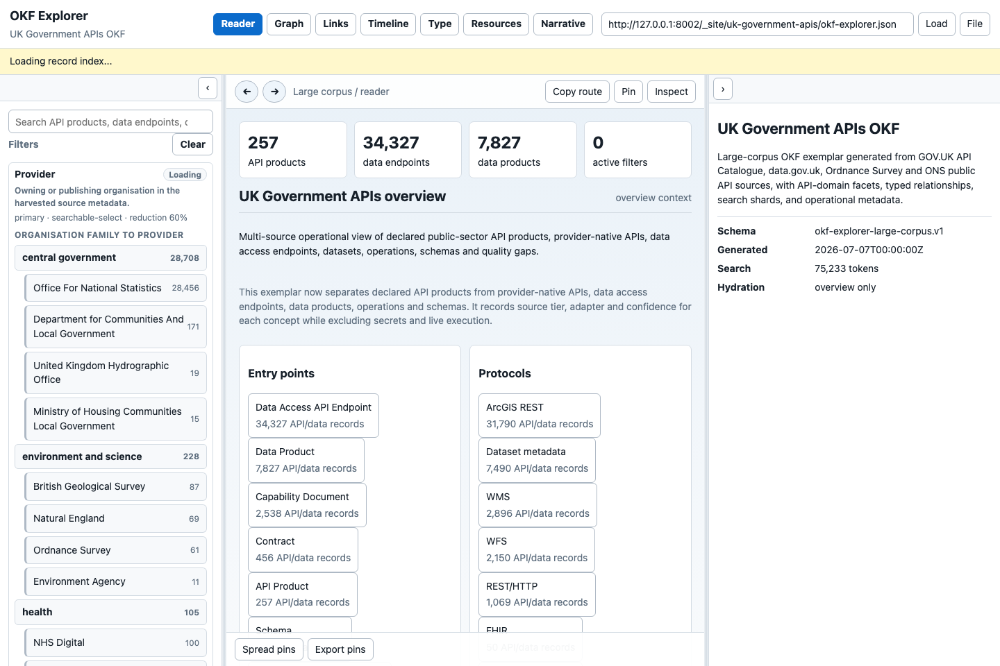
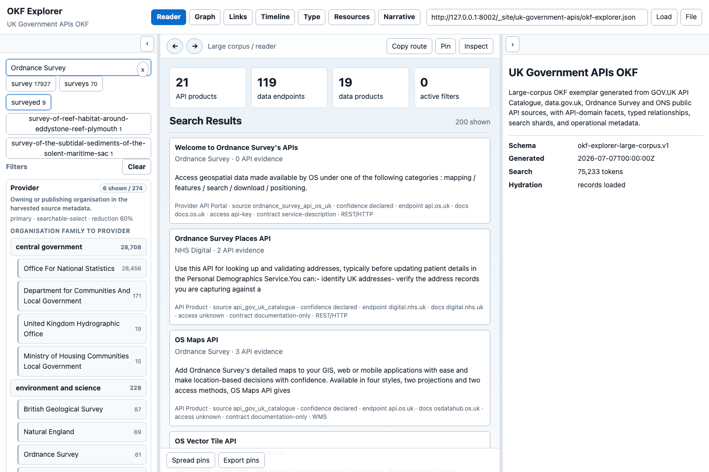
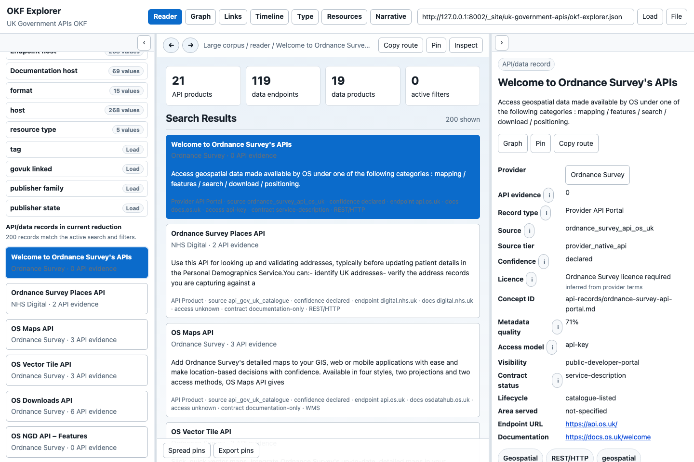
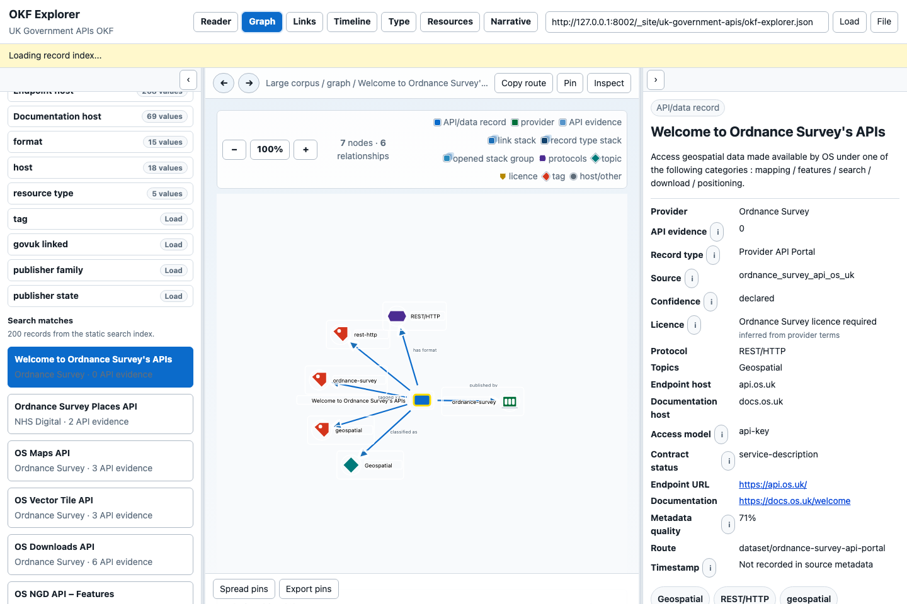
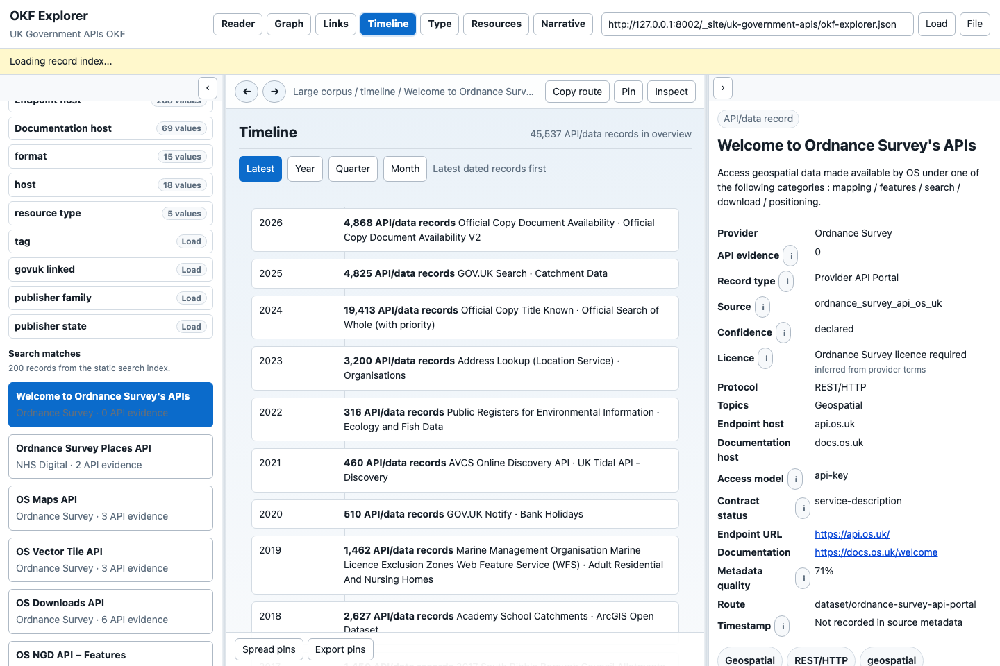
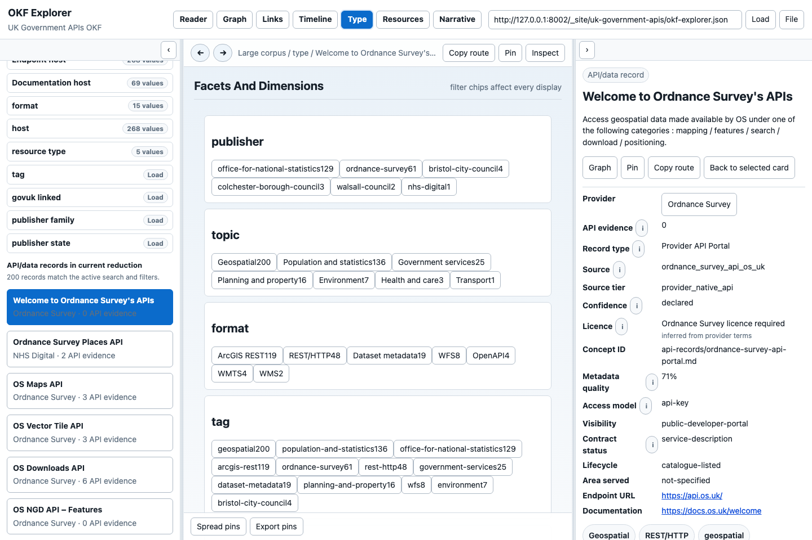
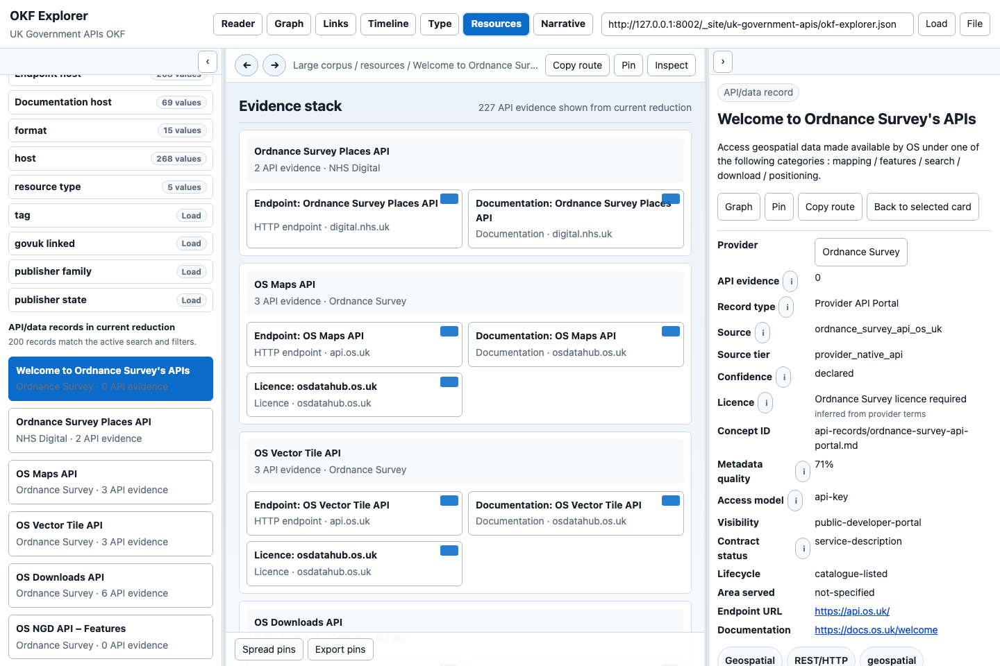
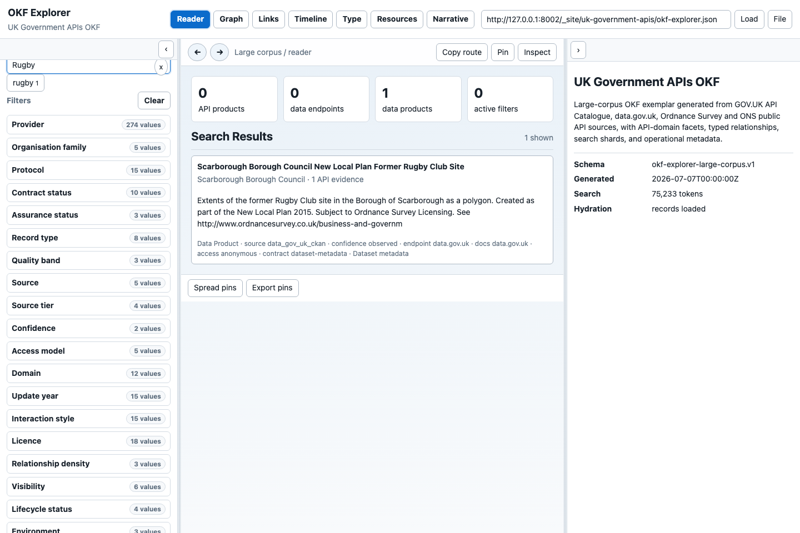

# OKF Explorer Persona Manual

This manual describes the Explorer through user stories. It is written for
people who need to browse a pack, evaluate an API/data source, demonstrate the
Explorer, or build a better OKF bundle.

Screenshots were captured from the local GitHub Pages build on 2026-07-08 using
the UK Government APIs OKF descriptor.

The behaviour expectations are grounded in GOV.UK-style service quality:
understand real user tasks, make the service simple, make it accessible, expose
source/provenance clearly, use open standards, protect privacy/security, and
measure whether the service works.

## Personas

| Persona | Goal |
|---------|------|
| Policy researcher | Find relevant APIs/data sources and understand public-sector provenance. |
| Data engineer | Decide whether a source has usable endpoint, protocol, licence, contract and access metadata. |
| Service assessor | Check whether the display makes terms clear, exposes gaps and supports keyboard/accessible inspection. |
| Knowledge curator | Improve a pack so search, facets, graph, timeline and cards work well. |
| AI operator | Point an AI at the pack and get sourced answers rather than hallucinated catalogue summaries. |

## Story 1: Start With The Overview

As a policy researcher, I want the pack to open with an overview, so I can tell
what corpus I am reading before applying filters.

Expected behaviour:

- The page loads the bundle descriptor from the Bundle URL field.
- Reader is the default view for the shared UK Government APIs link.
- Count cards distinguish API products, data endpoints, data products and
  active filters.
- The left panel starts with search and closed facets.
- The right panel explains schema, generated timestamp, search-token count and
  hydration state.
- If the app is still loading a background index, a visible status line says so
  without blocking overview reading.

Use this state for a demo opening. It shows the key correction in the exemplar:
formal API products, data access endpoints and data products are counted
separately.

## Story 2: Open And Search A Facet

As a data engineer, I want to open Provider, search inside it and select a
known provider, so I do not depend on whichever providers happen to be highest
by count.

Expected behaviour:

- Clicking a closed facet opens it immediately.
- If the facet needs full record hydration, it should show a loading state in
  the facet body and then show values without requiring a second click.
- Only the open facet renders its values. Closed facets show counts and selected
  summaries only.
- High-cardinality facets expose an in-facet search box and paged values.
- A plain click selects one value and replaces any previous value in the same
  facet.
- Ctrl-click, Cmd-click or Shift-click adds or removes a value for multi-select.
- The facet remains open after selection so the reader can see the active value
  and change it.
- Clear removes active filters and search context.

If Provider and Canonical provider contain the same user-facing choice, the UI
should avoid making the reader choose between duplicate navigation facets.

## Story 3: Search Across The Static Index

As a policy researcher, I want to search for "Ordnance Survey" and see matching
products, provider-native API records, operations and endpoints without waiting
for the whole corpus to load.

Expected behaviour:

- Typing in the search box uses the static search index first.
- A clear `x` appears when text is present.
- Changing from one materially different query to another clears stale selected
  record context.
- Search chips show indexed terms and counts.
- Results show title, provider, evidence count, summary, record type, source,
  confidence, endpoint/docs hosts, access model, contract status and protocol
  where available.
- Searching should feel alive: status text should say when records are loading
  or when only the static index is currently available.

Search is not proof that the source is complete. It is a way into the pack,
followed by record inspection.

## Story 4: Inspect A Record Card

As a data engineer, I want to click an API/data record and inspect the right
card, so I can judge provenance, access, licence and contract status.

Expected behaviour:

- A single click inspects a record and populates the right card.
- The active result is visibly selected.
- The right card starts with the record title and summary, then groups metadata
  under clear headings.
- Route, record type, source, source tier, confidence, provider, endpoint URL,
  documentation URL, access model, licence, contract status, protocol, topics
  and timestamp are visible where known.
- Info icons explain terms such as API evidence, confidence, licence basis,
  metadata quality and missing timestamps.
- Missing values use reader-facing wording such as "Not recorded in source
  metadata" rather than raw `None`.
- Topic, protocol and tag chips are clickable filters.
- Copy route copies a stable route that can be shared or cited.
- Graph switches to graph context for the inspected record.
- Pin preserves useful records for comparison/export.

The card must distinguish "observed public metadata" from operational
assurance. A declared provider API portal is not automatically a live, open,
free or assured API.

## Story 5: Use Graph Without Getting Lost

As a knowledge curator, I want Graph to show relationships without making dense
clusters unreadable, so I can understand the context instead of fighting the
layout.

Expected behaviour:

- Graph shows node and relationship counts for the current context.
- The legend explains colours and shapes for API/data records, providers,
  evidence, stacks, record-type stacks, opened-stack groups, protocols, topics,
  licences, tags and host/other nodes.
- Plus/minus controls zoom; the graph can be panned.
- Single-click inspects a real node in the right card.
- Double-click navigates or reduces context.
- Double-clicking metadata nodes such as provider, host, format, topic, tag or
  licence applies the corresponding facet reduction where available.
- Dense API/data records collapse into count-bearing stacks.
- Opening a stack expands one group at a time and restacks the previous group.
- If a stack is too large, it should regroup by a semantic dimension such as
  record type, format, topic, licence, access model, source adapter or update
  year.
- Arrowheads should terminate at node/card/icon boundaries, not pass through
  visual centres.
- Labels should not hide selected nodes or each other at normal zoom levels.
- Spread pins helps recover a dense layout; Export pins records the current
  graph positions.

Known visual-regression evidence for graph clutter lives in
`evaluation/okf-explorer/evidence/` and is part of the evaluation harness.

## Story 6: Review Time

As a researcher, I want a time-ordered view with "latest first" and grouped
time buckets, so I can avoid being stranded on old records.

Expected behaviour:

- Timeline defaults to Latest, not arbitrary or oldest-first order.
- Latest shows newest dated records first.
- Year, Quarter and Month group dated metadata at progressively finer
  resolution.
- Clicking a bucket applies a date facet/reduction.
- Missing dates are shown as missing source metadata, not as new, stale or
  invalid.
- Timeline should reflect the active search/filter reduction.

The timeline is a navigation aid and a metadata-quality signal. It is not a
guarantee that the underlying API was created or modified on that date unless
the source metadata says so.

## Story 7: Compare Record Types

As a service assessor, I want Type view to explain what kinds of records are in
the current context, so I do not confuse data products with API products.

Expected behaviour:

- Type view groups the current context by record type.
- Record types use plain-language labels: API Product, Data Access API
  Endpoint, Data Product, API Operation, Capability Document, Contract, Schema
  and Provider API Portal.
- Counts reflect the active reduction and search.
- Selecting a type should show representative records and keep the right card
  context understandable.

This is one of the most important views in the UK Government APIs exemplar
because thousands of data access endpoints should not be reported as thousands
of formal API products.

## Story 8: Inspect Resources

As a data engineer, I want Resources view to expose endpoint hosts, formats,
documentation and resource types, so I can judge integration routes.

Expected behaviour:

- Resources view shows endpoint/resource groupings for the active context.
- Host, format, resource type and documentation host are visible when known.
- Resource cards should link back to the owning API/data record.
- Resources should preserve licence/access/contract metadata from their parent
  or expose when it is inherited.
- Large resource lists stay bounded and lazy-loaded.

## Story 9: Handle Corpus Boundaries Honestly

As an AI operator, I want the UI to show when a search has only one match in
this pack, so I do not assume the wider web would also have one match.

Expected behaviour:

- Search results count is explicit.
- The right panel keeps overview context if no record is selected.
- A one-result search is not treated as an error.
- Documentation explains when a result count is a corpus boundary rather than a
  statement about the real world.

The evaluation harness includes a Rugby question for this reason.

## Other UI Behaviours

| Behaviour | Expected result |
|-----------|-----------------|
| Bundle URL field | Paste a public HTTPS bundle or descriptor URL, click Load, or use a recent/suggested URL. Suggestions close when focus moves away. |
| File button | Load a local bundle file for private inspection without publishing it. |
| Left collapse button | Collapse or restore the facet/search panel. |
| Right collapse button | Collapse or restore the detail card panel. |
| Back/Forward | Navigate in-app route history. Disabled state should be clear when no target exists. |
| Copy route | Copy a stable route for the current view or selected record. |
| Inspect | Show structured JSON/metadata for the current context where available. |
| Reduce context | Narrow the current view to the selected card or metadata value. |
| Load full relationships | Hydrate relationship chunks with caps/truncation notices; should not make Graph unreadable. |
| Links view | Show relationship summaries first, then drill into rows and right-card detail. |
| Narrative view | Present generated pack methodology, caveats, warnings and source boundary notes. |
| Loading states | Show visible status for bundle loading, index loading, facet hydration and record hydration. |
| Error states | Explain failed bundle loads, invalid URLs, transient shard errors and unavailable search shards without losing the loaded pack when possible. |
| Keyboard use | Buttons, inputs, tabs, facet values, graph controls and right-card links should be reachable with visible focus. |
| Accessibility text | Icon-only controls need accessible names or visible tooltips. |

## Demonstration Guidance

For a 20 minute demo, follow
[demo-script-2026-07-09.md](demo-script-2026-07-09.md). Keep the demonstration
grounded in user stories:

1. "I need to know what exists."
2. "I need to find a provider/API/data source."
3. "I need to know whether it is usable and under what terms."
4. "I need to see relationships without losing provenance."
5. "I need an AI to answer from the pack, not from guesses."
