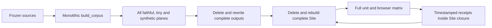
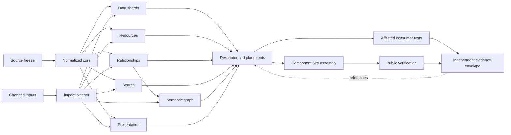

---
"@context":
  - https://chris-page-gov.github.io/okf-explorer/profile/bundle-wiki/v1/context.jsonld
  - https://chris-page-gov.github.io/okf-explorer/profile/bundle-wiki/v1/semantic-context.jsonld
"@id": https://chris-page-gov.github.io/okf-explorer/docs/postmortems/heritage-foundry-2026/architecture.html
"@type": https://schema.org/TechArticle
type: TechArticle
title: "Implemented selective-rerun architecture for the Evaluation Foundry"
description: "Implemented dependency graph, impact planner, assurance tiers and candidate/evidence separation."
generated:
  by: process:heritage-foundry-postmortem-builder
  at: "2026-08-04T05:00:00Z"
assertion_status: normalized
assertion_scope: real-world
tags:
  - postmortem
  - architecture
  - dependency-graph
  - evaluation-foundry
---
# Implemented Selective-Rerun Architecture For The Evaluation Foundry

## The Missing Control

The parent [Foundry process](../../beginners/19-foundry-authoring-and-domain-profiles.md)
already requires a consumer lock, dependency graph and transitive invalidation
rules. Its [authoring profile schema](../../../profiles/authoring/v1/domain-profile.schema.json)
provides those structures. The derivative
[Evaluation Profile v1 schema](../../../evaluation-foundry/schemas/okf-evaluation-profile.v1.schema.json)
reduces the consumer contract to a consumer name, journeys, deterministic-build
count and compatibility list. Plane roots survived, but the executable graph
that could use those roots did not.

## Historical Flow

The final edge is the observer effect: refreshing evidence changes the candidate
being evidenced.

## Implemented Candidate Flow

The evidence envelope references the immutable candidate; it is not an input to
the candidate root. The implementation is split across the
[Evaluation Profile v2](../../../evaluation-foundry/fixtures/heritage-warwickshire/evaluation-profile.yaml),
[impact planner](../../../scripts/plan_evaluation_foundry_impact.py),
[plane writer](../../../scripts/heritage_build_io.py),
[component Site cache](../../../scripts/site_component_cache.py) and
[promotion-envelope validator](../../../scripts/check_promotion_envelope.py).

## Implemented Dependency Cones

| Change class | Producer work | Consumer/publication work |
|---|---|---|
| Report copy or public link | Presentation and affected reading pages | Link check, Site component and relevant public actions |
| Registry entry | Registry projections and Site manifest | Source-selection/federation smoke and public route check |
| Search aliases or typo logic | Search plane only | Search worker tests and search-tagged questions |
| Relationship predicate/mapping | Relationship and semantic planes | Graph/Links tests; Search only if aliases derive from relationships |
| Geometry mapping | Affected record/map shards | Map tests and map-tagged questions |
| Explorer TypeScript/CSS | App build | Component/affected journeys; no corpus rebuild when contracts are unchanged |
| Protected-link observation | Evidence/freshness plane only | Scheduled receipt validation outside candidate and Site bytes; no candidate root change |
| Source or normalized core | Complete transitive closure | All affected consumer tests and release composition |

## Browser Assurance Tiers

The fail-closed impact plan and the 13-case adversarial gate are independent,
cheap prerequisites. They run in parallel, but no selected Python, app,
browser, Foundry, documentation, Site or release-policy job starts until both
have passed. Those selected jobs then fan out in parallel. The Pages and
nightly full-shadow workflows use the same adversarial prerequisite, so an
already-reconstructed late-finding class cannot consume a full candidate build
or three-engine run before it fails.

The profile and CI now encode three review tiers:

1. Explorer runtime, routing, workers, storage, graph, map, styles,
   accessibility, browser dependencies, journey-runner or unknown changes run
   Chrome, Firefox and WebKit on the pull request.
2. Contract-preserving Data, Search, Semantic, registry and Presentation changes
   run deterministic contracts plus affected Chromium journeys on the pull
   request.
3. The complete three-engine matrix and complete Foundry family run on the
   [nightly full-shadow workflow](../../../.github/workflows/foundry-full-shadow.yml)
   and again before terminal promotion, regardless of selective reuse.

This is a risk classification, not a weakening of terminal assurance. The
[pull-request workflow](../../../.github/workflows/okf-explorer-ci.yml) retains a
stable aggregate required check and treats an unknown path or missing trusted
root comparison as full invalidation.

## Semantic Canonicalization

[YAML-LD](../../beginners/22-evaluation-foundry-and-yaml-ld.md) is the readable,
human-maintained authoring form. The normalized graph and Semantic plane root
define semantic equality. JSON-LD is a generated interchange representation
whenever that plane changes and again at release; it is not a second hand-edited
source. Semantic nodes and reified assertions are stable hash shards, and the old
duplicate assertion materialization is removed.

## Link Freshness Boundary

Candidate link intent is structural and stable: each shard is selected by
`SHA-256(canonical URL)`. Live network observations and protected rich-page
browser observations use the independent
[link-observation workflow](../../../.github/workflows/link-observation.yml).
Its timestamped receipts are workflow artifacts outside the candidate and Site,
so refreshing a source URL cannot change the bytes being observed.

## Impact Plan Contract

The [planner](../../../scripts/plan_evaluation_foundry_impact.py) produces a
schema-validated `impact-plan.json` containing:

- old and new input roots;
- changed normalized entities or configuration paths;
- affected producer nodes and the graph edge that selected each node;
- roots eligible for reuse;
- required validators, question tags, journey groups and public actions;
- whether a full audit is mandatory;
- an explanation suitable for review.

Its executable interfaces are `--explain`, `--changed-from`, `--changed-path`,
`--plane`, `--fixture`, `--test-tag` and `--journey-group`. The
[impact tests](../../../tests/test_evaluation_foundry_impact.py) replay historical
#68/#69 root receipts, exercise explicit selectors and require unknown or
untrusted changes to fail closed.

## Publication And Release Boundary

The independently rooted
[`okf-heritage-coventry-warwickshire` publication unit](../../../publication-units/heritage-coventry-warwickshire/publication-unit.json)
owns corpus/data/readers and release assets; the main repository retains the
Explorer runtime, common schemas, registry and documentation shell. Export and
local validation are implemented. Remote repository creation, exact Pages
identity journeys, registry activation and terminal promotion remain pending
until their real deployed URLs and bytes can be checked.

Terminal policy requires an annotated tag bound to the exact commit, a GitHub
artifact attestation, platform immutable releases, draft-first attachment of all
assets and a deterministic archive retained as an immutable release asset. The
[policy](../../../release-assurance/release-policy.json),
[validator](../../../scripts/check_release_policy.py) and
[external promotion workflow template](../../../publication-units/heritage-coventry-warwickshire/repository-template/promotion-release.yml)
implement those gates; this report does not claim they have passed for a public
external release yet.

## Acceptance Boundary

Local tests and deterministic checks can accept implementation structure and
candidate bytes. Only the eventual public identity journey, signed or attested
promotion envelope and platform immutable release can change the external unit
from pending to promoted. See the
[implementation register](data/implementation-acceptance-register.json) and
[decision register](data/architecture-decisions.json) for that state split.
