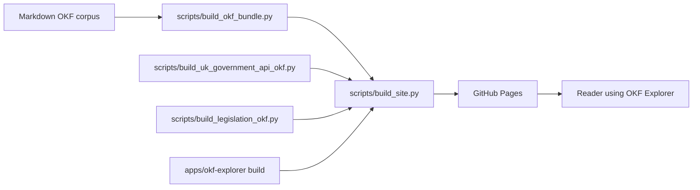

# Repository Guide

This repository is migrating toward one product job and one temporary
compatibility job:

1. Publish a static OKF Explorer that can load OKF bundles from any public HTTPS
   URL.
2. Preserve current exemplar URLs while production bundles move to independent
   versioned publication units referenced by the registry.

## Map Of The Repository

| Path | Purpose |
|------|---------|
| `apps/okf-explorer/` | Canonical SvelteKit OKF Explorer. This is the main UI source. |
| `explorer/` | Dependency-free compatibility Explorer PWA source, published under `legacy/`. |
| `viewer.html` and `view.html` | Legacy single-file viewer surfaces. |
| `scripts/build_okf_bundle.py` | Builds the small Markdown-derived `okf-bundle.json`. |
| `scripts/build_uk_government_api_okf.py` | Builds the UK Government APIs large-corpus pack. |
| `scripts/build_legislation_okf.py` | Builds the complete work-level legislation.gov.uk pack. |
| `scripts/check_legislation_okf.py` | Enforces legislation corpus completeness and publication invariants. |
| `scripts/build_site.py` | Builds the static Pages site in `_site/`. |
| `scripts/okf_semantic.py` | YAML 1.2/YAML-LD parser, pinned context loader, profile validation and JSON-LD projection. |
| `scripts/build_okf_registry.py` | Generates Explorer JSON and JSON-LD registries from one YAML-LD source. |
| `profiles/bundle-wiki/v1/` | Experimental OKF Bundle Wiki profile, context, JSON Schemas and SHACL shapes. |
| `registry/okf-registry.yamlld` | Single semantic source for the public registry projections. |
| `constraints/source-constraints.yamlld` | Machine-readable fair-use, access and licensing escalation ledger. |
| `scripts/evaluate_okf_explorer.mjs` | Runs the 100-question browser evaluation harness. |
| `uk-government-apis/` | Generated UK Government APIs OKF large-corpus descriptor, shards, selected Markdown records and organisation records. |
| `legislation/` | Generated UK Legislation descriptor, compressed work/search chunks, ontology, access, type and topic concepts. |
| `docs/uk-legislation/` | Maintained legislation documentation spine and illustrated manual. |
| `evaluation/legislation/` | Barrister-oriented AI answer suite, rubric and provenance schema. |
| `docs/` | Manuals, evaluation docs, conformance notes, the DCAT-AP/OpenAPI standards crosswalk and review history. |
| `evaluation/okf-explorer/` | UK Government APIs question suite and visual-regression evidence. |
| `evaluation/gov-ckan/` | GOV.UK CKAN paired exemplar question suite. |
| `document/`, `stack/`, `standards/`, `federated/`, `frameworks/`, `research/`, `uk-government/`, `organisations/`, `glossary/` | The local Markdown OKF corpus used by the small bundle. |
| `okf.config.json` | Small-bundle corpus configuration. |
| `okf-registry.json` and `okf-registry.jsonld` | Generated registry projections for the Explorer and Linked Data clients. |
| `CHANGELOG.md` | User-visible change history and validation record. |

## Publication Pipeline



The source of truth for the local small bundle is Markdown. The source of truth
for the UK Government APIs exemplar is the generator plus official harvested
sources and fixtures. The generated JSON and selected Markdown files under
`uk-government-apis/` are committed so the exemplar can be browsed and tested
without a live server.

The UK Legislation source boundary is the generator plus official Atom/CLML
interfaces and cached source responses. Generated compressed work/search
chunks are committed; provision trees are resolved from official CLML only
when selected. Documentation state and screenshot routes are maintained under
`docs/uk-legislation/` and `docs/assets/uk-legislation-manual/`.

## Stable Public Entry Points

- Root Explorer redirect:
  `https://chris-page-gov.github.io/okf-explorer/`
- Svelte Explorer:
  `https://chris-page-gov.github.io/okf-explorer/`
- Legacy compatibility Explorer:
  `https://chris-page-gov.github.io/okf-explorer/legacy/`
- UK Government APIs descriptor:
  `https://chris-page-gov.github.io/okf-uk-government-apis/okf-explorer.json`
- UK Government APIs in Explorer:
  `https://chris-page-gov.github.io/okf-explorer/?bundle=https%3A%2F%2Fchris-page-gov.github.io%2Fokf-uk-government-apis%2Fokf-explorer.json&view=reader#overview`
- UK Legislation descriptor:
  `https://chris-page-gov.github.io/okf-uk-legislation/okf-explorer.json`
- UK Legislation in Explorer:
  `https://chris-page-gov.github.io/okf-explorer/?bundle=https%3A%2F%2Fchris-page-gov.github.io%2Fokf-uk-legislation%2Fokf-explorer.json&view=reader#overview`

Former `ai-infrastructure-wiki` routes remain available for a deprecation cycle.
Human routes redirect while former bundle descriptor routes return the
machine-readable `okf-moved.v1` contract consumed by Explorer v0.4.0 and later.

## Local Validation

Run these before publication work:

```sh
python3 scripts/build_uk_government_api_okf.py --check
python3 scripts/check_legislation_okf.py
python3 scripts/build_okf_registry.py --check
python3 scripts/check_source_constraints.py
python3 scripts/check_documentation_lockstep.py
python3 scripts/build_okf_bundle.py --check
python3 scripts/update_viewer.py --check
python3 scripts/check_okf.py
python3 scripts/build_site.py
```

Large-corpus generators must publish both chunked whole-corpus relationships
and `data/adjacency/manifest.json`. The latter uses `fnv1a32-prefix-2` buckets
for route-scoped hydration; the Explorer and generators share test vectors so
non-ASCII route identifiers remain portable.

If the Explorer app changed:

```sh
cd apps/okf-explorer
pnpm check
pnpm test
pnpm build
cd ../..
python3 scripts/build_site.py
```

## How To Decide What To Read

If you are browsing an existing pack, start with
[okf-explorer-persona-manual.md](okf-explorer-persona-manual.md).

If you are researching legislation, start with the
[UK Legislation documentation spine](uk-legislation/index.md) and its
[illustrated manual](uk-legislation/illustrated-manual.md).

If you are asking an AI to answer questions from a pack, start with
[ai-okf-usage.md](ai-okf-usage.md).

If you are building a new pack, start with
[okf-bundle-authoring.md](okf-bundle-authoring.md) and keep
[explorer-overview-context.md](explorer-overview-context.md) open for the
large-corpus descriptor contract. If you need to check a field against an
external standard, see [okf-standards-crosswalk.md](okf-standards-crosswalk.md)
for the DCAT-AP/OpenAPI mapping.

If you are changing the Explorer UI, run the harness described in
[okf-explorer-evaluation.md](okf-explorer-evaluation.md) and update
`CHANGELOG.md`.
