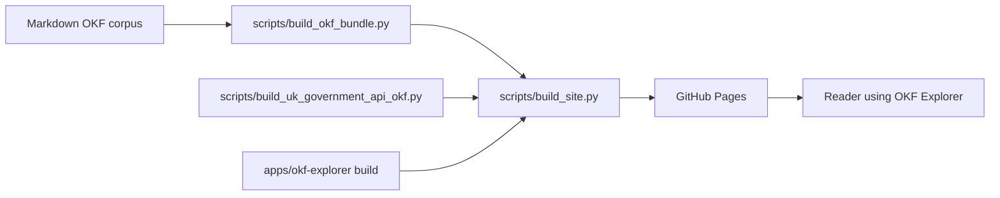

# Repository Guide

This repository has two jobs:

1. Publish a static OKF Explorer that can load OKF bundles from any public HTTPS
   URL.
2. Publish exemplar OKF bundles, including the local AI infrastructure wiki and
   the UK Government APIs large-corpus pack.

## Map Of The Repository

| Path | Purpose |
|------|---------|
| `apps/okf-explorer/` | Canonical SvelteKit OKF Explorer. This is the main UI source. |
| `explorer/` | Dependency-free compatibility Explorer PWA served at the Pages root. |
| `viewer.html` and `view.html` | Legacy single-file viewer surfaces. |
| `scripts/build_okf_bundle.py` | Builds the small Markdown-derived `okf-bundle.json`. |
| `scripts/build_uk_government_api_okf.py` | Builds the UK Government APIs large-corpus pack. |
| `scripts/build_site.py` | Builds the static Pages site in `_site/`. |
| `scripts/evaluate_okf_explorer.mjs` | Runs the 100-question browser evaluation harness. |
| `uk-government-apis/` | Generated UK Government APIs OKF large-corpus descriptor, shards, selected Markdown records and organisation records. |
| `docs/` | Manuals, evaluation docs, conformance notes and review history. |
| `evaluation/okf-explorer/` | UK Government APIs question suite and visual-regression evidence. |
| `evaluation/gov-ckan/` | GOV.UK CKAN paired exemplar question suite. |
| `document/`, `stack/`, `standards/`, `federated/`, `frameworks/`, `research/`, `uk-government/`, `organisations/`, `glossary/` | The local Markdown OKF corpus used by the small bundle. |
| `okf.config.json` | Small-bundle corpus configuration. |
| `okf-registry.json` | Suggested public bundle URLs for the Explorer. |
| `CHANGELOG.md` | User-visible change history and validation record. |

## Publication Pipeline



The source of truth for the local small bundle is Markdown. The source of truth
for the UK Government APIs exemplar is the generator plus official harvested
sources and fixtures. The generated JSON and selected Markdown files under
`uk-government-apis/` are committed so the exemplar can be browsed and tested
without a live server.

## Stable Public Entry Points

- Root compatibility Explorer:
  `https://chris-page-gov.github.io/ai-infrastructure-wiki/`
- Svelte Explorer:
  `https://chris-page-gov.github.io/ai-infrastructure-wiki/next/`
- UK Government APIs descriptor:
  `https://chris-page-gov.github.io/ai-infrastructure-wiki/uk-government-apis/okf-explorer.json`
- UK Government APIs in Explorer:
  `https://chris-page-gov.github.io/ai-infrastructure-wiki/next/?bundle=https%3A%2F%2Fchris-page-gov.github.io%2Fai-infrastructure-wiki%2Fuk-government-apis%2Fokf-explorer.json&view=reader#overview`

## Local Validation

Run these before publication work:

```sh
python3 scripts/build_uk_government_api_okf.py --check
python3 scripts/check_documentation_lockstep.py
python3 scripts/build_okf_bundle.py --check
python3 scripts/update_viewer.py --check
python3 scripts/check_okf.py
python3 scripts/build_site.py
```

If the Explorer app changed:

```sh
cd apps/okf-explorer
pnpm check
pnpm test
pnpm build
cd ../..
python3 scripts/build_site.py
```

## How To Decide What To Read

If you are browsing an existing pack, start with
[okf-explorer-persona-manual.md](okf-explorer-persona-manual.md).

If you are asking an AI to answer questions from a pack, start with
[ai-okf-usage.md](ai-okf-usage.md).

If you are building a new pack, start with
[okf-bundle-authoring.md](okf-bundle-authoring.md) and keep
[explorer-overview-context.md](explorer-overview-context.md) open for the
large-corpus descriptor contract.

If you are changing the Explorer UI, run the harness described in
[okf-explorer-evaluation.md](okf-explorer-evaluation.md) and update
`CHANGELOG.md`.
