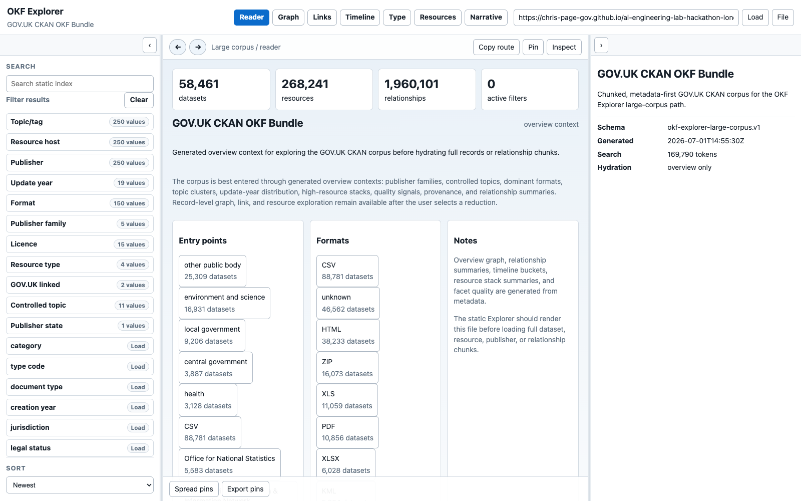
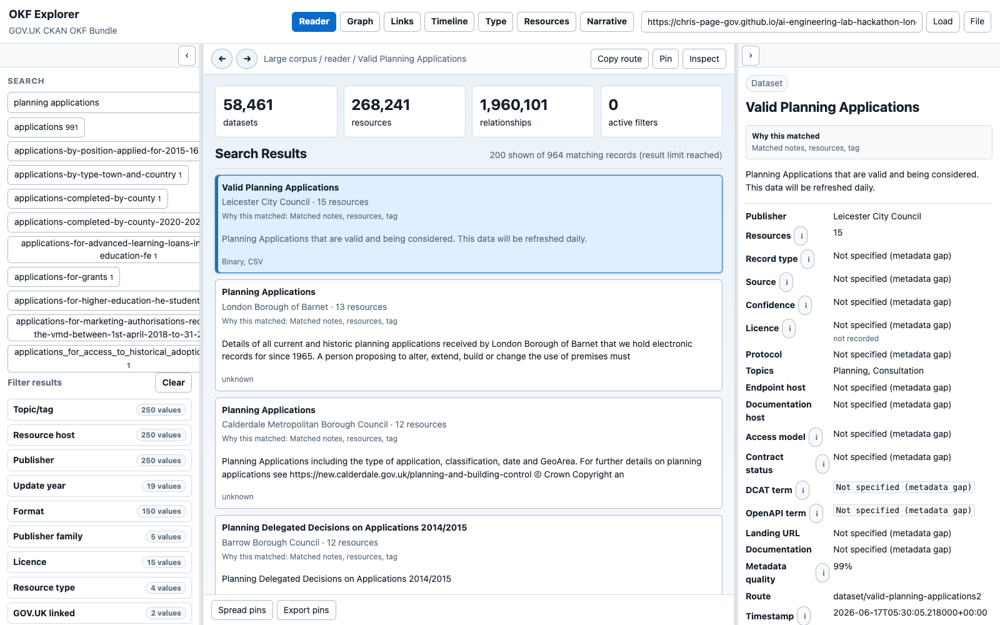
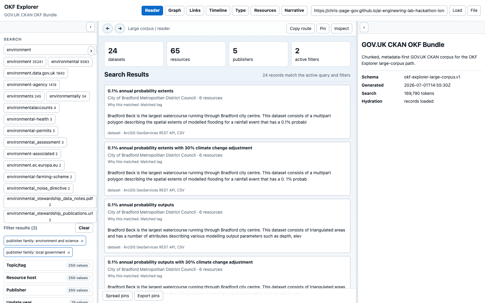

# Static Search and Filtering Manual

This illustrated manual covers the deterministic search and filtering
interface introduced on `codex/static-search-filtering`. It uses the real
GOV.UK CKAN descriptor: 58,461 datasets, 268,241 resources and 1,960,101
relationships.

> **Why the hosted Explorer may still look unchanged:** at capture time, the
> public Pages site served the pre-feature `main`. These screenshots were
> captured from the local Pages build of the feature branch on 2026-07-13. If
> the hosted controls still differ, confirm that this branch has been reviewed,
> merged and deployed.

Explorer remains a static browser application. Search does not call an LLM,
embedding service, Vespa deployment, remote retrieval service or agent API.

## 1. Recognise The New Controls

The left panel now separates three tasks:

1. **Search** finds lexical matches in the static index.
2. **Filter results** reduces the candidate set using structured metadata.
3. **Sort** orders the resulting records.



In this unfiltered state:

- the metrics show the complete large-corpus overview;
- facets remain folded until opened;
- the default sort is **Newest** because there is no text query;
- the application has loaded only overview context, not every record; and
- the selected route remains in the URL hash.

The public CKAN descriptor in the screenshot uses the v1 search manifest. The
branch deliberately retains that compatibility path. A regenerated v2 corpus
uses the same interface and URLs but can apply indexed filter postings without
hydrating the full record index.

## 2. Search And Read The Result Total

Enter ordinary words or a known identifier in Search. Text queries default to
**Relevance** unless the URL or user explicitly selects another order.



The `planning applications` example demonstrates several new behaviours:

- `200 shown of 964 matching records (result limit reached)` distinguishes the
  displayed page from the complete candidate count;
- every result says which indexed fields matched instead of displaying an
  unexplained numeric score;
- the selected record repeats its match explanation in the right panel;
- inferred, confidence and metadata-quality fields remain visible as signals,
  not assurances; and
- missing metadata is rendered as `Not specified (metadata gap)` rather than
  raw `None`, `null` or an empty value.

“Why this matched” describes deterministic evidence such as title, notes,
resources, tags, provider or identifier fields. It is not a generated answer
and does not claim that the record is authoritative, complete or operational.

### Search for an organisation or abbreviation

Organisation names should not behave like unrelated everyday words. When an
exact query uniquely identifies a publisher, Explorer shows the interpretation
and uses that publisher's existing static postings as the candidate set. For
example, `Home Office` is interpreted as the Home Office organisation rather
than separate matches for “home” and “office”. An unambiguous initialism such as
`DSIT` resolves to Department for Science, Innovation and Technology even when
the letters are not a lexical term in the record text.

The behaviour stays inspectable:

- autocomplete labels a recognised **Organisation** and its record count
  instead of exposing a wall of raw token completions;
- the search panel states which organisation was recognised;
- every result's “Why this matched” text repeats the interpretation; and
- ambiguous abbreviations remain ordinary queries until the user chooses a
  specific entity.

New `okf-static-search.v2` bundles can publish authoritative labels and aliases
in `data/search/entities.json`. Older CKAN v1 bundles derive exact organisation
names and conservative initialisms from the compact publisher facet and reuse
its delta-encoded postings, so this recognition does not require full-corpus
hydration. Explicit aliases supplied by a bundle take precedence over inferred
initialisms.

## 3. Add And Remove Filters

Open a facet and select a value. A normal click replaces the current value in
that facet. Ctrl-click, Cmd-click or Shift-click adds another value.

The semantics are fixed and shareable:

- **AND between different facets**; and
- **OR between multiple values in the same facet**.



Here the two publisher-family values are alternatives within one facet, so a
record may be in `environment and science` **or** `local government`. The
query still applies as an additional constraint. Explorer reports 24 matching
records, 65 resources and 5 publishers in the reduced context.

Each active choice becomes a chip:

- select the `x` on one chip to remove only that value;
- select **Clear** to remove all facet values; or
- use browser Back/Forward to restore an earlier retrieval state.

With an `okf-static-search.v2` corpus, filters are applied before the result
limit and facet counts are recalculated using the query plus every active
filter except the facet whose choices are being counted. Missing indexed
values use an internal sentinel but are always displayed as **Not specified
(metadata gap)**.

## 4. Choose A Sort Order

The Sort menu offers:

| Sort | Behaviour |
| --- | --- |
| Relevance | Uses the selected deterministic lexical ranking for a text query. With no query it falls back to newest. |
| Newest | Orders by the best available record timestamp, then title. |
| Title | Orders alphabetically by title. |
| Metadata quality | Orders by the recorded metadata-quality signal, then title. This is a completeness signal, not service assurance. |

Defaults are intentional:

- a text query defaults to **Relevance**;
- filter-only browsing defaults to **Newest**; and
- choosing a different sort writes it to the public URL.

The ranking benchmark evaluates current weighted scoring, field-weighted IDF,
and IDF with exact title/identifier/phrase boosts. Weighted scoring remains the
default because neither alternative met the required 3% macro nDCG@10
improvement gate without weakening the other safeguards.

## 5. Share And Restore Retrieval State

Search state is inspectable rather than hidden in application storage. The URL
uses this contract:

```text
?q=...&filter.<facet>=...&filter.<facet>=...&sort=...#<route>
```

The state shown in the third screenshot is equivalent to:

```text
?q=environment
&filter.publisher_family=environment%20and%20science
&filter.publisher_family=local%20government
&sort=metadata-quality
#overview
```

The two repeated `filter.publisher_family` parameters preserve the OR
selection. The `#overview` portion remains the selected Explorer route. On
initial load and browser Back/Forward, Explorer restores the query, valid
filters, sort and selected route. Malformed or unsupported facet keys and sort
names are ignored safely; an unknown value simply cannot match the indexed
corpus. Existing `bundle`, `view` and hash links remain compatible.

Small OKF bundles use the same `q` and `sort` parameters plus repeated
`filter.type` values. They do not load the large-corpus worker.

## 6. Understand V1 And V2 Corpus Behaviour

| Corpus | Search and filter behaviour |
| --- | --- |
| `okf-static-search.v2` | Lazily loads ordinal filter postings, applies filters before limiting results, calculates dynamic facet counts and returns structured match evidence. |
| Existing v1 manifest | Continues lexical worker search, reuses legacy publisher postings for recognised organisations and uses the existing full-index filtering path when other filter postings are unavailable. URLs and visible semantics remain the same. |
| Small bundle | Uses in-memory lexical matching, type filters and the shared URL/sort contract. |

The screenshots use the published CKAN v1 corpus to prove compatibility with a
real large corpus. The right panel reports `records loaded` after the v1
fallback hydrates record data. A v2 rebuild avoids that full hydration for
indexed facets.

## 7. Troubleshooting

| Symptom | Check |
| --- | --- |
| Hosted interface looks like the previous release | Confirm the feature branch has been merged and the Pages deployment has completed. Until then, use a local branch build. |
| Search is still preparing | Large corpora load only the lexicon and posting shards needed by the query. Wait for the visible preparation/search status to clear. |
| Selecting a facet loads records | The corpus probably has a v1 manifest or lacks postings for that facet, so Explorer is using the correctness fallback. |
| Result count exceeds the cards shown | The static result limit was reached; the total is the candidate count, not the number of rendered cards. |
| A filter disappears from a copied URL | Its facet key is unsupported or malformed and was ignored safely. An unknown but well-formed value instead produces an empty reduction. |
| Metadata quality appears high | Treat it as record completeness only. Inspect provenance, source, confidence, licence and contract fields separately. |

For Graph, Timeline, Type and Resources workflows, continue with the broader
[OKF Explorer Persona Manual](okf-explorer-persona-manual.md).
