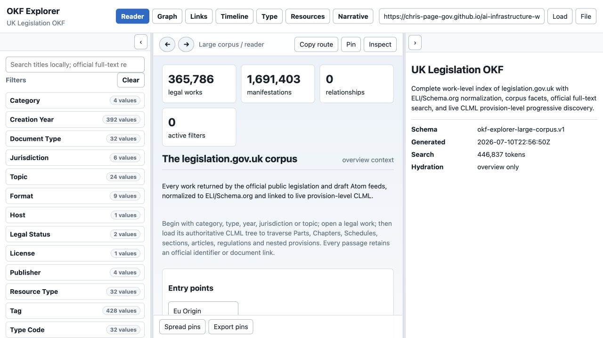
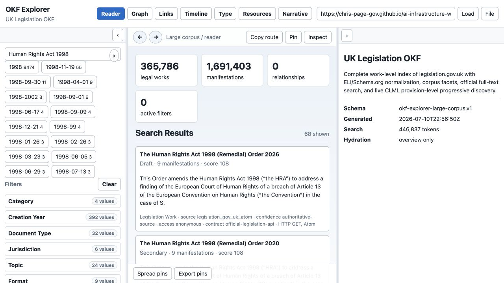
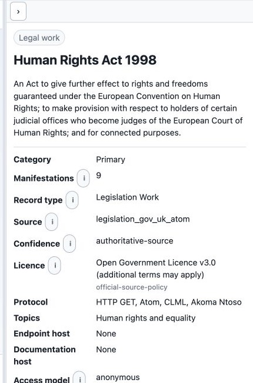
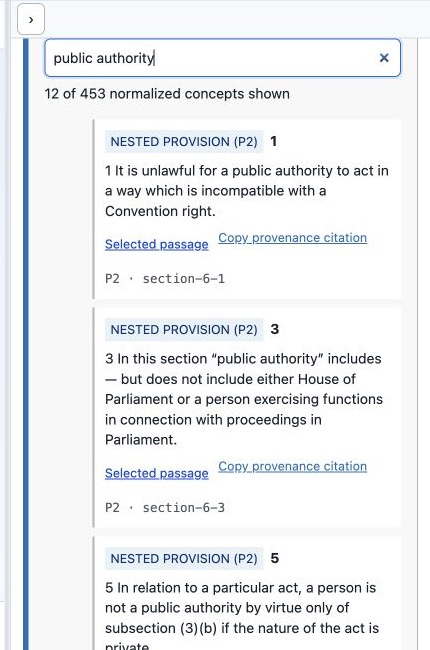

# Illustrated UK Legislation OKF Manual

[Documentation spine](index.md) · [Getting started](getting-started.md) · [Personas and journeys](personas-and-user-journeys.md) · [Agent guide](agent-research-guide.md) · [Evaluation](evaluation-and-quality.md) · [Maintenance](maintenance.md)

This manual is organized around the personas and journeys in [Personas and user journeys](personas-and-user-journeys.md). Screenshots were captured from the hosted Explorer on 2026-07-11. Their routes and refresh instructions are recorded in [the screenshot manifest](../assets/uk-legislation-manual/manifest.json) and [maintenance guide](maintenance.md).

## 1. Orient before searching

**Persona:** policy researcher or first-time user  
**User story:** As a researcher, I want to understand the corpus before searching so I do not mistake a pack count for a claim about all law.

Check:

- the title says **UK Legislation OKF**;
- legal works and manifestations are counted separately;
- Category, Creation Year, Document Type, Jurisdiction and Topic are available;
- the generated timestamp and overview-only hydration state are visible;
- notices explain official versus derived metadata.

The initial state is intentionally lightweight. It does not load hundreds of thousands of work records or provision trees.

## 2. Search without confusing related instruments

**Persona:** pupil barrister or paralegal  
**User story:** As a pupil, I want to find the Human Rights Act 1998 while seeing related instruments so I can select the principal Act deliberately.

Steps:

1. Search `Human Rights Act 1998`.
2. Compare principal, remedial, amendment, commencement and draft results.
3. Prefer the exact title only after checking Category, type, year and number.
4. Retain the search in the URL so the research state can be shared.

Expected behaviour:

- search starts from compressed static shards;
- official full-text Atom results can supplement local title matches;
- results state source, confidence, access and protocol;
- a high score is relevance, not legal currency.

## 3. Inspect identity and provenance

**Persona:** barrister or legislative data engineer  
**User story:** As counsel, I want the record card to distinguish authoritative identifiers and formats from derived catalogue fields.

Record before relying on the work:

- official identifier;
- document type and normalized category;
- year and number;
- jurisdiction;
- legal-status warning;
- source adapter and confidence;
- available manifestations and official work/contents/effects links.

The record uses ELI and Schema.org alignment for interoperability, while CLML remains the authoritative structural source. The Open Government Licence statement does not remove any additional terms applying to particular material.

## 4. Resolve and cite the selected passage

**Persona:** barrister or AI operator  
**User story:** As counsel, I want to search the authoritative instrument structure and cite the exact wording supporting each proposition.

Steps:

1. Select **Load every Part, Chapter, section, article and nested provision**.
2. Search within the instrument for `public authority` or a provision number.
3. Read the normalized provision label together with its CLML element and ID.
4. Open **Selected passage** to verify the official pinpoint source.
5. Use **Copy provenance citation**, then add version, commencement, extent, amendments and retrieval date.

The filter shown reduces 453 normalized Human Rights Act concepts to the provisions containing the phrase. Nested P2-P7 structures remain explicitly identified rather than being falsely promoted to top-level sections.

## 5. Build the answer as propositions

**Persona:** AI operator or evaluator  
**User story:** As an evaluator, I want every material statement to be traceable so a fluent answer cannot hide unsupported conclusions.

For each proposition, create:

| Field | Requirement |
|---|---|
| claim | one material legal proposition |
| source title | exact work/instrument title |
| URL | direct selected-passage URL |
| passage | supporting text or faithful pinpoint extract |
| version | point-in-time/current-text context |
| commencement | checked status or explicit uncertainty |
| extent | territorial application or explicit uncertainty |
| amendments | applied/unapplied effects checked |
| retrieved at | ISO date |

Validate the answer against `evaluation/legislation/answer-schema.json` and score it with `scripts/evaluate_legislation_answers.py`. Missing official or proposition-level provenance triggers the suite's hard cap.

## 6. Know when to leave the pack

The Explorer answers questions about the legislation corpus. Leave it—and say why—when the task needs:

- case law or judicial treatment;
- a citator or authoritative commencement analysis beyond the displayed sources;
- procedural rules or practice directions not represented as legislation.gov.uk works;
- facts, evidence or client instructions;
- legal advice rather than source-grounded research assistance.

## Updating this manual

Do not replace screenshots casually. Follow the state contract in [maintenance.md](maintenance.md): reproduce the route and interaction, verify the expected text, capture at 1280×720, update the manifest, inspect the image, and rerun the Pages build. If only counts changed, update the affected screenshots and text without rewriting stable user journeys.
