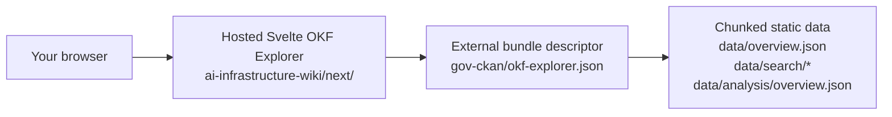
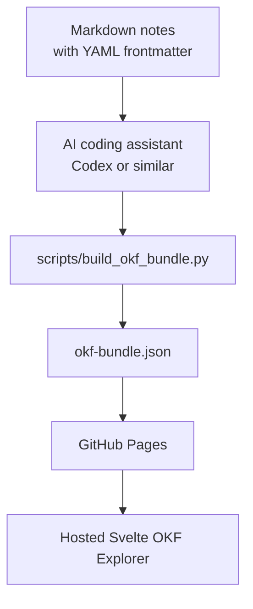

# Use The OKF Explorer With Your Own Bundle

This manual shows the fastest path from a folder of Markdown notes to a public
OKF bundle that can be opened in the hosted Svelte OKF Explorer.

## Try The Large CKAN Example

Open this URL first:

[GOV.UK CKAN OKF bundle in the hosted Svelte Explorer](https://chris-page-gov.github.io/ai-infrastructure-wiki/next/?bundle=https%3A%2F%2Fchris-page-gov.github.io%2Fai-engineering-lab-hackathon-london-2026%2Fgov-ckan%2Fokf-explorer.json&view=reader#overview)

It loads the Svelte Explorer from this repository and the GOV.UK CKAN
large-corpus descriptor from another repository:

```text
Explorer:
https://chris-page-gov.github.io/ai-infrastructure-wiki/next/

Bundle descriptor:
https://chris-page-gov.github.io/ai-engineering-lab-hackathon-london-2026/gov-ckan/okf-explorer.json
```

The important idea is that the Explorer and the bundle do not need to live in
the same repository. Any public HTTPS OKF bundle URL can be supplied in the
`bundle=` query parameter.



## What You Should See In The CKAN Example

1. Reader opens with a lightweight overview of the GOV.UK CKAN corpus.
2. The left panel contains search and facets such as publisher, format, tag,
   licence, host, resource type, and update year.
3. Searching for `IAPT` reduces the Reader and Graph views to relevant datasets.
4. Graph shows a bounded context, node-type key, zoom controls, and relationship
   labels without loading every relationship first.
5. Links opens relationship summaries first. Selecting a relationship summary
   opens the right-hand data card with direction, source, target, count, and
   JSON detail.

## URL Patterns

Small or medium bundles use one generated file:

```text
https://chris-page-gov.github.io/ai-infrastructure-wiki/next/?bundle=ENCODED_OKF_BUNDLE_URL
```

Large corpora use a descriptor that points at chunked static data:

```text
https://chris-page-gov.github.io/ai-infrastructure-wiki/next/?bundle=ENCODED_OKF_EXPLORER_DESCRIPTOR_URL
```

Example for a small bundle:

```text
Bundle:
https://example.github.io/my-okf/okf-bundle.json

Explorer URL:
https://chris-page-gov.github.io/ai-infrastructure-wiki/next/?bundle=https%3A%2F%2Fexample.github.io%2Fmy-okf%2Fokf-bundle.json
```

If URL encoding is confusing, open the Explorer without a `bundle=` parameter
and paste the bundle URL into the Bundle URL field:

```text
https://chris-page-gov.github.io/ai-infrastructure-wiki/next/
```

## Create A Small OKF Bundle From Markdown

Use this path for most wiki-sized projects.



### 1. Start From This Repository

Fork or clone `ai-infrastructure-wiki`.

Keep:

- `scripts/build_okf_bundle.py`
- `scripts/update_viewer.py`
- `scripts/check_okf.py`
- `scripts/build_site.py`
- `okf.config.json`
- `.github/workflows/pages.yml`
- `apps/okf-explorer/`
- `explorer/`

Then add or replace the Markdown corpus with your own notes.

Each OKF Markdown file should have YAML frontmatter like this:

```markdown
---
type: "Concept"
title: "Example concept"
description: "One sentence explaining this node."
tags: [example, okf]
timestamp: 2026-07-06T00:00:00Z
---

# Example concept

This concept links to [another concept](another-concept.md).
```

Keep links as browser-compatible Markdown links. Do not use Obsidian-only
wikilinks.

### 2. Ask A Coding Assistant To Normalize The Bundle

Paste this prompt into Codex or another coding assistant while it is opened in
your repository:

```text
You are working in a repository that should publish an Open Knowledge Format
bundle for the Markdown files in this repo.

Goal:
- Treat Markdown files as the source of truth.
- Build a small OKF bundle at okf-bundle.json that can be loaded by the hosted
  Svelte OKF Explorer.
- Keep browser-compatible Markdown links. Do not introduce Obsidian wikilinks.
- Preserve existing prose unless a frontmatter or link fix is needed.

Tasks:
1. Inspect the Markdown corpus and identify the folders that should be included.
2. Update okf.config.json so it describes this corpus, including siteTitle,
   corpus id, title, subtitle, root file, sourceRoot, markdownUrl, and section
   order.
3. If scripts/update_viewer.py has a fixed list of OKF folders, update that list
   to include the corpus folders and exclude generated or private folders.
4. Ensure every included Markdown file has YAML frontmatter with at least:
   type, title, description, and timestamp.
5. Fix broken relative Markdown links.
6. Run:
   python3 scripts/build_okf_bundle.py
   python3 scripts/update_viewer.py
   python3 scripts/check_okf.py
   python3 scripts/build_site.py
7. Report the generated bundle URL I should use after GitHub Pages is published.

Acceptance:
- okf-bundle.json is generated and committed.
- viewer.html is synchronized if the legacy viewer is retained.
- _site/ is generated locally but not committed.
- The repository can publish with GitHub Pages using GitHub Actions.
```

For a very large dataset, ask the assistant for the large-corpus path instead:

```text
This corpus is too large for one okf-bundle.json file. Build the
okf-explorer-large-corpus.v1 descriptor path instead:
- okf-explorer.json
- data/manifest.json
- data/overview.json
- data/analysis/overview.json
- chunked dataset/resource/relationship files under data/
- static search shards under data/search/

Keep startup overview-only, load search through static shards, and avoid any
runtime server dependency.
```

### 3. Validate Locally

Run the checks before publishing:

```sh
python3 scripts/build_okf_bundle.py --check
python3 scripts/update_viewer.py --check
python3 scripts/check_okf.py
python3 scripts/build_site.py
```

If you are also editing the Svelte Explorer itself:

```sh
cd apps/okf-explorer
pnpm install
pnpm check
pnpm build
```

For a normal bundle-only project, you do not need to build the Svelte Explorer.
You can use the hosted Explorer from this repository.

### 4. Publish With GitHub Pages

1. Push your repository to GitHub.
2. In repository settings, enable GitHub Pages with **GitHub Actions** as the
   source.
3. Push to `main` and wait for the Pages workflow to deploy.
4. Confirm that your bundle is public:

```text
https://YOUR-GITHUB-USER.github.io/YOUR-REPO/okf-bundle.json
```

For a large corpus, confirm the descriptor is public:

```text
https://YOUR-GITHUB-USER.github.io/YOUR-REPO/okf-explorer.json
```

### 5. Open Your Bundle In The Hosted Explorer

Paste the public bundle URL into:

```text
https://chris-page-gov.github.io/ai-infrastructure-wiki/next/
```

Or build a direct link:

```text
https://chris-page-gov.github.io/ai-infrastructure-wiki/next/?bundle=ENCODED_PUBLIC_BUNDLE_URL
```

You can encode a URL in a browser console:

```js
encodeURIComponent('https://YOUR-GITHUB-USER.github.io/YOUR-REPO/okf-bundle.json')
```

## Add Your Bundle To The Registry

To make the Explorer suggest your bundle while people type in the Bundle URL
field, add an entry to `okf-registry.json`:

```json
{
  "id": "my-okf",
  "label": "My OKF bundle",
  "url": "https://YOUR-GITHUB-USER.github.io/YOUR-REPO/okf-bundle.json",
  "kind": "external-bundle",
  "description": "Short description of the bundle."
}
```

For a large corpus, use the descriptor URL and a `kind` such as
`large-corpus`.

## Troubleshooting

- If the Explorer says it cannot load the bundle, check that the URL is public
  HTTPS and opens directly in a browser.
- If a file picker works but a URL does not, the bundle is probably not
  published to GitHub Pages yet.
- If graph or link views are slow, the bundle may need the large-corpus
  descriptor path rather than one monolithic JSON file.
- If search works locally but not after publishing, confirm that all generated
  `data/search/*` files are included in the deployed site.
- If browser navigation loses the bundle, copy the route again from the
  Explorer after the bundle has loaded.
