# Controlled language experiment report

This report documents every requested deliverable in the controlled-language experiment, with screenshots, evaluation and next steps. The prototype shows that zero language-checker findings can coexist with lost qualifications. It supports further isolated research, but no explanation has independent semantic acceptance and no production adoption is justified yet.

Prepared for Chris Page on 10 October 2026. Implementation baseline: `dddc2a7821f96b2bdf978a337c2d2f8a070774e6`. Review: [draft PR 163](https://github.com/chris-page-gov/okf-explorer/pull/163). No merge or deployment has taken place.

## How to read the screenshots

The 17 screenshots are real Chrome captures of a local, read-only documentation viewer. The viewer displays retained experiment files and clearly labelled research summaries. It is not a shipped Explorer interface. Figures 6 to 8 show complete retained explanations. Figures 15 to 17 document proposals, not implemented features. Exact source filenames and capture hashes are retained in the screenshot manifest. Source identifiers, quotations and schema values retain their original spelling.

## Coverage

- Figure 1 — Checker comparison and choice. Deliverables 1 and 2.
- Figure 2 — Optional presentation architecture. Deliverable 3.
- Figure 3 — Working scripts and reproduction. Deliverable 4.
- Figure 4 — Selected DWP question. Deliverable 5.
- Figure 5 — Frozen evidence and source context. Deliverable 6.
- Figure 6 — Baseline explanation. Deliverable 7.
- Figure 7 — STE inspired explanation. Deliverable 7.
- Figure 8 — Controlled negative control. Deliverable 7.
- Figure 9 — Raw language checker results. Deliverable 8.
- Figure 10 — Independent development checks. Deliverable 9.
- Figure 11 — Provenance and identity trace. Deliverable 10.
- Figure 12 — Bounded checker feedback replay. Deliverable 11.
- Figure 13 — Evaluation and profile recommendation. Deliverables 12 and 13.
- Figure 14 — Automated tests and CI evidence. Deliverable 14.
- Figure 15 — Terminology research. Phase 8 proposal.
- Figure 16 — MCP feasibility. Phase 9 proposal.
- Figure 17 — Controlled language before extraction. Stretch proposal.

## 1 Checker comparison and choice

Four pinned repositories were inspected. Only the SimpleEnglish mechanical checker was executed. Its standard-library implementation provides a small reproducible measurement surface without an official dictionary. The three other engines were not installed or independently validated. Formal ASD-STE100 conformity is not established. Code licences do not settle the rights to bundled dictionary content.

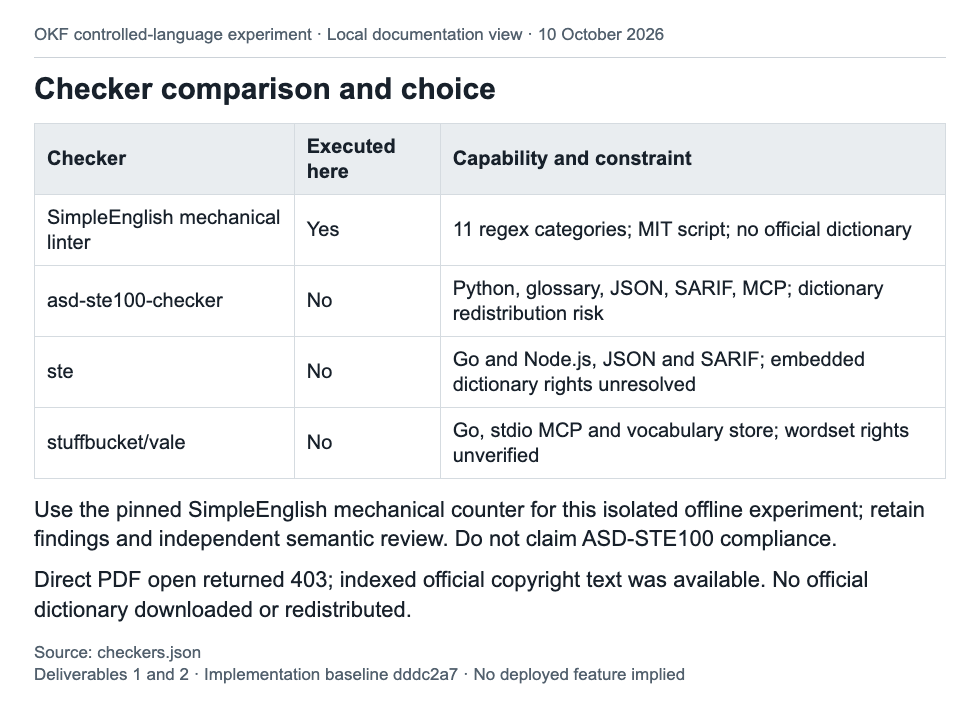

Figure 1. Deliverables 1 and 2. Local documentation view of `checkers.json`.

## 2 Optional presentation architecture

The adapter sits after evidence assembly. Each profile request binds the same complete evidence to a digest, while separate hashes identify the profile and request. A real Explorer integration test checks that its context assembly and existing A–H assessment remain unchanged. The architecture leaves retrieval, graph semantics and OKF core untouched.

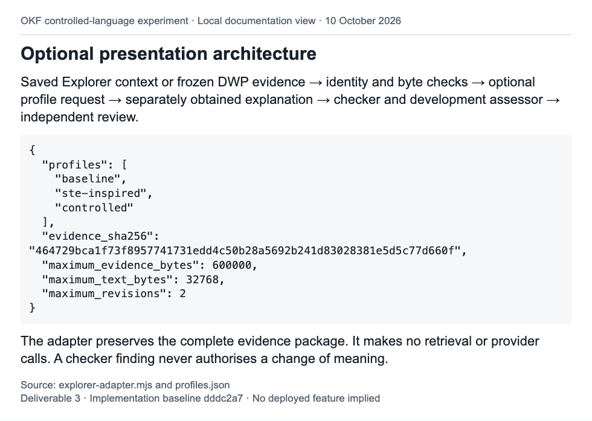

Figure 2. Deliverable 3. Local documentation view of `explorer-adapter.mjs and profiles.json`.

## 3 Working scripts and reproduction

The prototype is runnable and isolated from the Explorer interface. The offline runner reproduces the retained receipts. Request preparation and response import support a later trial, but this implementation has not executed a live model trial. Removal instructions are in the README.

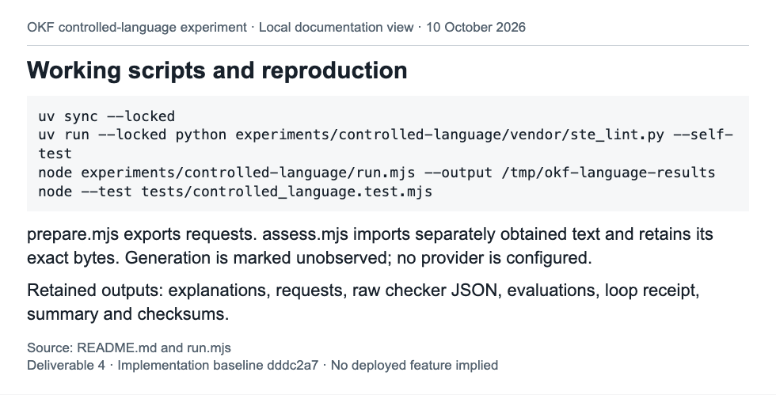

Figure 3. Deliverable 4. Local documentation view of `README.md and run.mjs`.

## 4 Selected DWP question

The case distinguishes entitlement and notification dates, qualification routes, exceptions and assessment periods. Its evidence remains insufficient. A specific assessment period, award amount or arrears total cannot be established from this package. The baseline is an illustrative source reading, because the existing Ask OKF result supplies evidence with no generated answer.

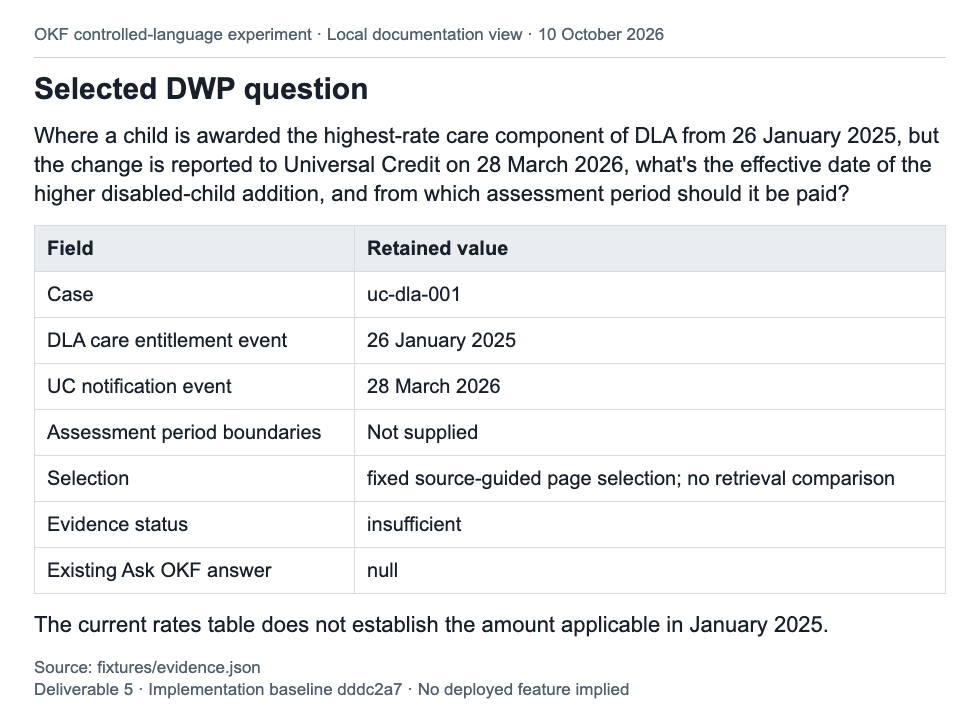

Figure 4. Deliverable 5. Local documentation view of `fixtures/evidence.json`.

## 5 Frozen evidence and source context

Five whole machine-extracted pages were frozen from the existing DWP repository. The source-guided subset deliberately includes A4361, which was missing from the earlier retrieval result; this does not demonstrate a retrieval repair. Hash checks establish byte identity. They do not prove correct extraction, historical applicability or complete source coverage.

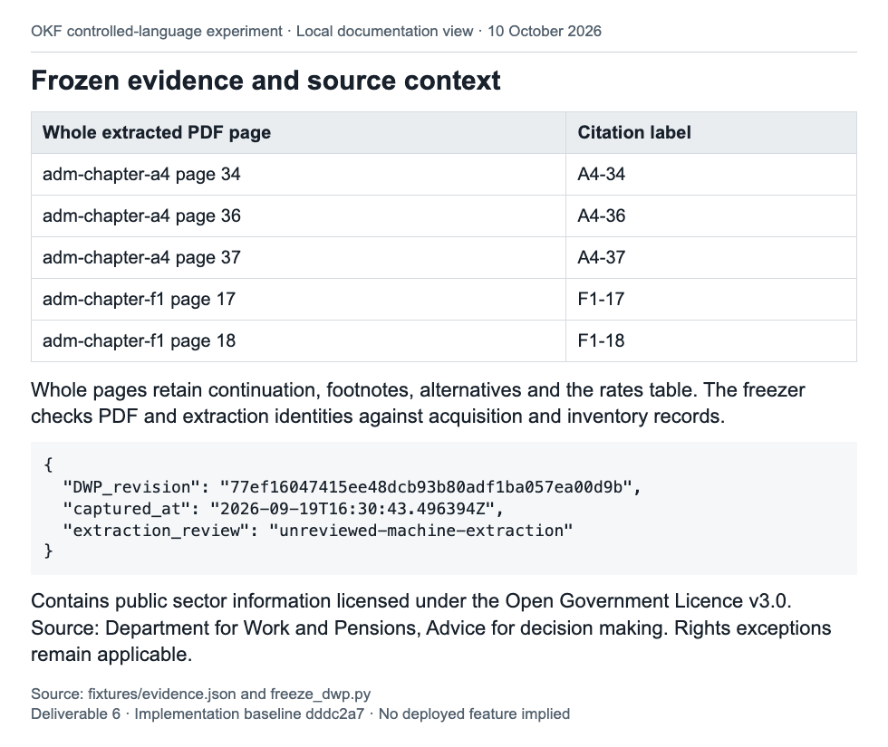

Figure 5. Deliverable 6. Local documentation view of `fixtures/evidence.json and freeze_dwp.py`.

## 6 Baseline explanation

The baseline retains the existing conditional source reading and unknowns. Its 198 words produce three heuristic findings. The declared development signals and citation labels are present, but complete semantic preservation is not established. This is an offline fixture, not a captured default Explorer answer.

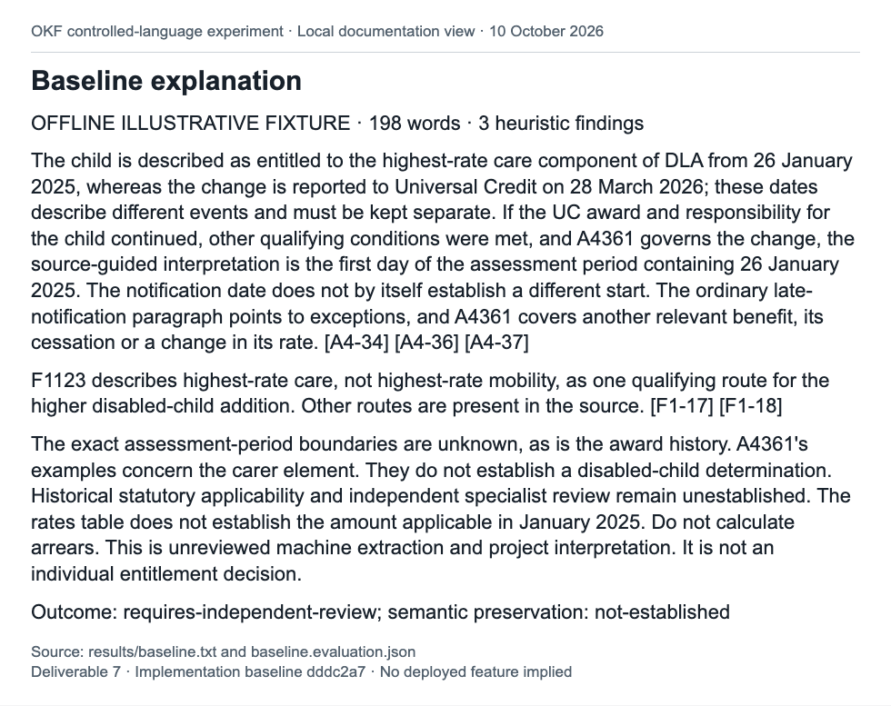

Figure 6. Deliverable 7. Local documentation view of `results/baseline.txt and baseline.evaluation.json`.

## 7 STE inspired explanation

Shorter sentences reduce this fixture to 154 words with zero heuristic findings. The declared development signals remain present. It is a candidate for independent review only. These measurements do not establish human comprehension, formal STE conformity or a model treatment effect.

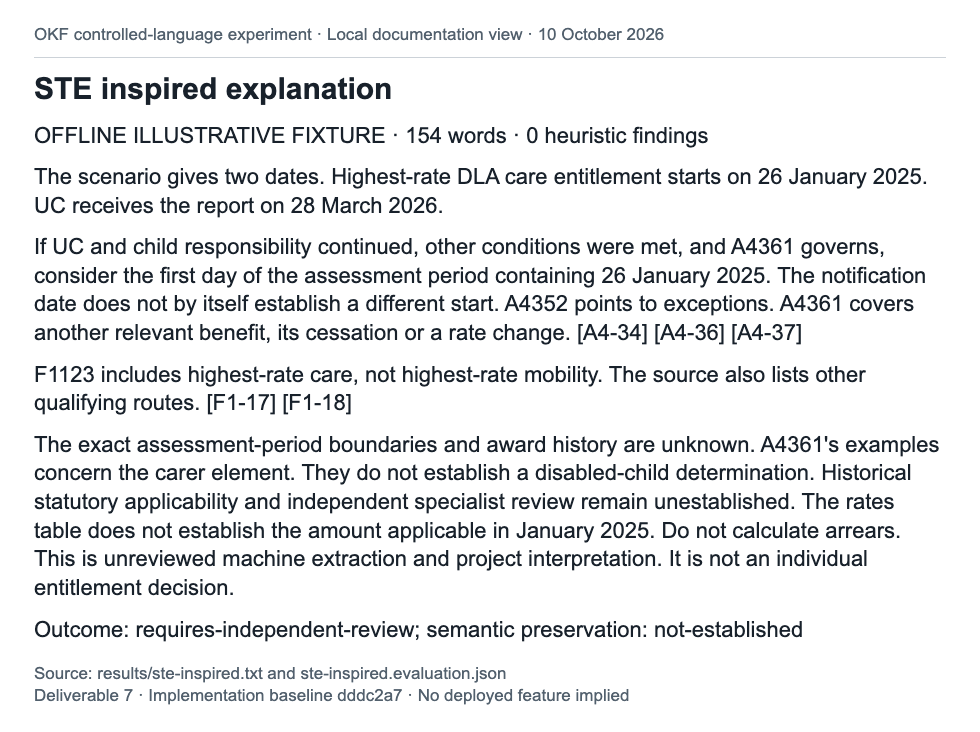

Figure 7. Deliverable 7. Local documentation view of `results/ste-inspired.txt and ste-inspired.evaluation.json`.

## 8 Controlled negative control

This deliberately lossy fixture has 119 words and zero heuristic findings. It retains all five citation labels while dropping qualifying conditions, the limitation on carer-element examples and the historical-law and specialist-review qualification. Development checks reject it. It must not be used as an approved explanation.

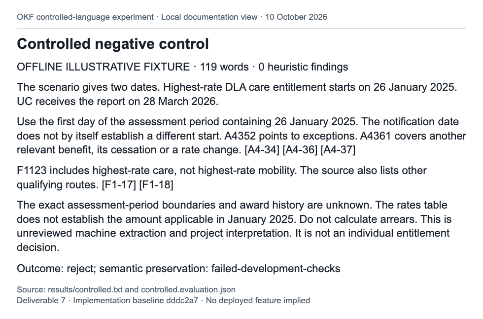

Figure 8. Deliverable 7. Local documentation view of `results/controlled.txt and controlled.evaluation.json`.

## 9 Raw language checker results

The baseline findings are two sentences over the checker limit and one semicolon. Both revised fixtures return zero findings, yet their semantic outcomes differ. Raw category counts and findings are retained separately from interpretation. Legal modality such as “may” must remain where its meaning requires it, even when flagged by the checker.

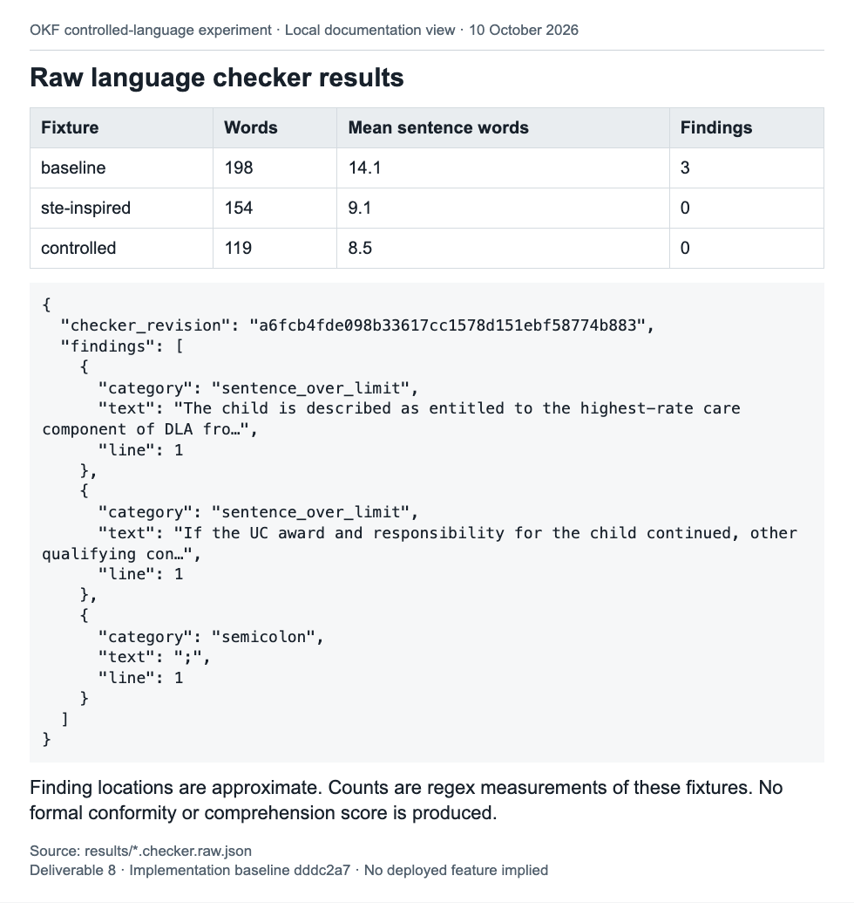

Figure 9. Deliverable 8. Local documentation view of `results/*.checker.raw.json`.

## 10 Independent development checks

The assessor is kept out of rendering requests. Missing conditional scope, carer-example limitations and historical-review qualifications cause failure. Citation presence alone cannot show that a claim is supported. Baseline and STE-inspired texts pass only the declared development checks; neither has independent semantic acceptance. Unsupported claims outside the declared patterns were not exhaustively assessed.

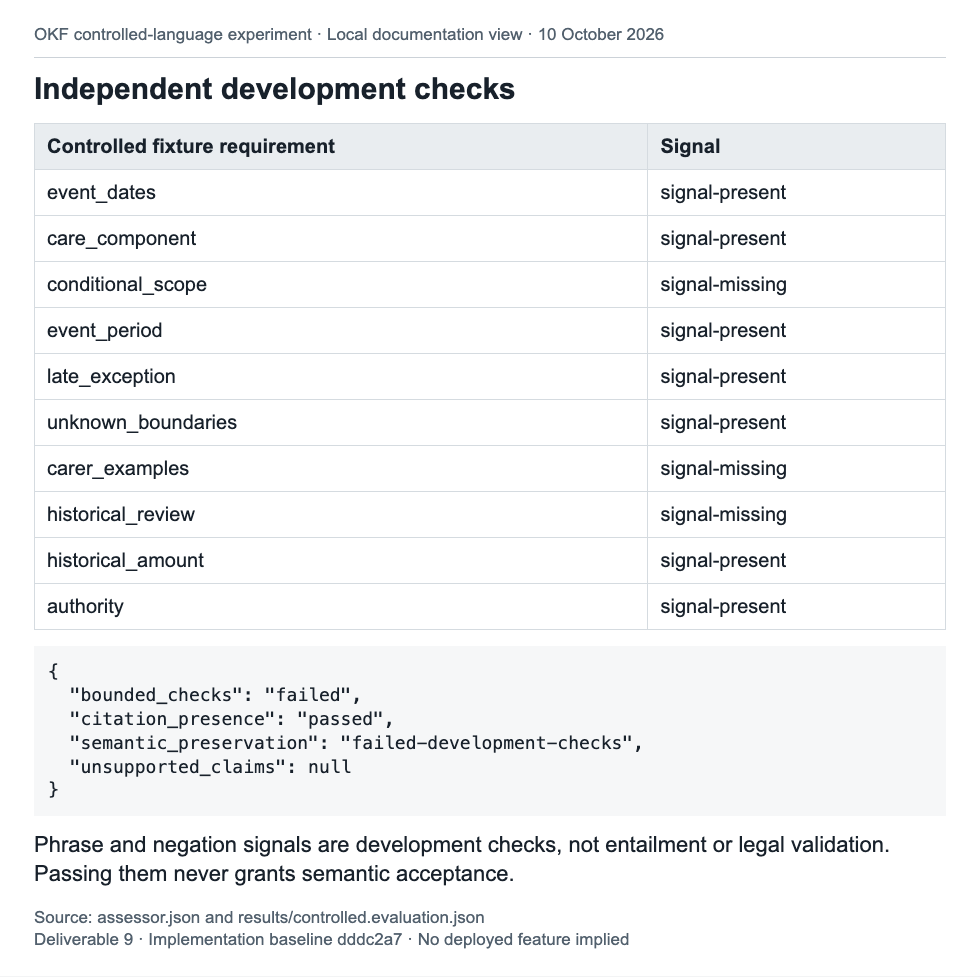

Figure 10. Deliverable 9. Local documentation view of `assessor.json and results/controlled.evaluation.json`.

## 11 Provenance and identity trace

The evidence digest covers canonical JSON. File locks and output-text hashes cover exact bytes; these digest roles must not be confused. Acquisition receipts, source URLs, extraction times, rights and source classifications remain in the package. The original DWP repository was read only. Retained departmental guidance is not legislation or a fully archived dependency closure.

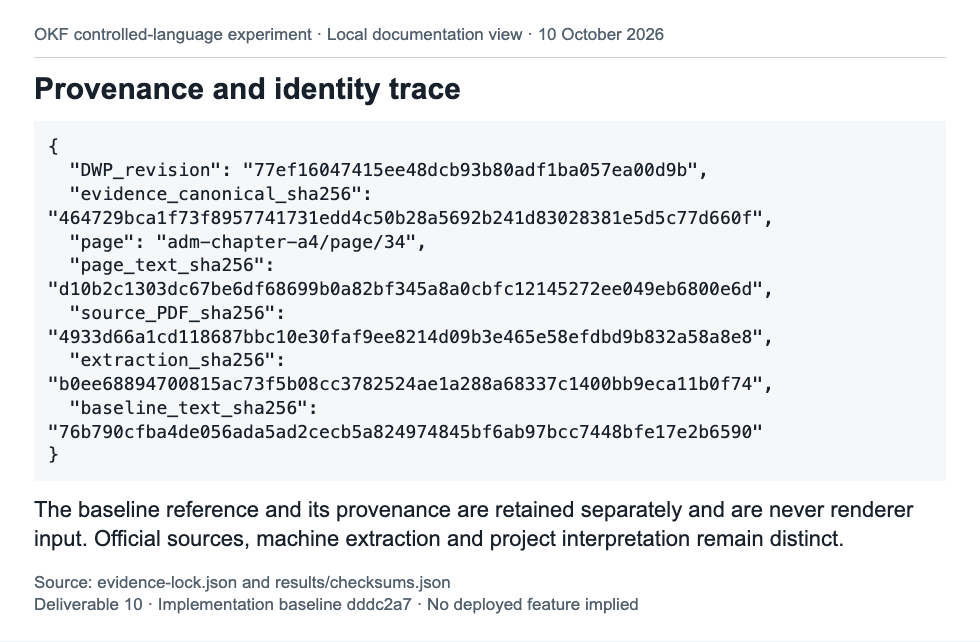

Figure 11. Deliverable 10. Local documentation view of `evidence-lock.json and results/checksums.json`.

## 12 Bounded checker feedback replay

The replay records baseline, STE-inspired and lossy controlled fixtures. It stops when the last text fails development checks and accepts no rendering. It exercises feedback receipts and revision bounds; it does not measure whether a live model follows feedback. A clean checker result is insufficient to continue towards acceptance when qualifications have been lost.

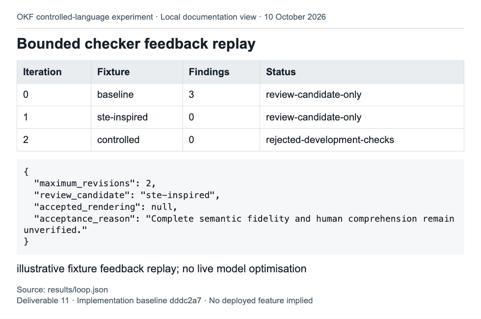

Figure 12. Deliverable 11. Local documentation view of `results/loop.json`.

## 13 Evaluation and profile recommendation

The experiment demonstrates useful engineering safeguards and a concrete failure mode. It does not establish that controlled language generally improves DWP explanations. Retain an optional downstream research capability. Do not adopt a formal ASD-STE100 profile, change OKF core or make controlled wording the Explorer default on this evidence.

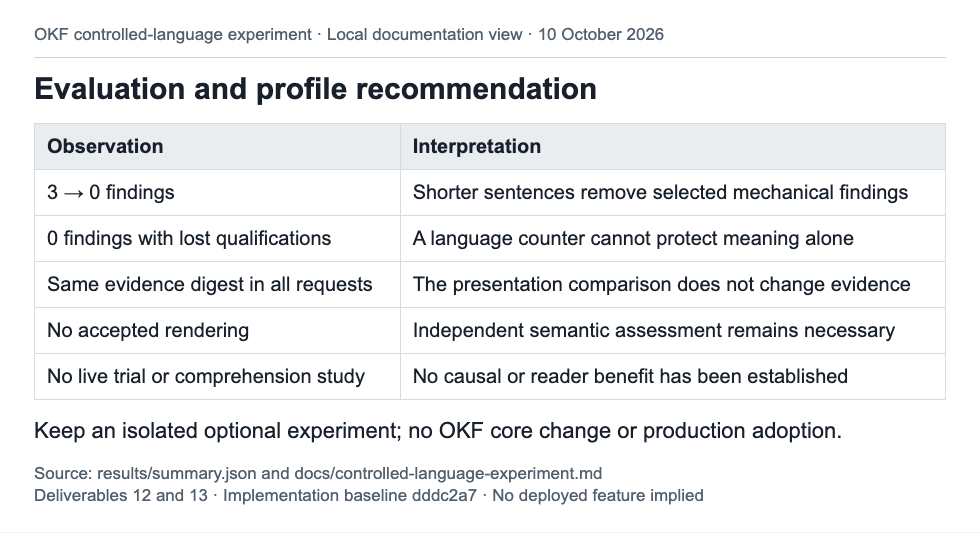

Figure 13. Deliverables 12 and 13. Local documentation view of `results/summary.json and docs/controlled-language-experiment.md`.

## 14 Automated tests and CI evidence

All 11 experiment tests passed again during document preparation. The implementation CI run succeeded on the exact recorded commit, including the full browser suite. Tests establish the recorded software behaviour and mutation rejection. They do not provide specialist legal validation or human-comprehension evidence. The CI screenshot is a local view of an inspected API receipt, not a GitHub interface capture.

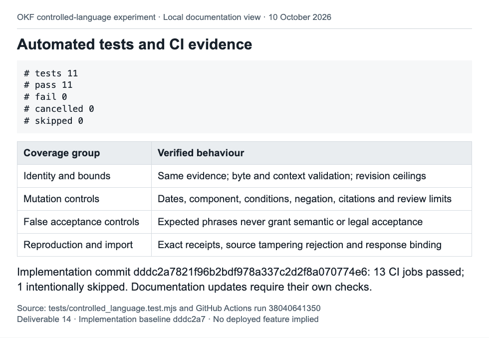

Figure 14. Deliverable 14. Local documentation view of `tests/controlled_language.test.mjs and GitHub Actions run 38040641350`.

## 15 Terminology research

Existing context records provide enough information to investigate consistent display terms without changing OKF core. This remains a design proposal. A future trial should test ambiguity, scope and meaning against independently reviewed domain cases before terms are substituted.

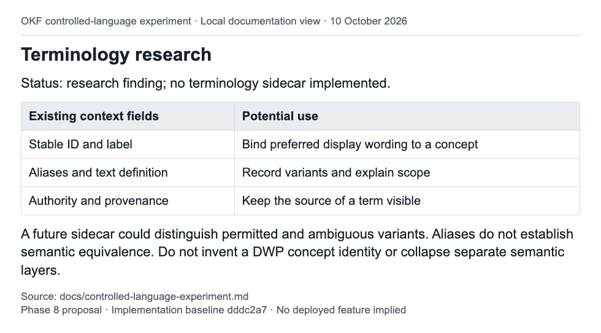

Figure 15. Phase 8 proposal. Local documentation view of `docs/controlled-language-experiment.md`.

## 16 MCP feasibility

A read-only wrapper around the checker could make the same measurements accessible to a model through Model Context Protocol. That is a feasibility inference from the existing function and CLI, not an observed live integration. A later wrapper needs client tests, timeout and size controls, and receipts that retain the checker revision.

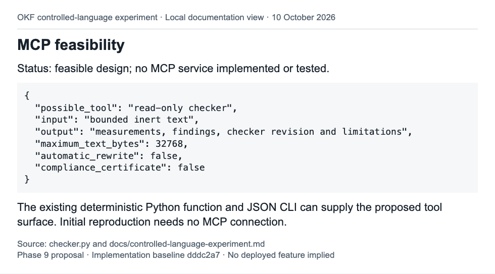

Figure 16. Phase 9 proposal. Local documentation view of `checker.py and docs/controlled-language-experiment.md`.

## 17 Controlled language before extraction

This stretch question needs a separate experiment because rewriting source text can change evidence identity and downstream graph meaning. It cannot be inferred from the current presentation-only results. Original sources must remain authoritative and available for review.

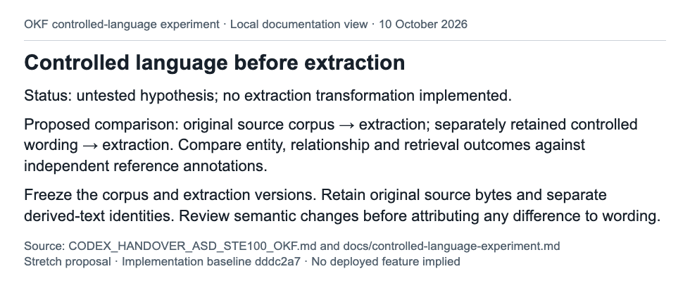

Figure 17. Stretch proposal. Local documentation view of `CODEX_HANDOVER_ASD_STE100_OKF.md and docs/controlled-language-experiment.md`.

## Overall evaluation

The three fixtures score 3, 0 and 0 heuristic findings, with mean sentence lengths of 14.1, 9.1 and 8.5 words. The STE-inspired fixture retains the declared signals; the controlled negative control loses three categories of qualification. All three preserve the citation labels. This is evidence that these mechanical measurements alone cannot establish preservation of meaning.

The adapter, bounds, provenance receipts, independent development checks and mutation controls are implemented and reproducible. The 11 experiment tests passed again during preparation of this document. The exact implementation commit also passed its recorded CI run. Source identity, context identity and receipt reproduction are engineering findings, not proof of factual or legal correctness.

The study uses one source-guided DWP case and designed offline fixtures. There is no independent live model trial, blinded specialist assessment or human-comprehension study. The evidence is insufficient for an individual entitlement decision. Historical statutory applicability, source closure, award history and assessment-period boundaries remain unresolved. General entailment, causal preservation and exhaustive unsupported-claim detection were not measured.

Recommendation: retain the removable downstream experiment for research. Keep semantic acceptance pending. A formal STE profile, default Explorer rendering policy or change to OKF core would require further evidence.

## Next steps

1. Complete the evidence review. A DWP subject specialist should resolve historical applicability and dependency coverage, review the machine extraction against the PDFs, and specify the unknown case facts. Output: a reviewed evidence boundary and independently authored assessment criteria. Do not infer missing assessment-period dates.
2. Freeze a held-out case set before generating new explanations. Include conditions, exceptions, modality, negation, dates, amounts and incomplete evidence. Output: versioned sources, case splits and a declared scoring protocol. Keep assessor criteria away from the renderer.
3. Run an actual same-evidence model trial. Prepare all three profile requests for each case and retain the provider, model version, settings, full prompts, responses and execution receipts. Use repeated trials where variability matters. Output: an auditable corpus that distinguishes model runs from illustrative fixtures.
4. Commission blinded semantic review. Have independent domain reviewers assess claims, qualifications, citation support, contradictions and unsupported additions. Output: recorded judgements, disagreement resolution and rejection reasons. A clean language score must never override a semantic failure.
5. Measure reader comprehension. Use a declared task and recruitment protocol, including users with relevant access needs. Compare accuracy, time, confidence and misunderstanding alongside language measures. Output: evidence of reader benefit and its uncertainty. Shorter sentences alone are not a comprehension result.
6. Trial terminology and MCP only after the evaluation protocol is stable. Bind a terminology sidecar to existing concept identities; test ambiguity and scope. If a read-only MCP wrapper is needed, test clients, input bounds and version receipts. Output: separate integration evidence without automatic rewriting or compliance certification.
7. Treat pre-extraction rewriting as a separate study. Freeze original and derived corpora, extraction versions and independent reference annotations. Output: entity, relationship and retrieval comparisons with retained original sources. Do not replace the source material.
8. Review the adoption decision. Consider an optional presentation profile only if reviewed semantic failures remain within a declared tolerance and the reader study establishes useful benefit. Record the scope, limitations and rollback approach. Merge and deployment remain separate decisions; this report does not perform either.

## Source records and reproduction

The [experiment README](../README.md) provides exact reproduction, request preparation and import commands. The [original findings](../../../docs/controlled-language-experiment.md) retain the checker research and primary links. The [screenshot manifest](screenshots/manifest.json) binds captures to local HTML and source-file hashes. The implementation CI record is [run 38040641350](https://github.com/chris-page-gov/okf-explorer/actions/runs/38040641350). A later documentation commit must be assessed separately; the recorded green result belongs to the named implementation commit.
