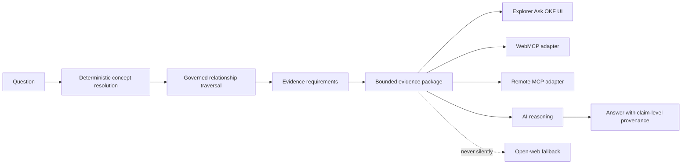
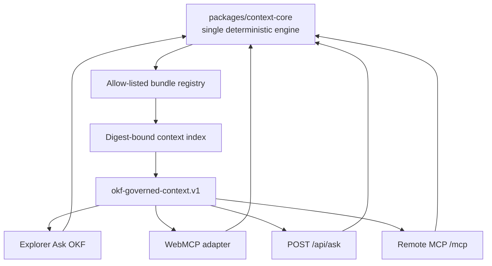

# Deep Research Report: Ask OKF, Bounded Evidence Packages, and DWP Imprisonment/Hospital Guidance

## Executive summary

The research brief is directionally right: **Ask OKF should be treated as a deterministic, transport-independent context-assembly layer that produces a bounded evidence package (BEP), not as a chatbot and not as a synonym for search/RAG**. The pinned `okf-explorer` implementation already embodies much of that architecture. The attached start note identifies the intended chain as **OKF bundle → Ask OKF → BEP → remote MCP → compatible conversational/voice client**, and explicitly says the work is experimental rather than a completed standard or benchmark. fileciteturn0file0 The research brief then asks for stronger semantics around completeness, provenance, canonical identity, boundedness and evaluation. fileciteturn0file1

My inspection of the exact pinned Explorer revision, `905e680f6d3ad385de9b8effc351566eba0ab2b3`, finds that a substantial **Ask OKF core already exists**. It has a typed `okf-context-index.v1` producer index, produces `okf-governed-context.v1`, resolves declared concept phrases deterministically, traverses a restricted set of governed directed assertions, enforces explicit evidence requirements and budgets, exposes omissions/conflicts/ambiguities, carries provenance and assertion status, and deliberately leaves `ai_answer` as `null`. fileciteturn1file0 fileciteturn2file0 fileciteturn3file0 The tests are materially stronger than ordinary retrieval tests: they cover directionality, missing dependencies, absent provenance, conflicts, restricted evidence, byte limits, cyclic graphs, deterministic context identity and prompt-injection-like source text. fileciteturn5file0

The **imprisonment case is now demonstrably successful within its declared, frozen legacy-DMG scope**. The current OKF-DWP publication contains an explicit source-backed acceptance case and an exported browser context package for the exact question. The recorded package has `evidence_status: "sufficient"`, resolves nine intended concepts, carries the Chapter 12 → Chapter 24/53/54/78 routing and benefit-specific evidence, and explicitly warns that New Style JSA/ESA and the acquired ADM bodies are outside the frozen evidence. fileciteturn18file0 fileciteturn19file0 The repository's public browser verification recorded 52 retained context records, 127 relationships, nine resolved concepts and four satisfied requirements, with package equality between the browser path and a fresh direct engine run. fileciteturn16file0

The earlier relationship-graph problem was therefore **not primarily a rendering failure**. The project's own gap analysis and UI verification found that the original DWP material lacked the necessary authored semantic chain; the graph renderer was showing the relationships it had. Once the semantic dependencies were authored, the imprisonment traversal became representable. fileciteturn7file0 fileciteturn8file0

The **hospital case is not yet at the same maturity**. The current `full-dmg/context/assembly-index.json` is scoped to imprisonment/custody. It includes hospital text where hospitalisation is part of a custody rule — for example a prisoner transferred to hospital — but I found no separately authored hospital context profile/evidence-requirement layer comparable to the imprisonment profile. The repository search for hospital-specific context-assembly authoring returned no matching result. The existing index itself describes its scope as frozen imprisonment guidance and warns that ADM bodies are not acquired. fileciteturn20file0 This means that an Ask OKF hospital answer should presently be expected to **fail closed or be partial**, rather than be promoted to sufficient merely because hospital paragraphs happen to exist somewhere in the wider full-DMG corpus.

That gap matters because the current official DWP sources show hospitalisation is a genuinely multi-branch question. For legacy JSA, hospital admission normally conflicts with availability, actively-seeking-work and capability conditions, though short sickness provisions can preserve JSA in defined circumstances. citeturn16view0turn22view0 Income Support may be affected through premiums and longer-stay applicable-amount rules. citeturn22view0 Legacy ESA and Pension Credit have their own hospital and mental-health detention rules, including duration-dependent and component/addition effects rather than a simple “benefit stops” rule. citeturn19view2turn19view3turn21view5turn21view6

A particularly important correction is the **DMG versus ADM boundary**. ADM is not simply a newer manual that globally supersedes DMG. DWP states that ADM is used instead of DMG for Universal Credit, PIP and contribution-based JSA/ESA for people eligible for Universal Credit; DMG continues to apply in other cases. citeturn12search8turn13search0turn13search1turn13search2 This means Ask OKF ultimately needs **guidance-regime resolution as a first-class dependency**, not merely benefit-name resolution.

The most important architectural next step is therefore **not another retrieval algorithm**. It is to generalise the existing successful imprisonment pattern into a publish-time BEP profile for hospitalisation and then expose exactly the same core through two adapters:



**WebMCP and Remote MCP should coexist rather than compete.** Chrome currently describes WebMCP as a page-to-browser-agent mechanism built around `document.modelContext`; tool discovery requires a client to visit the site and support the API. citeturn26search0turn26search4 ChatGPT, by contrast, connects to remote MCP servers for custom MCP integrations; OpenAI currently says Pro users can connect MCPs with read/fetch permissions in developer mode, while full MCP is Business/Enterprise/Edu, and custom MCP apps are web-only rather than mobile. citeturn26search1 Consequently, **Remote MCP is the right priority for making Ask OKF callable from ChatGPT; WebMCP remains the right progressive enhancement for Explorer itself.**

One execution limitation should be explicit. I could inspect the exact pinned repositories through the connected GitHub source and inspect current DWP material over the web, but a direct shell clone failed because the execution container could not resolve `github.com`. I therefore **did not independently run the repository's Node/Playwright test suite or deploy an MCP server in this research run**. Where I cite pass counts below, those are repository-published verification receipts, not tests personally rerun in this container. The commands required to reproduce them are supplied at the end.

## Research baseline, inspected implementation and prior art

### What was actually inspected

The attached `00_START_HERE.md` fixes the Explorer research baseline at revision `905e680f6d3ad385de9b8effc351566eba0ab2b3`, identifies the existing package/index/engine identifiers, and explicitly separates the transport-independent core from WebMCP and an earlier Python MCP retrieval prototype. It also records the prior finding that missing DWP graph relations were a semantic-authoring gap rather than a graph-display bug. fileciteturn0file0

The attached research brief identifies the specific Explorer files to inspect and asks whether BEPs can have a stronger semantic contract than conventional RAG context: evidence identity, provenance, deterministic selection, boundedness, completeness-relative-to-requirements and reproducible packaging. fileciteturn0file1 The source register supplies the proposed standards/research comparison set — nanopublications, PROV, RO-Crate, Trusty URIs, ProvSQL, sufficient-context work, citation-grounding work, GraphRAG, RECOMP, JSON canonicalisation, MCP and related systems. fileciteturn0file2

At the pinned Explorer revision, the ADR says the context engine is deliberately **transport independent**, model independent and domain independent. A producer supplies a digest-bound index containing aliases, records, governed assertions and explicit evidence dependencies. Resolution is from declared phrases rather than an opaque embedding model; traversal follows directed assertions rather than treating every hyperlink as semantic; whole evidence items are either retained or omitted under budget. fileciteturn1file0

The TypeScript model is already close to a usable BEP profile. `ContextPackage` carries the question, bundle/binding, scope, `evidence_status`, resolved concepts, ambiguities, unresolved terms, selected records, relationships, requirements, missing evidence, conflicts, limitations, budget data and `ai_answer: null`. Records carry authority, scope, provenance, rights, access and review status, while assertions carry source, target, predicate, assertion status and provenance. fileciteturn2file0

There is one small terminology point worth fixing before the structure hardens into a public profile: the code enum is currently spelled **`"normalized"`**, not `"normalised"`, even though prose around the project sometimes uses British spelling. fileciteturn2file0 For machine contracts, keep the existing spelling for compatibility unless there is a versioned schema change.

The implementation imposes practical deterministic bounds: the inspected default budget is 64 nodes, 128 relationships, traversal depth 6 and 524,288 output bytes, with hard maxima of 200 nodes, 1,000 relationships, depth 8 and the same 524,288-byte package bound. It accepts only a deliberately small predicate set — `dcterms:references`, `dcterms:requires` and selected SKOS relationships — and bounds phrase-resolution work. fileciteturn3file0

### Vendor/project claims against observed evidence

| Proposition | Classification | Research finding |
|---|---|---|
| Ask OKF is deterministic rather than model-driven | **Inspected implementation** | Supported: phrase resolution, restricted traversal, requirement evaluation and canonical context identity are implemented without an LLM dependency. fileciteturn1file0turn3file0 |
| Ask OKF performs no automatic external evidence retrieval | **Inspected implementation** | Supported; tests explicitly reject unexpected `fetch` during context construction. fileciteturn5file0 |
| Missing DWP imprisonment relationships were an Explorer graph bug | **Measured/project investigation** | Rejected. Project inspection found adjacency/display intact and the semantic destination relationships absent from the original authoring. fileciteturn7file0turn8file0 |
| The new imprisonment case now assembles sufficient bounded context | **Published project measurement plus inspected artefact** | Supported for the frozen declared scope. An actual exported package says `evidence_status:"sufficient"` and the browser verification records 52 selected records/127 relationships. fileciteturn19file0turn16file0 |
| “Sufficient” means the answer is legally complete/current | **Hypothesis rejected by design** | Explicitly false. Sufficiency is only relative to declared producer requirements and scope; the DWP artefact repeatedly says it is not a current individual entitlement determination. fileciteturn1file0turn19file0 |
| Browser fixture success proves WebMCP host interoperability | **Vendor/project claim constrained** | No. Project verification explicitly says its fixtures test the application contract, not native AI-host interoperability. fileciteturn8file0 |
| WebMCP will automatically make Ask OKF callable by ChatGPT | **Hypothesis rejected** | No. WebMCP is page/browser-agent technology; ChatGPT's custom integration path is remote MCP. citeturn26search0turn26search1 |
| Current OKF-DWP Ask OKF can already answer a general hospital question sufficiently | **Hypothesis** | Not established and unlikely under the present producer profile. The published context index is imprisonment-scoped and no hospital-specific context profile/evaluation equivalent was found. fileciteturn20file0 |

### How BEP relates to prior art

The BEP idea should **reuse existing provenance and packaging standards but not pretend that any one of them already specifies Ask OKF's answerability semantics**. The attached register correctly separates these concerns. fileciteturn0file2

| Prior art | What it contributes | What BEP still needs |
|---|---|---|
| W3C PROV / provenance models | Identity and provenance relationships between entities, activities and agents | Query-relative evidence selection, mandatory dependencies and explicit “insufficient” state |
| RO-Crate | Portable research-object packaging around JSON-LD and identifiable data entities | A question-relative, budgeted evidence closure and answerability contract. Current RO-Crate specification remains a packaging/metadata standard rather than a task-sufficiency protocol. citeturn26search3turn26search10 |
| Nanopublication / trusty-identifier family | Fine-grained assertions and content-addressed or verifiable scholarly objects | End-to-end package closure under a user question and bounded traversal |
| RAG/GraphRAG | Search/ranking and graph-assisted candidate retrieval | Deterministic governed dependencies, explicit evidence status and reproducibility |
| RECOMP/context compression | Smaller model context | Whole-evidence integrity, authority status, provenance and fail-closed omissions |
| Citation-grounding/ALCE-style evaluation | Whether answer claims have supporting citations | Whether all *required* branches were retrieved before answer generation |
| RFC-style canonical JSON | Deterministic serialisation foundations | Semantic definition of which data enters the identity hash |
| MCP | Standard client/server exposure of tools | The BEP semantics themselves; transport must not define sufficiency |

The strongest conceptual move in the brief is therefore to define a BEP not as “some retrieved chunks” but as:

> **A question-relative, scope-relative, requirement-closed, bounded, provenance-preserving evidence projection over an immutable producer index, with an explicit status describing whether its declared evidence obligations were satisfied.**

That is a materially stronger object than ordinary RAG context, but it deliberately **does not claim metaphysical or legal completeness**.

## Published DWP evidence and guidance-regime boundary

The current public DWP material makes two conclusions especially important for OKF.

First, **the general Chapter 12 imprisonment statement must not be over-generalised**. DMG 12003 says that the benefits listed immediately above it are disqualified from receipt during relevant imprisonment and explicitly distinguishes payability from entitlement. Payment can resume on release where entitlement conditions still hold. citeturn17view0 But the requested JSA, IS, SPC and ESA question is dealt with by **12015**, which routes those benefits to their benefit-specific chapters rather than making 12003 the universal answer. citeturn17view1 The OKF-DWP authored profile correctly encodes this caveat and says custody does not universally preserve entitlement. fileciteturn19file0

Second, **ADM does not globally replace DMG**. DWP's current catalogue says ADM is used instead of DMG for Universal Credit, PIP and contribution-based JSA/ESA where the claimant is eligible for Universal Credit; DMG remains applicable in the other cases covered by it. citeturn12search8turn13search0turn13search1turn13search2 A robust Ask OKF question therefore needs to resolve not simply `ESA`, but potentially **legacy contributory ESA versus New Style ESA**, and likewise the relevant JSA regime.

### Imprisonment: current source position

The current official evidence supports a more nuanced result than “benefits stop”.

For legacy JSA, Chapter 24 treats imprisonment/legal custody as incompatible with the relevant availability condition and says the claimant is not entitled in the ordinary custody case; special distinctions exist around remand/police custody and other circumstances. citeturn21view0

For contributory ESA in DMG Chapter 53, paragraphs 53256 onward provide a specific disqualification regime: payment is suspended from the first day of imprisonment/detention; where disqualification lasts more than six weeks the claimant is treated as not having limited capability for work; exceptions include cases where no penalty is ultimately imposed and specified mental-disorder situations. citeturn21view1 This is exactly why “imprisonment affects payability but never entitlement” would be wrong as a general ESA proposition.

The **current ADM U6**, relevant to the newer ESA regime, confirms the same structural distinction in contemporary ADM language: U6060 provides for ESA disqualification during qualifying imprisonment/legal custody, U6061 suspends payment from the first day, and U6062 treats a claimant as not having LCW where disqualification exceeds six weeks. It also sets out exceptions and a separate suspension rule for claimants who are not disqualified. citeturn25view0turn25view1

For income-related ESA, Chapter 54 contains separate prisoner/remand and hospital-transfer treatment rather than simply importing the contributory rule. For example, a prisoner amount can be nil while particular remand cases may retain allowable housing-cost treatment; mental-health transfers depend on the legislation under which detention takes place. citeturn21view3

For Pension Credit, Chapter 78 contains its own prisoner definitions, nil-award/guarantee-credit rules, remand exceptions and hospital-transfer branches. citeturn21view4 The frozen OKF source itself captures the explicit “prisoner admitted to hospital” branch and the instruction to determine the legislation under which the admission occurred. fileciteturn20file3

The ADM U6 material also illustrates why **“hospital” and “prison” are not mutually exclusive states**. A person transferred to a mental hospital under specified prisoner-transfer legislation may remain disqualified until the expected release date; other hospital orders can be treated differently. citeturn25view2

### Hospital: current source position

DMG Chapter 18 still supplies the common definition/routing material for hospital in-patients, while benefit-specific financial effects are routed elsewhere. The old general hospital downrating regulations for the listed benefits were revoked from 10 April 2006; Chapter 18 sends JSA and IS effects to Chapter 24 and Pension Credit to Chapter 78. citeturn22view3turn22view5

For **legacy JSA**, Chapter 24 says admission to hospital normally means the claimant cannot satisfy availability, actively-seeking-employment and capability requirements. There are special short-period sickness provisions — broadly up to two weeks on the specified conditions and frequency — under which JSA may continue. citeturn16view0turn22view0 Chapter 24 also says the personal rate of contribution-based JSA is not itself reduced because someone is in hospital; the more fundamental issue is usually whether the claimant continues to satisfy the conditions of entitlement. citeturn22view0

For **Income Support**, hospital admission does not yield a simple immediate stop rule. Chapter 24 requires consideration of the severe-disability premium after four weeks and contains longer-stay provisions affecting the applicable amount and certain premiums after 52 weeks. citeturn22view0

For **legacy ESA**, hospital treatment is similarly not “ESA stops”. Chapter 54 distinguishes contributory and income-related effects, components/premiums and prescribed mental-health cases. The contributory personal rate is not simply removed because of hospital admission, although components can be affected after a long continuous period; the income-related applicable amount can change according to duration and status. citeturn19view2turn19view3

For **State Pension Credit**, Chapter 78 says hospitalisation may affect the amount in defined circumstances, but reaching 52 weeks in hospital is no longer itself a general downrating trigger under the post-2006 rules. Additional amounts such as severe-disability/carer additions can need reassessment after shorter periods because qualifying benefits or household circumstances may change. citeturn21view5turn21view6

This gives the correct shape of a future Ask OKF hospital traversal:

```mermaid
flowchart TD
    H[Hospital admission] --> DEF[Hospital / in-patient status<br/>DMG Ch 18]
    DEF --> J[Legacy JSA]
    DEF --> I[Income Support]
    DEF --> E[ESA]
    DEF --> P[State Pension Credit]

    J --> C24[DMG Ch 24<br/>availability / ASE / sickness]
    I --> C24

    E --> REG{Which ESA regime?}
    REG --> EC[Legacy ESA(C)]
    REG --> EI[Legacy ESA(IR)]
    REG --> NS[New Style ESA]
    EC --> C53[DMG Ch 53 and related ESA chapters]
    EI --> C54[DMG Ch 54 and related ESA chapters]
    NS --> ADM[ADM, including U2/U6 where relevant]

    P --> C78[DMG Ch 78<br/>patient/additional-amount rules]

    H --> CUST{Transferred from prison/court?}
    CUST -->|yes| MH[Resolve detention legislation]
    MH --> C54
    MH --> C78
    MH --> ADM
```

### Evidence coverage in OKF-DWP

The following separates **source presence** from **Ask OKF semantic readiness**:

| Required material | Present in frozen/full-DMG evidence | Semantically connected for imprisonment | Hospital-specific Ask OKF readiness |
|---|---:|---:|---:|
| DMG 12003 | Yes | Yes, with scope qualification | Only indirect; not a hospital rule |
| DMG 12015 | Yes | Yes | Not the hospital entry point |
| Chapter 24 | Yes | Yes: JSA/IS custody passages and dependency paths | **Source exists**, but no equivalent hospital producer profile established |
| Chapter 53 | Yes | Yes: ESA(C) custody evidence | Hospital-related source material exists, but hospital task requirements not separately authored |
| Chapter 54 | Yes | Yes: ESA(IR) custody evidence | Hospital and mental-health passages exist, but no general hospital BEP profile established |
| Chapter 78 | Yes | Yes: SPC custody evidence | Hospital passages exist, including prisoner-to-hospital, but no hospital acceptance case equivalent |
| Chapter 18 | Full-DMG corpus source exists in the wider DWP corpus; current official source verified externally | Not needed as main imprisonment path | **Should become a mandatory hospital seed/dependency** |
| ADM bodies | Catalogue metadata only in the published imprisonment BEP; bodies explicitly not acquired there | No: current BEP warns they are absent | **Major gap for contemporary New Style JSA/ESA hospital questions** |

The imprisonment acceptance fixture itself names Chapter 12, Chapter 24, Chapter 41, Chapter 42, Chapter 53, Chapter 54 and Chapter 78 evidence, hashes and locators, and explicitly says the New Style regime bodies and acquired ADM bodies are absent. fileciteturn18file0 The producer index likewise states that its scope is frozen legacy imprisonment guidance and warns users to obtain regime/date information and fresh authoritative evidence before applying it to an individual. fileciteturn20file0

## BEP semantic contract, Ask OKF API and adapters

### Recommended BEP profile

The existing `okf-governed-context.v1` should be retained as the compatibility base and strengthened rather than replaced. The core invariant should be:

> **A BEP is sufficient only when every producer-declared requirement whose trigger is satisfied has its required records and required directed paths present in the selected package, within the declared scope and without an unresolved conflict that invalidates that requirement.**

That definition gives “sufficient” an auditable computational meaning while avoiding the dangerous claim that all evidence in the world has been found.

I recommend the following additional top-level fields in a future `okf-governed-context.v1.1` or compatible extension:

```json
{
  "schema": "okf-governed-context.v1",
  "profile": "https://.../profiles/bep/1",
  "context_id": "urn:sha256:...",
  "engine": "okf-context-assembly.v1",
  "question": "...",
  "bundle": {
    "id": "...",
    "snapshot": "...",
    "content_digest": "sha256:..."
  },
  "binding": {
    "index_url": "...",
    "index_sha256": "..."
  },
  "scope": "...",
  "guidance_regime": {
    "resolved": ["legacy-dmg"],
    "unresolved": ["new-style-esa-status"],
    "as_of": "2026-09-19"
  },
  "evidence_status": "sufficient",
  "status_basis": {
    "requirements_total": 4,
    "requirements_met": 4,
    "requirements_unmet": 0,
    "conflicts_blocking": 0,
    "truncated": false
  },
  "resolved_concepts": [],
  "ambiguities": [],
  "unresolved_terms": [],
  "selected": [],
  "relationships": [],
  "requirements": [],
  "missing_evidence": [],
  "conflicts": [],
  "limitations": [],
  "budget": {},
  "ai_answer": null
}
```

The useful semantic distinction is between four identities:

**source identity** → immutable official artefact or captured page;

**assertion identity** → a statement/edge and its provenance/status;

**package identity** → deterministic digest of the canonical selected BEP;

**execution identity** → optional record of when/where a context build occurred.

Those should not be collapsed into one timestamp or hash. The attached brief explicitly asks for this separation, and the existing Explorer model already distinguishes source capture from package construction sufficiently to extend it cleanly. fileciteturn0file1turn2file0

### Concrete external Ask OKF API

The external API should remain narrower than the internal engine.

#### Input JSON Schema

```json
{
  "$schema": "https://json-schema.org/draft/2020-12/schema",
  "$id": "https://chris-page-gov.github.io/okf/schema/ask-okf-request.v1.json",
  "title": "Ask OKF request",
  "type": "object",
  "additionalProperties": false,
  "required": ["bundle", "question"],
  "properties": {
    "bundle": {
      "type": "string",
      "pattern": "^[a-z0-9][a-z0-9._-]{0,63}$",
      "examples": ["okf-dwp"]
    },
    "version": {
      "type": "string",
      "maxLength": 128,
      "description": "Optional approved immutable bundle snapshot or alias."
    },
    "question": {
      "type": "string",
      "minLength": 1,
      "maxLength": 4000
    },
    "as_of": {
      "type": "string",
      "format": "date",
      "description": "Question date where applicability is time-sensitive."
    },
    "budget": {
      "type": "object",
      "additionalProperties": false,
      "properties": {
        "max_nodes": {"type": "integer", "minimum": 1, "maximum": 200},
        "max_relationships": {"type": "integer", "minimum": 0, "maximum": 1000},
        "max_depth": {"type": "integer", "minimum": 0, "maximum": 8},
        "max_bytes": {
          "type": "integer",
          "minimum": 1024,
          "maximum": 524288
        }
      }
    }
  }
}
```

The service must resolve `bundle: "okf-dwp"` through an **allow-listed registry** to an immutable index/snapshot. It should never accept an arbitrary user URL and server-fetch it, because that needlessly introduces SSRF and provenance ambiguity.

#### Output JSON Schema

The MCP/API response should carry the package itself rather than a model-written answer:

```json
{
  "$schema": "https://json-schema.org/draft/2020-12/schema",
  "$id": "https://chris-page-gov.github.io/okf/schema/ask-okf-response.v1.json",
  "type": "object",
  "additionalProperties": false,
  "required": [
    "schema",
    "context_id",
    "engine",
    "question",
    "bundle",
    "scope",
    "evidence_status",
    "resolved_concepts",
    "selected",
    "relationships",
    "requirements",
    "missing_evidence",
    "limitations",
    "ai_answer"
  ],
  "properties": {
    "schema": {"const": "okf-governed-context.v1"},
    "context_id": {"type": "string", "pattern": "^urn:sha256:[0-9a-f]{64}$"},
    "engine": {"type": "string"},
    "question": {"type": "string"},
    "bundle": {"type": "object"},
    "binding": {"type": "object"},
    "scope": {"type": "string"},
    "evidence_status": {
      "enum": ["sufficient", "insufficient", "conflicting"]
    },
    "resolved_concepts": {"type": "array"},
    "ambiguities": {"type": "array"},
    "unresolved_terms": {"type": "array"},
    "selected": {"type": "array"},
    "relationships": {"type": "array"},
    "requirements": {"type": "array"},
    "missing_evidence": {"type": "array"},
    "conflicts": {"type": "array"},
    "limitations": {"type": "array"},
    "budget": {"type": "object"},
    "ai_answer": {"type": "null"}
  }
}
```

In MCP, publish this as an `outputSchema` and return the BEP through structured content. The current MCP revision explicitly supports structured outputs governed by JSON Schema; retaining an object at the root also maximises compatibility with clients predating the newest relaxation of structured-content shape. citeturn26search6turn26search11

### WebMCP adapter

The inspected Explorer adapter is already sensibly narrow: `okf_build_context` and `okf_explain_context`, read-only and marked as untrusted content. fileciteturn6file0 That should stay.

Current Chrome guidance confirms the relevant API is `document.modelContext.registerTool`, with JSON-schema inputs and `AbortSignal` cancellation. It also emphasises `readOnlyHint` and `untrustedContentHint` for exactly this sort of externally sourced data. citeturn26search4turn26search7

The adapter should therefore remain a thin mapping:

```ts
registerTool({
  name: "okf_build_context",
  annotations: {
    readOnlyHint: true,
    untrustedContentHint: true,
    consequentialHint: false
  },
  inputSchema: AskOkfInputSchema,
  execute: (args, { signal }) =>
    askOkfCore.buildContext(args, { signal })
});
```

No semantics should live in the adapter.

### Remote MCP adapter

This is the missing integration layer needed for ChatGPT.

The preferred public surface is one high-value tool:

```text
ask_okf(bundle, question, version?, as_of?, budget?) -> BEP
```

and optionally two diagnostic tools:

```text
okf_get_context(context_id)
okf_explain_context(context_id)
```

Do **not** initially expose low-level `resolve`, `expand`, `get_record`, `traverse_edge`, etc. A model forced to orchestrate those manually would reintroduce model-controlled evidence selection — exactly what the BEP architecture is trying to avoid.

The remote MCP process should call the same TypeScript engine, or a server package generated directly from it:



OpenAI's current documentation says ChatGPT custom MCP connectivity uses **remote** MCP servers; local servers are not directly connected unless bridged through the supported secure-tunnel route. It also currently says Pro users may connect read/fetch MCP permissions in developer mode, although full MCP functionality is available to Business and Enterprise/Edu. Custom apps are currently web-only rather than mobile. citeturn26search1 That is why the target should be **remote read-only MCP first, voice only after verified client support**.

### Security model

The current Explorer design already gets several important things right: source content is untrusted, arbitrary predicates are rejected, restricted source text is not leaked, malformed metadata fails closed, and no uncontrolled external fetch is part of context construction. fileciteturn5file0

The Remote MCP layer should add five hard controls:

| Risk | Required control |
|---|---|
| SSRF/arbitrary source retrieval | Logical bundle IDs mapped server-side to allow-listed immutable manifests; never fetch a question-supplied URL |
| Prompt injection in source guidance | All source/record text labelled untrusted data; tool description says never interpret source text as tool/client instructions |
| Oversized/complex query attacks | Preserve engine node/edge/depth/byte caps; add request-size, timeout and rate limits |
| Cross-tenant/private data leakage | Public and restricted bundles resolved under explicit access policy; preserve existing `access` filtering before serialization |
| False authority | Carry `assertion_status`, authority, review status, scope and limitations through to the client; never flatten authored/model-derived records into official evidence |

Chrome's own WebMCP security guidance specifically warns that prompt injection remains an agentic-system risk and recommends `untrustedContentHint` plus appropriate read-only/consequential annotations. citeturn26search7 OpenAI similarly cautions that custom apps are not independently verified and should only be added when the underlying application is trusted. citeturn26search9

## Evaluation cases, machine-readable examples and gap analysis

### Imprisonment acceptance test

The current repository acceptance case is well-designed because it evaluates the **evidence path rather than a model answer**. Its own description says no legal conclusion/model answer is scored; exact source identities and directed paths are checked. fileciteturn18file0

A production pass criterion should be:

| Stage | Pass criterion |
|---|---|
| Source coverage | Required captured Chapter 12, 24, 53, 54 and 78 evidence exists with immutable identifiers/hashes |
| Semantic coverage | Imprisonment, claimant, JSA, IS, SPC, ESA regime, entitlement and payability concepts resolve |
| Retrieval | Question independently resolves the expected seed concepts; fixture expected IDs are not secretly used as retrieval seeds |
| Traversal | Directional route reaches all declared benefit branches |
| Assembly | All triggered producer requirements satisfied within budget |
| Provenance | Every selected authoritative passage has source URL/hash/locator/capture metadata |
| Boundary | ADM/New Style absence is surfaced, not filled with model knowledge |
| Answerability | `evidence_status == "sufficient"` only for the explicitly frozen legacy-DMG scope |
| Determinism | Same bundle, question and budget return same `context_id` and canonical package |
| Negative control | Reverse/missing edge, missing page or too-small budget changes status to insufficient |

The implementation tests already cover most of those failure modes independently. fileciteturn5file0

The published browser package is an important real artefact, not merely a planned shape: it has context ID `urn:sha256:283cddceca09958b96949527280ea14775de5f26d092c939cacfaa545500e80e`, an immutable bundle snapshot, nine resolved concepts, no ambiguity/unresolved term in that test, and `evidence_status:"sufficient"`. fileciteturn19file0

A reduced machine-readable example is:

```json
{
  "schema": "okf-governed-context.v1",
  "context_id": "urn:sha256:283cddceca09958b96949527280ea14775de5f26d092c939cacfaa545500e80e",
  "engine": "okf-context-assembly.v1",
  "question": "A claimant is imprisoned. Explain the effect on JSA, IS, State Pension Credit and ESA, distinguishing loss of payment from loss of entitlement, and trace each conclusion to the relevant DMG guidance.",
  "bundle": {
    "id": "https://chris-page-gov.github.io/okf-dwp/id/bundle/full-dmg",
    "snapshot": "dwp-full-dmg-2026-09-16-a26a93daa9f5"
  },
  "evidence_status": "sufficient",
  "resolved_concepts": [
    {"label": "Imprisonment disqualification and payability"},
    {"label": "Legacy JSA availability during custody"},
    {"label": "Income Support prisoner applicable amount"},
    {"label": "State Pension Credit prisoner credit rates"},
    {"label": "ESA custody regime distinction"},
    {"label": "Benefit payability in the captured custody guidance"},
    {"label": "Benefit entitlement in the captured custody guidance"}
  ],
  "relationships": [
    {
      "source": "DMG 12015 context",
      "predicate": "dcterms:references",
      "target": "DMG Chapter 24"
    },
    {
      "source": "DMG 12015 context",
      "predicate": "dcterms:references",
      "target": "DMG Chapter 53"
    },
    {
      "source": "DMG 12015 context",
      "predicate": "dcterms:references",
      "target": "DMG Chapter 54"
    },
    {
      "source": "DMG 12015 context",
      "predicate": "dcterms:references",
      "target": "DMG Chapter 78"
    }
  ],
  "missing_evidence": [],
  "limitations": [
    "Legacy captured DMG scope only.",
    "New Style JSA/ESA and acquired ADM bodies are outside this package.",
    "Sufficiency does not constitute an individual entitlement decision."
  ],
  "ai_answer": null
}
```

The actual package is substantially richer and preserves evidence text, provenance, assertion status and exact traversal paths. fileciteturn19file0

### Hospital acceptance test

The hospital question should be added as a **source-backed but initially expected-insufficient** acceptance case:

> “A claimant is admitted to hospital. Explain the effect on JSA, Income Support, State Pension Credit and ESA, distinguishing entitlement, payment and changes in amount, and trace each conclusion to the applicable DWP guidance.”

Do not pre-author the evaluation to demand a particular prose answer. Its pass criteria should require:

- resolution of hospital/in-patient status and all four benefits;
- Chapter 18 common definition/routing;
- Chapter 24 JSA/IS branches;
- relevant legacy ESA hospital branches;
- Chapter 78 Pension Credit patient/additional-amount branches;
- distinction between ordinary hospital admission and prisoner/court mental-health transfer;
- benefit-regime ambiguity for broad `JSA`/`ESA`;
- an explicit ADM boundary where New Style JSA/ESA is possible;
- duration dependencies such as short sickness, four-week and 52-week effects where applicable;
- **insufficient** status whenever required ADM evidence or regime facts are absent.

On the current imprisonment-focused context index, the honest example should therefore look like this:

```json
{
  "schema": "okf-governed-context.v1",
  "context_id": "urn:sha256:<computed-by-engine>",
  "engine": "okf-context-assembly.v1",
  "question": "A claimant is admitted to hospital. Explain the effect on JSA, Income Support, State Pension Credit and ESA, distinguishing entitlement, payment and changes in amount, and trace each conclusion to the applicable DWP guidance.",
  "bundle": {
    "id": "https://chris-page-gov.github.io/okf-dwp/id/bundle/full-dmg",
    "snapshot": "dwp-full-dmg-2026-09-16-a26a93daa9f5"
  },
  "evidence_status": "insufficient",
  "resolved_concepts": [],
  "unresolved_terms": [
    "hospital admission as a general benefit circumstance"
  ],
  "ambiguities": [
    {
      "term": "JSA",
      "reason": "Legacy versus New Style regime is not established."
    },
    {
      "term": "ESA",
      "reason": "Legacy contributory/income-related versus New Style regime is not established."
    }
  ],
  "selected": [],
  "relationships": [],
  "requirements": [],
  "missing_evidence": [
    {
      "requirement": "hospital-common-guidance",
      "needed": "DMG Chapter 18 hospital/in-patient context profile"
    },
    {
      "requirement": "hospital-jsa-is",
      "needed": "Authored Chapter 24 hospital evidence closure"
    },
    {
      "requirement": "hospital-esa",
      "needed": "Authored legacy ESA hospital evidence closure plus ADM regime boundary"
    },
    {
      "requirement": "hospital-spc",
      "needed": "Authored Chapter 78 patient/additional-amount evidence closure"
    },
    {
      "requirement": "new-style-guidance",
      "needed": "Current ADM bodies where New Style JSA/ESA may apply"
    }
  ],
  "limitations": [
    "The presently published Ask OKF profile is imprisonment-specific.",
    "Hospital references incidental to prisoner-transfer passages do not establish general hospital answerability."
  ],
  "ai_answer": null
}
```

That JSON is **a proposed expected failure shape, not an observed engine output**. This distinction is important. I inspected the producer index and found it imprisonment-scoped, but I could not execute the core against that hospital question in this environment.

### Concrete gap analysis

The work remaining is narrower than it first appeared.

**The Ask OKF engine itself is not the principal gap.** It already implements bounded deterministic resolution/traversal/requirements with good negative tests. fileciteturn3file0turn5file0

**The main DWP content gap is publisher-side semantic authoring.** The successful imprisonment work added precisely what the original bundle lacked: conceptual aliases, chapter-routing identities, relevant evidence records and explicit `dcterms:requires` closures. fileciteturn20file0 The hospital problem needs the same treatment, centred on Chapter 18 and benefit-specific branches rather than prison material.

**The main integration gap is Remote MCP.** The pinned Explorer has page-level WebMCP tools but that does not make the same functions remotely callable from ChatGPT. fileciteturn6file0 Current Chrome WebMCP itself notes that clients must visit a site to discover its tools. citeturn26search0 Current ChatGPT documentation instead expects remote MCP for custom-server connectivity. citeturn26search1

**The main temporal/legal gap is guidance-regime versioning.** An immutable frozen DMG bundle is excellent for reproducibility but cannot by itself answer “what is the rule now?” unless publication-time acquisition includes the currently applicable ADM/DMG materials and a governed applicability layer. Current official ADM U6 demonstrates that material relevant to contemporary ESA imprisonment exists outside the frozen BEP. citeturn25view0

### Patch-level recommendations

The smallest credible sequence is:

**In `okf-dwp`:**

```text
knowledge/full-dmg/hospital/
    context-profile.yamlld
    hospital-inpatient.yamlld
    legacy-jsa-hospital.yamlld
    is-hospital-applicable-amount.yamlld
    esa-hospital-regimes.yamlld
    esa-contributory-hospital.yamlld
    esa-income-related-hospital.yamlld
    pc-hospital-rates.yamlld
    guidance-regime.yamlld
```

Add Chapter 18 hospital pages and the exact Chapter 24/ESA/78 pages as evidence records; author directional dependencies; add one or more `ContextRequirement`s that require all branches only when their triggering concepts resolve. Add `evaluation/context-assembly/hospital-case.json`, plus negative variants for ambiguous ESA/JSA regime and missing ADM material.

Do **not** turn every literal cross-reference into a legal relationship. Preserve the current distinction between official/normalised source routing and model-authored research dependencies.

**In `okf-explorer`:**

Extract/confirm the existing core as a package that can run in both browser and server environments, for example:

```text
packages/context-core/
    types.ts
    validate.ts
    resolve.ts
    traverse.ts
    requirements.ts
    assemble.ts
    canonicalise.ts
```

Keep the UI adapter under Explorer; add:

```text
packages/context-mcp/
    server.ts
    bundle-registry.ts
    tool-schema.ts
```

with one `ask_okf` remote tool and optional `okf_explain_context`.

Add contract tests asserting:

```text
browser build == direct core build == HTTP build == MCP structuredContent
```

for byte-for-byte canonical package equality.

Add a test ensuring two semantically identical builds with different execution timestamps produce the same content identity, while a changed bundle/index digest changes it.

Add a test that an arbitrary `bundle: "http://169.254.169.254/..."` or external URL is rejected before any network request.

Add an MCP output-schema test and a source-text prompt-injection test at the remote adapter boundary, not just the core.

### Published graph evidence

The OKF-DWP publication includes a rendered browser graph for the successful imprisonment demonstration. The repository documentation identifies this as `validation/ask-okf/screenshots/12-public-graph.png` and separately publishes context-summary and insufficient-budget screenshots. fileciteturn17file0


The associated browser receipt says the graph view displayed 28 nodes and 28 relationships for that verification run; the full package contained more relationships because the graph is a view, not the entire BEP. fileciteturn16file0

## Reproduction, URLs and limitations

### Repository reproduction

The pinned Explorer revision inspected in this report is:

```text
905e680f6d3ad385de9b8effc351566eba0ab2b3
```

The current OKF-DWP publication commit inspected is:

```text
6842be1e9d0a47bf4a7502856c569cfa30c18b07
```

and its demonstration binds the DWP content to:

```text
efb05c66616a9cd4328a86cf412780fe7bc7cf0b
```

The repository publication records those pinning relationships explicitly. fileciteturn16file0

A local reproduction sequence is:

```bash
git clone https://github.com/chris-page-gov/okf-explorer.git
git clone https://github.com/chris-page-gov/okf-dwp.git

cd okf-explorer
git checkout 905e680f6d3ad385de9b8effc351566eba0ab2b3

cd ../okf-dwp
git checkout 6842be1e9d0a47bf4a7502856c569cfa30c18b07

# Verify the content commit referenced by the published demonstration:
git show efb05c66616a9cd4328a86cf412780fe7bc7cf0b --stat
```

The DWP demonstration documentation then gives the context-evaluation path:

```bash
uv sync --locked

uv run --project ../okf-explorer --locked \
  python -c 'import jsonschema, referencing'

node scripts/evaluate_context_assembly.mjs \
  --explorer-root ../okf-explorer

node scripts/evaluate_context_assembly.mjs \
  --explorer-root ../okf-explorer \
  --check
```

and a lower-level controls invocation of the form:

```bash
node ../okf-explorer/scripts/run_context_controls.mjs \
  --index full-dmg/context/assembly-index.json \
  --case evaluation/context-assembly/imprisonment-case.json \
  --controls <controls-file> \
  --output <output-file>
```

These commands are taken from the repository's published demonstration documentation. fileciteturn17file0

For the Explorer project itself, rerun the project-reported verification rather than relying on its receipt:

```bash
cd ../okf-explorer

pnpm install --frozen-lockfile
pnpm check

# Inspect package.json for the exact current named test targets, then run
# the context/WebMCP unit and browser suites:
pnpm test

# Where still present at the pinned revision:
pnpm test:e2e:terminal
```

The existing verification document reports successful `pnpm check`, WebMCP tests, Playwright runs on Chromium/Firefox/WebKit, terminal E2E and browser fixture runs, but those are **published project measurements** rather than independently rerun measurements in this session. fileciteturn8file0

### Remote MCP experimental specification

After implementing the adapter, a local MCP validation should test the endpoint independently of ChatGPT:

```bash
# Illustrative; use the project's chosen server command
pnpm --filter @okf/context-mcp start

# Expected service
# POST http://127.0.0.1:3000/mcp
```

The production endpoint should be HTTPS, for example:

```text
https://<approved-okf-host>/mcp
```

with a logical bundle registry such as:

```json
{
  "okf-dwp": {
    "bundle_id": "https://chris-page-gov.github.io/okf-dwp/id/bundle/full-dmg",
    "snapshot": "dwp-full-dmg-2026-09-16-a26a93daa9f5",
    "index_url": "https://raw.githubusercontent.com/chris-page-gov/okf-dwp/efb05c66616a9cd4328a86cf412780fe7bc7cf0b/full-dmg/context/assembly-index.json",
    "index_sha256": "38159445a60d4bcabc23cb2cf728e14cbd0a4b55013276c291356e7a1452ff54"
  }
}
```

Those snapshot/index values come from the successfully exported imprisonment context package. fileciteturn19file0

Test Remote MCP with these exact calls:

```json
{
  "bundle": "okf-dwp",
  "question": "A claimant is imprisoned. Explain the effect on JSA, IS, State Pension Credit and ESA, distinguishing loss of payment from loss of entitlement, and trace each conclusion to the relevant DMG guidance."
}
```

Expected: `sufficient` **only under the frozen legacy-DMG scope**, with the same governed package identity as a direct-core execution for identical parameters.

Then:

```json
{
  "bundle": "okf-dwp",
  "question": "A claimant is admitted to hospital. Explain the effect on JSA, Income Support, State Pension Credit and ESA, distinguishing entitlement, payment and changes in amount, and trace each conclusion to the applicable DWP guidance."
}
```

Expected **before hospital authoring**: insufficient/partial diagnostic, not an invented answer.

Expected **after hospital authoring**: sufficient only if all applicable declared hospital evidence dependencies are included; if New Style JSA/ESA remains ambiguous or ADM evidence is absent, the package should remain insufficient for a blanket contemporary answer.

### Primary URLs for source checking

Because the request specifically asks for URLs, the relevant public roots are:

```text
DWP Decision Makers' Guide:
https://www.gov.uk/government/collections/decision-makers-guide-staff-guide

DWP Advice for Decision Making:
https://www.gov.uk/government/publications/advice-for-decision-making-staff-guide

OKF Explorer:
https://github.com/chris-page-gov/okf-explorer

OKF-DWP:
https://github.com/chris-page-gov/okf-dwp

Chrome WebMCP:
https://developer.chrome.com/docs/ai/webmcp

OpenAI custom MCP / developer mode documentation:
https://help.openai.com/en/articles/12584461-developer-mode-and-mcp-apps-in-chatgpt
```

Current official DWP collection pages confirm that the DMG remains actively maintained; the relevant volume collection pages have 2026 updates, so relying solely on the frozen 15 September 2026 capture should always be described as reproducible historical evidence rather than automatic current-law assurance. citeturn12search3turn13search0turn13search1turn13search2

### Exact limitations of this research run

**Repository execution.** Direct `git clone` from the execution container failed with:

```text
fatal: unable to access 'https://github.com/chris-page-gov/okf-explorer.git/':
Could not resolve host: github.com
```

I therefore inspected the pinned files and current commits using the connected GitHub source, but did not independently execute Node/Playwright tests locally. The distinction between project-reported test receipts and my inspection is maintained throughout this report.

**Hospital Ask OKF execution.** I inspected the current producer index and searched the repository for hospital-specific context-assembly authoring, but I could not execute a live `buildContext()` call against the hospital question. Therefore the proposed hospital `insufficient` package above is an **experimental expectation**, not a captured runtime result.

**PDF screenshots.** The current DWP PDFs were opened and their parsed text inspected. I also attempted the required rendered-PDF screenshot operation on Chapter 12, Chapter 24, Chapter 53, Chapter 54, Chapter 78 and ADM U6 pages. The screenshot service returned cache/internal errors rather than rendered pages, including the final ADM U6 attempt. The substantive DWP findings above therefore cite the parsed primary PDFs rather than claiming a successful visual PDF inspection.

**Current-source versus frozen-source mismatch.** The OKF-DWP demonstration is deliberately frozen. Current official ADM U6 was independently checked in this research and contains relevant contemporary ESA custody guidance that the published imprisonment BEP itself says it has not acquired. citeturn25view0turn25view1 That is not a defect in reproducibility; it is a limitation in **current-answer scope** that must be explicit in any external Ask OKF service.

**Voice integration.** Current OpenAI documentation establishes remote MCP/custom-app support and says Pro users can connect read/fetch MCPs in developer mode, but also states MCP apps are currently web-only and does not establish that the Live Voice surface can invoke an arbitrary custom MCP tool. citeturn26search1 It would therefore be incorrect to advertise “Ask OKF works in ChatGPT Voice” until an end-to-end voice invocation has actually been measured.

### Final assessment

The research changes the implementation priority in a useful way.

The original question was whether Explorer needed **better search, WebMCP, or a new tool**. The evidence now supports a more precise answer:

**Explorer search did not need to become an LLM. Ask OKF needed a governed context-assembly layer. That layer now substantially exists.**

**The imprisonment case no longer demonstrates a missing engine; it demonstrates that explicit semantic/evidence dependencies can solve the original retrieval failure.** The published BEP is a credible proof of that within its frozen scope. fileciteturn19file0turn16file0

**The hospital case is the correct next evaluation because it tests generalisation.** It cannot be solved responsibly by copying the imprisonment graph. It requires Chapter 18, temporal thresholds, condition-of-entitlement versus amount distinctions, mental-health/prison transfer branches and — crucially — DMG-versus-ADM regime resolution. citeturn22view3turn22view0turn19view2turn21view5

**WebMCP should remain, but Remote MCP is the missing route to ChatGPT.** Both should be thin adapters over the same deterministic core. fileciteturn6file0 citeturn26search0turn26search1

And the strongest product principle to carry forward is:

> **Ask OKF should not promise that it knows the answer. It should make an auditable claim that, for a specified immutable bundle, scope and question, a specified set of evidence requirements was — or was not — satisfied.**

That gives an AI something substantially better than “relevant chunks”: a **bounded, reproducible, provenance-bearing evidence contract whose incompleteness is itself machine-readable**.