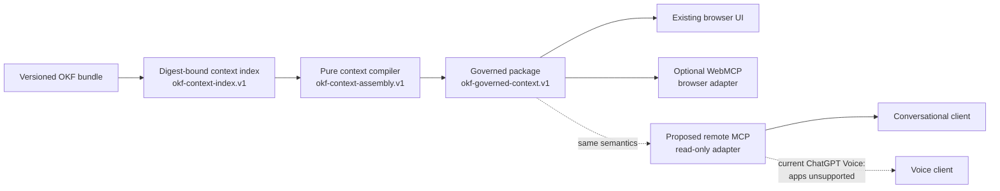
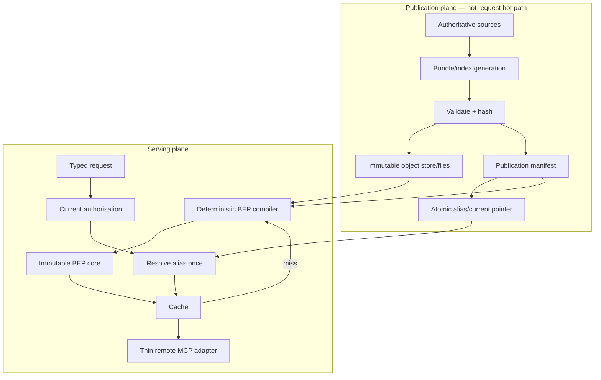
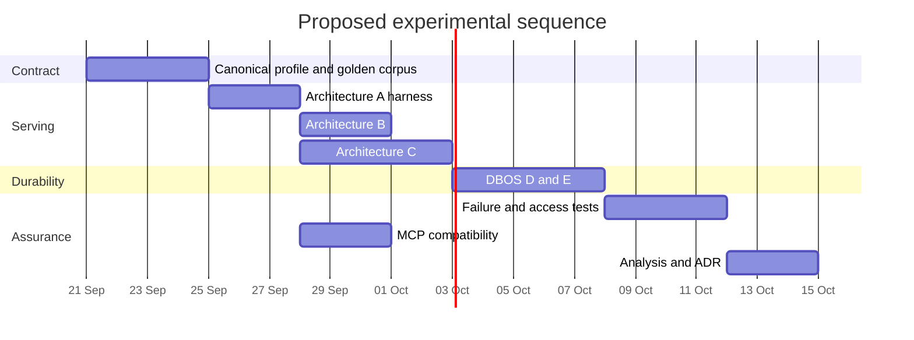

# Research B — Storage, deterministic compilation and efficient BEP serving

## Executive summary

The Research B brief asks a narrower and more operational question than Research A: given a bounded evidence package (BEP) whose semantics are already substantially defined, **what is the simplest storage, compilation and serving architecture that preserves those semantics while remaining efficient, reproducible and recoverable?** It explicitly requires comparison rather than presupposing DBOS, PostgreSQL or a graph database, and fixes the production baseline at `okf-explorer` commit `905e680f6d3ad385de9b8effc351566eba0ab2b3`. fileciteturn0file2

My principal conclusion is:

> **Build the deterministic BEP serving path first as the smallest possible extension of the existing immutable-index compiler: Architecture A, with a thin read-only remote MCP adapter and content-addressed immutable artefacts. Do not put DBOS, PostgreSQL or a graph database on the request path until measurements demonstrate a need.**

That recommendation follows directly from the inspected implementation. The pinned compiler is already a bounded, transport-independent TypeScript function: it validates a digest-bound index, performs declared-phrase resolution, traverses only governed directed predicates, retains whole evidence records, checks producer-authored requirements, exposes ambiguity/conflict/omission, enforces deterministic resource bounds and produces no model answer. fileciteturn1file0L2-L2 fileciteturn2file0L2-L2 Its current index is itself capped at 4 MiB, 10,000 records, 30,000 assertions and 500 requirements, while a response is capped at 200 nodes, 1,000 relationships, depth eight and 512 KiB. fileciteturn3file0L2-L2 This is not presently a workload that, by its shape alone, demands a network database.

The design should nevertheless be hardened before calling the resulting object a portable, byte-reproducible BEP. The current `canonicalJson()` sorts object keys recursively but is a bespoke JavaScript canonicaliser; no RFC 8785 conformance evidence exists. Concept resolution also uses locale-sensitive operations in places. RFC 8785 deliberately specifies locale-independent UTF-16 property ordering, preserves array order and imposes stricter JSON constraints. fileciteturn3file0L2-L2 citeturn25search0turn25search1 **Cross-process and cross-runtime byte equality therefore remains an unmeasured hypothesis, despite repeatability being tested within the existing TypeScript test environment.** fileciteturn6file0L2-L2

The most useful database distinction is consequently not “relational versus graph”, but **immutable serving versus mutable publication**. The request-time compiler can operate over frozen, digest-addressed indexes. A future publishing plane has different needs: current aliases, concurrent publication, access-policy changes, auditing, revocation and atomic movement of a “latest” pointer. Those are the conditions under which PostgreSQL becomes attractive. A graph-shaped logical model does not force a graph database; the existing workload is bounded adjacency expansion over explicit edges, which can be represented by arrays, maps, SQLite B-trees or relational indexes. Mike Stonebraker's contrary-to-fashion remarks about specialist databases and graph systems are useful hypotheses, not architecture decisions. His own interview also describes PostgreSQL as an excellent general starting point even while arguing that specialist engines can dominate specialist workloads. citeturn23search2

**DBOS is substantially more relevant to the publication pipeline than to BEP retrieval.** The current TypeScript product is now v5.0, released on 16 September 2026 and tagged at commit `1cf44a1dacc359316f75898ae7ed7a65302f4919`. fileciteturn11file0L2-L2 fileciteturn12file0L2-L2 It provides Postgres-backed checkpoints, recovery, durable queues and database-aware transactions. Current DBOS documentation describes one checkpoint write per step plus two per workflow and recommends placing large values in object storage and checkpointing references rather than repeatedly storing large outputs. citeturn24search1 That makes DBOS a plausible later addition around **ingest → compile → validate → publish**, where crash recovery matters. It does not make a deterministic pure compiler more deterministic.

DBOS's widely cited 43,000-workflows-per-second figure is **not a BEP capacity measurement**. It is a supplier benchmark, published 23 April 2026, for no-op workflows with no steps on an AWS RDS `db.m7i.24xlarge` with 96 vCPUs, 384 GB RAM and 120,000 provisioned IOPS; each no-op workflow generated two writes and the observed bottleneck was WAL flushing. Queued workflows were materially slower. citeturn23search1 Moreover, DBOS v5.0 subsequently changed its system schema by separating workflow inputs and outputs from status rows; that change is visible both in the release note and inspected v5 source. fileciteturn11file0L2-L2 fileciteturn15file0L2-L2 A new BEP benchmark must therefore be run rather than extrapolating either the April benchmark or older DBOS schema behaviour.

There is also a concrete consumer-boundary finding. The baseline's `webmcp.ts` is an optional browser `document.modelContext` adapter and explicitly says registration does not establish that a particular AI host can invoke it. fileciteturn7file0L2-L2 A **remote MCP adapter is a separate component**. MCP's July 2026 protocol revision moved towards self-describing stateless requests, while current tooling supports machine-readable results and output schemas. citeturn24search10 For ChatGPT specifically, OpenAI currently documents custom MCP-backed apps, but also states unambiguously that **Voice mode currently does not support apps**. citeturn24search0 Thus the desired path

`OKF bundle → Ask OKF → BEP → remote MCP → ChatGPT text`

is experimentally testable now, subject to workspace configuration, whereas

`… → remote MCP → ChatGPT Voice`

is **not currently an accepted deployment path**. A bespoke voice/API client would be a separate product, security and cost decision.

No repository files were modified or deployed in this research. I inspected the pinned source read-only. I did not run a new end-to-end performance benchmark, DBOS installation, PostgreSQL instance or production MCP deployment; consequently, performance figures below are either published measurements, proposed experimental variables, or explicit estimates—not fabricated observations. The separately supplied Research A is also a reconstructed delivery and explicitly warns that its earlier execution receipts were not recovered; I therefore use its BEP semantics as research context rather than as independent proof of execution. fileciteturn0file0 fileciteturn0file1

One requested contextual file, `00_START_HERE.md`, was **not present among the attachments available to this run**, and I found no file of that name in the inspected pinned repository. I therefore could not independently ingest it. Any context from it that survives in Research A or the Research B brief has been treated as secondary supplied context, not as a directly inspected artefact.

## Baseline architecture, evidence and claim status

The supplied source register is well structured but correctly describes itself as a **research source register rather than an OKF or BEP conformance claim**. fileciteturn0file3 I therefore used it as a discovery/index layer and rechecked the load-bearing current product claims against official documentation or inspected source. Research A likewise provides valuable semantic groundwork—especially the distinction between semantic, selection, byte and replay reproducibility—but its reconstructed form explicitly says that not every earlier source association or test receipt was freshly recovered. fileciteturn0file0

The inspected baseline architecture is:



The architecture decision deliberately puts the compiler outside Search and outside transport. It has no model dependency, browser-state dependency or automatic external retrieval; producer-authored dependencies and requirements rather than ordinary links govern evidence traversal. fileciteturn1file0L2-L2 The type contract confirms explicit provenance, authority, scope, access, relationships, requirement results, missing evidence, conflicts, budget state and `ai_answer: null`. fileciteturn2file0L2-L2

The core engine is more conservative than a conventional retrieval system. It resolves only declared aliases; builds outgoing adjacency from governed assertions; fails closed on restricted evidence, malformed provenance and missing dependencies; checks literal evidence hashes; and does not use `required` IDs as implicit retrieval seeds. fileciteturn4file0L2-L2 Its tests explicitly exercise reversed edges, incomplete requirements, provenance failures, snapshot mismatches, ambiguous aliases, fixed interpretation work, conflicts, restricted evidence, byte/depth/node/relationship limits, cycles and prompt-injection-like evidence text. fileciteturn6file0L2-L2

The result is already close to a BEP compiler but not yet a complete BEP interoperability profile. Research A correctly distinguishes package validity, producer-declared requirement coverage and substantive evidential sufficiency; it also distinguishes semantic, selection, byte and execution/replay reproducibility. fileciteturn0file1 The current engine itself embeds a limitation stating that `sufficient` means closure of applicable bundle-authored requirements rather than a verified answer or individual decision. fileciteturn4file0L2-L2

The evidence-to-claim gap is therefore:

| Claim | Evidence presently available | Classification | Verdict |
|---|---|---|---|
| The baseline compiler is transport-independent and has no model or remote-fetch dependency | ADR and inspected `index.ts` | **Inspected implementation** | Supported. fileciteturn1file0L2-L2 fileciteturn4file0L2-L2 |
| It preserves bounded whole evidence and explicit gaps | Inspected implementation and tests | **Inspected implementation** | Supported within its contract. fileciteturn4file0L2-L2 fileciteturn6file0L2-L2 |
| `evidence_status="sufficient"` proves the real-world answer | Code says the opposite | **Unsupported interpretation** | Reject. It means declared-requirement closure only. fileciteturn4file0L2-L2 |
| Existing `context_id` is cross-runtime canonical | Same-runtime equality tests exist; no RFC 8785 conformance/cross-runtime corpus inspected | **Hypothesis** | Not yet established. fileciteturn6file0L2-L2 citeturn25search0 |
| Browser WebMCP proves remote MCP/AI-host access | Baseline explicitly says otherwise | **Unsupported interpretation** | Reject. fileciteturn7file0L2-L2 |
| Project verification proves production deployment | Verification receipt explicitly disclaims that | **Published project measurement, not production evidence** | Reject broader claim. fileciteturn9file0L2-L2 |
| A graph-shaped BEP requires a graph database | No workload evidence establishes this | **Architecture hypothesis** | Reject as default assumption. |
| DBOS achieves deterministic BEP contents | DBOS checkpoints/replays execution; semantic determinism remains application responsibility | **Vendor capability plus inference** | Reject. citeturn24search1turn24search2 |
| DBOS can sustain 43K BEPs/s | Supplier benchmark is no-op workflows, not BEPs | **Vendor benchmark misapplied** | Reject. citeturn23search1 |
| DBOS supports exactly-once effects everywhere | Product docs limit exact transactional behaviour; ordinary steps can retry | **Overclaim** | Reject. citeturn24search2turn24search3turn24search6 |
| Whole-workflow AC/DC is a released DBOS product guarantee | CIDR paper describes a prototype and research proposal | **Published research, not current product guarantee** | Reject. citeturn23search0 |
| Current ChatGPT Voice can invoke a custom BEP MCP app | OpenAI says Voice currently does not support apps | **Current official product evidence** | False as of 19 September 2026. citeturn24search0 |

The browser/UI verification document reports substantial local testing, including transport and browser fixtures, but explicitly distinguishes those results from public deployment, domain correctness and native AI-host invocation. Those are **project-recorded measurements**, not measurements reproduced during this research. fileciteturn9file0L2-L2

## Database design space, Stonebraker and DBOS

For BEPs, “which database?” is downstream of several separable decisions.

| Layer | BEP question | Typical mechanism |
|---|---|---|
| Logical model | What are evidence atoms, assertions, requirements, provenance and scope? | Existing OKF/BEP schema; backend-independent |
| Physical representation | Where do bytes and adjacency live? | Static JSON, compact arrays/maps, SQLite rows, PostgreSQL rows, immutable object blobs |
| Indexes | How do IDs, aliases and outgoing edges resolve cheaply? | Hash maps/B-trees; `(publication, source)` adjacency indexes |
| Query execution | How are aliases resolved, edges traversed and requirements checked? | Existing deterministic compiler |
| Materialisation/cache | Which expensive stable calculations should be reused? | Precompiled alias tables, adjacency, requirement closures, content-addressed BEP cache |
| Consistency | Which version of mutable state does one request observe? | Immutable publication ID or database snapshot |
| Durable workflow | How do multi-stage publication operations recover after failure? | CI/job runner initially; DBOS later if warranted |
| Application semantics | Is evidence authoritative, sufficient and permissible for this requester? | BEP policy and governance—not a database guarantee |

This distinction matters because the four relevant query shapes are different. **Point lookup** retrieves an alias, record ID or manifest. **Search/range lookup** finds aliases or text candidates. **Graph expansion** repeatedly performs bounded adjacency lookup from selected nodes. **Analytical scan** evaluates an entire corpus, benchmark output or provenance estate. A single system need not optimise every one: request serving can use adjacency indexes while offline evaluation uses scan-oriented representations.

The current BEP workload is primarily point lookup plus shallow bounded expansion. The compiler pre-sorts assertions, constructs outgoing adjacency and traverses from explicitly resolved seed concepts; maximum traversal depth is eight. fileciteturn3file0L2-L2 That workload can exploit locality extremely well if immutable adjacency is compiled once. A network round trip per edge would be a regression; PostgreSQL, if used, should therefore batch or materialise adjacency rather than reproduce an object-at-a-time traversal API across a database connection.

Row storage is the natural general-purpose representation for mutable evidence metadata and publication state. Columnar storage becomes attractive for *offline* corpus-wide analysis—evaluation metrics, provenance completeness, cardinalities and bulk transformation—not for the latency-sensitive “resolve these IDs and follow these edges” path. Full scans are reasonable while a corpus is tiny but should give way to alias/ID and adjacency indexes as corpus size grows.

For PostgreSQL, MVCC is relevant principally to **mutable publication state**. PostgreSQL's default `READ COMMITTED` semantics permit separate statements in one transaction to observe different snapshots; a stable multi-query view requires either pinning an immutable publication first or deliberately choosing stronger snapshot semantics. citeturn15view1 Likewise, result order is not an implied database property: order that contributes to a package identity must be explicitly specified rather than inherited from a physical plan. citeturn15view0

Communication cost also matters. The CIDR 2025 paper *OLTP Through the Looking Glass 16 Years Later: Communication is the New Bottleneck* reports that process/database communication and isolation can dominate otherwise small transaction workloads; its broader lesson for BEP serving is to count security/process/network boundaries as part of the system rather than comparing only the CPU cost of an in-process traversal. citeturn13search1 This strengthens rather than weakens the case for testing the existing in-process compiler before inserting a remote database into the hot path.

Stonebraker's interview is best read as an agenda for experiments:

| Timestamp | Stonebraker argument | Type | BEP interpretation |
|---|---|---|---|
| 9:07 | PostgreSQL's key advance included extensible data types motivated partly by GIS needs | Historical recollection | Flexibility of the general-purpose system matters; heterogeneous BEP evidence does not itself require specialist storage. citeturn23search2 |
| 15:55 | Specialised systems can outperform general-purpose systems; nevertheless PostgreSQL is an excellent way to “get going” because of its ecosystem | Opinion grounded in database history | Begin general-purpose/simple, then specialise against measured bottlenecks. citeturn23search2 |
| 21:37 | Criticism of MapReduce/eventual-consistency approaches versus database execution and transactions | Historical argument/opinion | Publication consistency deserves deliberate design, but this does not imply request-time transactions for immutable BEPs. citeturn23search2 |
| 28:12 | Graph databases are “almost never” the performance choice; graph interfaces can sit over relational storage | Strong opinion/hypothesis | Do not treat it as proof either way. Benchmark static/relational adjacency first; add a native graph engine only when workload evidence demands it. citeturn23search2 |
| 30:58 | Academic DBOS began from managing operating-system state with database techniques and later led to a durable-programming product | Historical account | Consistent with the documented distinction between the academic programme and the current product ecosystem. citeturn23search2 |
| 42:02 onward | Future data systems must combine increasingly heterogeneous information; later he argues read/write agents become a distributed-data consistency problem | Research opinion/prediction | Relevant if OKF evolves from read-only BEP production to autonomous publication/mutation; not justification for transaction-heavy read-only serving today. citeturn23search2 |

The academic DBOS programme and DBOS Inc should remain separate in the evidence model. The CIDR 2026 paper proposes broader workflow correctness properties and describes a prototype supporting physical backout and saga-style compensation; that is research evidence about what *could* be desirable, not a blanket guarantee of today's released SDK. citeturn23search0

The present TypeScript product should be evaluated at **v5.0 / `1cf44a1dacc359316f75898ae7ed7a65302f4919`**, not through Python documentation alone. Its package requires Node.js 20 or later and depends directly on PostgreSQL-facing components. fileciteturn13file0L2-L2 Version 5 moved large workflow inputs and outputs to separate tables; inspected schema comments explicitly identify avoiding large-input rewrites on status updates as the reason. fileciteturn15file0L2-L2 The migration source also contains targeted partial indexes for queue/recovery paths and retention-oriented payload tables, demonstrating that DBOS's own physical design continues to evolve in response to write amplification and operational workload. fileciteturn19file0L2-L2 fileciteturn20file0L2-L2

The DBOS guarantee boundary is:

| Property wanted | What current DBOS contributes | What DBOS does **not** establish |
|---|---|---|
| Repeatable, byte-identical BEP | Can durably replay checkpointed step results | Byte identity must come from frozen inputs, deterministic compiler and canonicalisation. citeturn24search1 |
| Replay a completed stochastic step | Yes: checkpointed output can be returned during recovery | Replayed value does not prove the original generation was deterministic. citeturn24search1turn24search3 |
| Retry an uncheckpointed step | Yes; steps are retryable/at-least-once until completion | An external side effect occurring just before failure can happen again; step must be idempotent. citeturn24search2turn24search3 |
| Exactly-once supported database effect | DBOS datasource transactions atomically commit application DB changes and the DBOS transaction record/checkpoint | Does not extend this transaction to arbitrary HTTP APIs or an unrelated object store. citeturn24search6 |
| Exactly-once arbitrary HTTP call | No generic guarantee | Requires provider idempotency or reconciliation. |
| Exactly-once object-store write | Not automatically | Content-addressed immutable `PUT` plus verification can make retries *application-idempotent*, not transactionally atomic with PostgreSQL. |
| Whole-workflow atomicity | Durable execution/recovery | Current released workflow is not simply one ACID transaction; CIDR AC/DC is research/prototype work. citeturn23search0 |
| Workflow isolation | Database transaction configuration can provide transaction isolation | No automatic isolation across every external operation in a long workflow. |
| Compensation | Application workflows can implement it | Semantic correctness of compensation is application/domain responsibility. |
| Current authorisation | None inherently | Must be checked against current policy at serving/publishing boundaries. |
| Semantic correctness of evidence | None | BEP governance/domain review remains independent. |
| Safe code upgrades | Product supplies workflow versioning/patching mechanisms | Breaking workflow-code changes cannot simply be replayed against arbitrary old checkpoints. citeturn24search11 |

DBOS Conductor is consequently an **operations/recovery control plane**, not a new evidence database or request-path compiler. DBOS documentation says the SDK continues to use PostgreSQL for workflow state and that Conductor coordinates distributed recovery, observability and retention while remaining off the workflow execution path. citeturn24search1

The April supplier benchmark is informative only about DBOS/PostgreSQL workflow overhead. It reports 144K small writes/s, 43K no-step workflows/s, 12.1K queued workflows/s on one queue and 30.6K/s when queue/partition contention is reduced. The test host was 96-vCPU/384-GB RDS with 120K provisioned IOPS, and the workload was dominated by very small writes. citeturn23search1 The headline must **not** be converted into “43K BEPs/s”: a BEP request has very different payload sizes, reads, graph traversal, canonicalisation, cache behaviour, network costs and potentially authorisation.

## Deterministic serving contract and architecture decision

The BEP compiler should have an explicit pure boundary. A future profile should conceptually be:

```text
compile_bep(
    bundle_digest,
    index_digest,
    accepted_request_spec,
    scope,
    effective_time,
    requirement_profile_digest,
    access_view_digest,
    budget,
    engine_version,
    resolver_version,
    canonicalisation_profile
) -> immutable_evidence_core
```

The **accepted request specification**, not raw speech or unconstrained LLM interpretation, is where deterministic compilation begins. Research A already makes this distinction. fileciteturn0file1 Non-deterministic discovery—speech recognition, semantic retrieval, ANN search, LLM query decomposition—is compatible with reproducibility only if its accepted result becomes a versioned, explicit compiler input before this function is invoked.

Four identities should be separated:

| Identity | Proposed purpose | Must exclude |
|---|---|---|
| `request_id` | Operational correlation/idempotency, tenant-scoped | Semantics of content identity |
| `request_fingerprint` | Hash of canonical accepted request inputs | Wall-clock execution metadata |
| `content_id` | Identity of immutable canonical evidence core | `content_id` itself, request UUID, timings, volatile telemetry |
| `projection_id` | Exact consumer representation/version over the core | Unrelated execution metadata |
| `execution_id` / receipt | One actual attempt, with timestamps, host/runtime, cache status and errors | Must not determine `content_id` |

A suitable proposed content preimage is:

```text
UTF8("OKF\0BEP\0CORE\0v1\0")
||
JCS(
  immutable_core_without_content_id_or_execution_receipt
)
```

followed by SHA-256.

This is a **proposed contract**, not a measurement or existing OKF standard. RFC 8785 is suitable because it defines an invariant JSON representation, requires recursive locale-independent property ordering and leaves array element order intact. citeturn25search0turn25search1 BEP semantics must therefore separately specify total array order: for example evidence records by stable record ID; assertions by `(source, predicate, target, assertion_id)`; requirement profiles by ID; omissions by `(code, affected_id)`; and conflicts by stable IDs.

This is also why the current implementation deserves a compatibility layer rather than being silently renamed “JCS”. Its `canonicalJson()` sorts object keys but the research has no evidence that it handles the full RFC 8785 conformance corpus; its resolver uses `toLocaleLowerCase('en-GB')` and `localeCompare()` for some textual ordering. fileciteturn3file0L2-L2 Those may be perfectly adequate for today's single-stack Explorer, but a portable BEP contract should not make canonical identity depend implicitly on browser/Node ICU behaviour.

A `latest` alias must never remain live throughout compilation. Resolve:

```text
tenant/access context + alias "latest"
        ↓
immutable publication_id
        ↓
bundle_digest
index_digest
requirements_digest
policy_digest
        ↓
compile entirely against those pinned identifiers
```

If mutable PostgreSQL rows are used, either fetch the publication ID once and thereafter read immutable version-keyed rows, or use a transaction snapshot adequate to prevent mixed-version reads. The latter must be deliberate because PostgreSQL `READ COMMITTED` does not make multiple statements see one immutable database snapshot. citeturn15view1

Approximate-nearest-neighbour search, floating-point ranking, mutable embedding indexes and wall-clock timeouts should remain **outside** the canonical compilation core. They can discover candidate inputs; their accepted output must then be pinned. A wall-clock timeout must produce an operational failure/receipt, not a canonical “partial BEP”, because machine scheduling would otherwise change content identity.

For future access-controlled deployments, content addressing is not an access control mechanism. The cache boundary should be:

```text
authorise current principal
        ↓
derive access_view_digest + policy_epoch
        ↓
resolve allowed publication
        ↓
cache key:
tenant
+ access_view_digest
+ policy_epoch
+ publication_id
+ request_fingerprint
+ engine/profile versions
        ↓
serve or compile
```

The current engine has only `public`/`restricted` record state. It filters concept resolution to public records and fails closed when a restricted evidence record is reached; tests verify that the restricted text itself is not emitted. fileciteturn4file0L2-L2 fileciteturn6file0L2-L2 This is good defensive behaviour but **not an implemented multi-tenant authorisation system**.

The candidate architectures compare as follows:

| Candidate | Main design | Advantages | Principal costs/risks | Research verdict |
|---|---|---|---|---|
| **A — immutable static compiler + thin server adapter** | Existing compiled index and TypeScript compiler; remote read-only MCP/HTTP wrapper; bounded content cache | Minimum semantic divergence; browser-compatible; zero DB dependency on hot path; easiest byte-equivalence testing | Cold-load/memory cost as corpora grow; publication coordination remains external | **Build first** |
| **B — in-memory/SQLite compiled serving index** | Compile immutable bundle to local server index; SQLite or mmap/local structures; content-addressed cache | Fast point/adjacency lookup; simple deployment; avoids central network hop | Replica refresh/version distribution; SQLite not solution for heavy concurrent writers | **Second experiment if A hits measurable loading/memory limits**; SQLite remains a natural embedded candidate. citeturn15view3 |
| **C — PostgreSQL serving/publication store** | Versioned manifests, alias table, evidence/edge/requirement indexes; large immutable blobs optionally external | Strong concurrent publication, mutable aliases, rich auditing, policy/currentness queries, multi-worker coordination | Network/connection cost, WAL/index amplification, more operations, snapshot discipline required | **Adopt when mutable publication/access requirements justify it** |
| **D — C plus DBOS for ingest/compile/validate/publish** | PostgreSQL/data layer as C; DBOS only orchestrates durable publication workflow | Durable restart/recovery, idempotent workflow IDs, traceable multi-stage publication | Extra checkpoint writes/storage/version management; new operational dependency | **Promising later publication architecture** if fault testing proves recovery value. citeturn24search1turn24search2 |
| **E — DBOS on request-time misses/all requests** | Each request/cache miss is durable workflow | Can recover genuinely long-running request workflows | Adds writes, latency, retention/privacy surface to an otherwise pure read function | **Do not adopt initially** |
| Native graph engine | Persist relationships in specialised graph store | May help flexible/deep graph analytics on sufficiently different future workloads | Additional infrastructure; no evidence current bounded traversal needs it | **Exclude until benchmark falsifies A/B/C** |

The recommended target therefore separates serving and publication:



A provisional relational physical schema, if and when C is justified, is:

| Relation | Key fields | Important indexes/purpose |
|---|---|---|
| `publication` | `publication_id`, bundle/index/requirements/policy digests, compiler profile | PK publication ID; unique digest set |
| `publication_alias` | `tenant_id`, `alias`, `publication_id`, `policy_epoch` | PK `(tenant_id, alias)`; **atomic mutable pointer** |
| `source_manifest` | source ID/digest, source/effective/capture dates, authority, rights | source digest; effective-date lookup |
| `evidence_atom` | publication, record ID, content hash, byte size, scope/access, blob ref | PK `(publication_id, record_id)` |
| `assertion` | publication, assertion ID, source, predicate, target | `(publication_id, source, predicate)`; optional reverse `(publication_id, target, predicate)` |
| `requirement_profile` | publication/profile/requirement IDs and immutable definition | `(publication_id, profile_id)` |
| `artifact` | content SHA-256, media type, size, immutable URI | PK content hash |
| `bep_cache` | tenant/access view/policy epoch/publication/request fingerprint/profile | composite cache key; stores content reference, not duplicate large package where possible |
| `execution_receipt` | execution ID/request ID/content ID/runtime/timings/status | operations/audit index; separate from content identity |

Evidence bodies can remain immutable files/object-store objects while PostgreSQL stores small manifests and references. That keeps large payloads out of frequently updated rows and follows the same principle current DBOS documentation recommends for large workflow outputs. citeturn24search1

Publication should be **object-first, pointer-last**:

1. Write immutable content-addressed objects.
2. Re-read/verify hash and size.
3. Write the immutable publication manifest.
4. In one database transaction, insert/validate publication metadata and atomically move the alias pointer.
5. Readers resolve the alias once and retain the resulting `publication_id`.
6. Objects uploaded before an aborted transaction are harmless orphans; garbage-collect them only after a grace period and reachability scan.
7. Never pretend PostgreSQL and a generic object store formed one distributed atomic transaction.

This makes the database pointer the publication commit point while preserving safe retry through content-addressed immutable objects.

## Security, compliance and operational risk

The current baseline already has unusually useful security properties for an evidence compiler: no automatic network retrieval, explicit predicate allowlisting, structural input validation, bounded alias-resolution work, bounded graph traversal, inert treatment of source text and fail-closed handling of restricted evidence. fileciteturn3file0L2-L2 fileciteturn4file0L2-L2 Its test suite specifically injects instruction-like text into evidence and checks that it is returned as evidence rather than executed. fileciteturn6file0L2-L2 Those properties should be preserved rather than reimplemented separately in a server.

The principal risks are:

| Risk | Current position | Required control |
|---|---|---|
| Prompt/tool injection inside evidence | Baseline treats evidence as untrusted inert data | Maintain strict data/instruction separation through MCP and model prompt layer. fileciteturn7file0L2-L2 |
| Forged “official” authority | Schema records authority, but schema validity cannot prove truth | Bind producer/manifests cryptographically or through trusted publication governance; never infer authority from prose |
| Mutable/mixed-version reads | Static baseline is naturally safer | Resolve publication once; immutable version IDs or stable DB snapshot |
| Cross-tenant cache disclosure | Not implemented today | Authorise before cache serve; include tenant/access-view/policy epoch in cache partition |
| Revoked access to immutable content | Content addressing cannot revoke bytes | Recheck present authorisation at each serve; cache content and permission separately |
| Existence leakage | Current `restricted_evidence` may reveal that something exists | Future policy must specify whether identifiers/existence may be disclosed; support non-distinguishing denial where required |
| Sensitive request text | Browser baseline deliberately does not persist questions to browser storage/URL | Default server telemetry should avoid raw query text; apply explicit retention/minimisation policy. fileciteturn9file0L2-L2 |
| Graph/alias denial of service | Existing hard work/budget bounds | Preserve hard deterministic limits server-side; rate-limit before compiler |
| Cache poisoning | Not applicable to current local map in same form | Cache only verified content IDs under complete version/access key; verify on load |
| Stale policy | Immutable artefact does not imply current entitlement | Policy epoch/version and current deny decision remain outside immutable historical content |
| Supply-chain drift | Baseline `package.json` contains semver ranges | Use lockfile + lockfile hash + runtime/container digest + SBOM for benchmark/release. fileciteturn10file0L2-L2 |
| DBOS replay after incompatible code change | Product requires version-aware workflow upgrades | Pin workflow application version and test recovery across rollout. citeturn24search11 |
| DBOS checkpoint privacy/storage growth | Workflow inputs/outputs and steps are stored | Use small content-addressed refs; explicit retention; do not checkpoint entire BEP repeatedly. citeturn24search1 |
| Object-store/PostgreSQL split-brain | No joint atomic transaction | Verify object before manifest commit; pointer-last publication; orphan GC |
| MCP schema/text drift | Structured and compatibility representations may diverge | Generate every projection from one immutable core; conformance test exact semantics |
| “Tool returned successfully” interpreted as grounding | Transport success says nothing about model use | Evaluate citations/qualification retention at the downstream model separately |

MCP must remain a transport adapter, not a second context engine. The July 2026 protocol revision makes requests self-describing and removes the need for session affinity in the core transport model, which is favourable for stateless BEP serving. citeturn24search10 The remote tool should expose a declared output schema and the canonical BEP object as structured content, with any compatibility text mechanically generated from the same object. The adapter should measure the duplication overhead rather than assuming the wire payload equals core BEP size.

The ChatGPT boundary is particularly important operationally. OpenAI's current app documentation says custom apps can be built with MCP and that availability is controlled by plan, workspace, role and interface. The same current page states that **Voice mode does not support apps**. citeturn24search0 Current developer-mode documentation also describes ChatGPT connecting to remote MCP servers rather than directly to a local server. citeturn24search5 These are vendor product facts that can change; they should therefore be acceptance-tested at deployment time rather than embedded as permanent architectural assumptions.

The present desired deployment boundary should be stated honestly as:

```text
Supported research target now:
OKF → deterministic BEP → remote MCP → compatible text client

Not currently demonstrated by official ChatGPT product support:
OKF → deterministic BEP → remote MCP app → ChatGPT Voice

Separate future option:
OKF → deterministic BEP → own API/MCP integration
    → custom speech/model client
```

For any future deployment containing personal or otherwise restricted information, policy and data-protection review must cover the request text, evidence payload, cache, execution receipts, model-provider boundary and operational logs—not merely the evidence database. The public-only compiler's `restricted` flag should not be mistaken for a complete government multi-tenant security model.

## Reproducible benchmark and failure programme

No new throughput numbers are reported here. The correct next experiment is a **semantic-equivalence benchmark first and a performance benchmark second**. A backend that is faster but changes selected evidence, qualification retention, omission state or canonical bytes has failed.

**Required environment.** Use an isolated non-production benchmark account/host with no production credentials; a read-only clone of the pinned repository; licensed/permitted OKF fixture data; an isolated PostgreSQL database only for C–E; and a disposable object-storage namespace where object-store tests are performed. Pin OS image digest, CPU architecture, CPU model, memory, Node exact version, package manager version, lockfile hash, TypeScript/runtime, database version/configuration, DBOS tag/commit and every input bundle digest. DBOS v5.0 itself requires Node 20 or later. fileciteturn13file0L2-L2

A clean baseline acquisition is:

```bash
set -euo pipefail

export OKF_REV=905e680f6d3ad385de9b8effc351566eba0ab2b3

git clone https://github.com/chris-page-gov/okf-explorer.git okf-bep-bench
cd okf-bep-bench
git checkout --detach "$OKF_REV"

test "$(git rev-parse HEAD)" = "$OKF_REV"

git status --porcelain
sha256sum pnpm-lock.yaml > ../okf-pnpm-lock.sha256

node --version
corepack pnpm --version

cd apps/okf-explorer
corepack pnpm install --frozen-lockfile

pnpm exec vitest run \
  src/lib/context/context.test.ts \
  src/lib/context/webmcp.test.ts
```

Expected initial acceptance outcome: the checkout remains source-clean, dependency installation follows the frozen lock, and the existing context/transport tests pass. Those expectations derive from the repository's test definitions and prior local verification; **this research did not itself rerun those commands**. fileciteturn6file0L2-L2 fileciteturn9file0L2-L2

For D/E, pin current DBOS rather than using `latest`:

```text
DBOS TypeScript release: v5.0
Git commit:
1cf44a1dacc359316f75898ae7ed7a65302f4919
```

That pin was inspected directly. fileciteturn11file0L2-L2 fileciteturn12file0L2-L2

**Corpus design.** Do not invent a single “national-scale” corpus. Use the actual permitted OKF bundle as the central case and synthetic fixtures to isolate individual limits. Because the existing index has *both* per-dimension limits and an overall 4 MiB limit, the nominal maxima of 10,000 records, 30,000 assertions and 500 requirements may not all be simultaneously realisable with representative evidence text. fileciteturn3file0L2-L2 The generator should therefore perform independent sweeps:

| Fixture | Purpose |
|---|---|
| Existing synthetic Study Club fixture | Semantic regression against known tests |
| Actual permitted OKF snapshot | Representative production-shaped workload |
| Alias-density sweep | Resolver cost and ambiguity |
| Edge-density sweep | Sparse versus high-degree adjacency |
| Depth sweep 0–8 | Traversal cost |
| Near-4-MiB index | Validation/load/cold-start boundary |
| Near-512-KiB output | Whole-record packing and byte accounting |
| Conflict/restricted fixture | Fail-closed paths |
| Unicode/canonicalisation fixture | Locale/JCS/cross-runtime identity |
| Publication-churn fixture | Frequent `latest` updates and concurrent readers |
| Popularity-skew fixture | 0%, 50%, 90%, 99% cache-hit scenarios |

Each test case should include the gold `content_id`, selected record IDs, relationship IDs, requirement status, gaps and expected bytes—not merely an expected answer.

**Query families** should include direct single-alias lookups; multi-concept requests; shallow and maximum-depth dependency chains; a high-degree hub; ambiguous alias; unknown term; conflict; restricted dependency; near-byte-budget package; repeated hot query; and cold first query after process restart.

**Backend sequence** should be A → B → C → D → E. Do not build all five before measuring A.

Every trial should emit JSONL approximately of this form:

```json
{
  "run_id": "uuid",
  "backend": "A-static",
  "backend_version": "git-or-image-digest",
  "publication_id": "sha256:...",
  "request_case": "q-depth-2",
  "request_fingerprint": "sha256:...",
  "content_id": "sha256:...",
  "canonical_sha256": "sha256:...",
  "equivalent_to_gold": true,
  "cache": "warm-hit",
  "concurrency": 8,
  "latency_ms": {
    "manifest": 0.02,
    "authorise": 0.01,
    "resolve": 0.10,
    "traverse": 0.20,
    "requirements": 0.05,
    "canonicalise_hash": 0.10,
    "total_in_process": 0.48,
    "transport": null
  },
  "work": {
    "rows_read": 0,
    "edges_examined": 8,
    "bytes_loaded": 12000,
    "bytes_output": 4900,
    "db_round_trips": 0,
    "db_writes": 0,
    "wal_bytes_delta": 0,
    "checkpoint_bytes": 0
  },
  "cpu_ms": 0.0,
  "rss_bytes": 0,
  "error": null
}
```

Those numeric values are placeholders illustrating the schema and **must never be shipped as measurements**.

For each query/backend combination record warm and cold p50, p95 and p99 latency; sustainable throughput at the predeclared error/latency limit; CPU time; peak/resident memory; records/edges/bytes examined; database round trips; physical reads; logical DB writes; WAL bytes; index/table size; checkpoint bytes; network bytes; object-storage calls; cache hit ratio; and, separately, MCP wire bytes. Model processing and speech latency must remain separate from BEP service latency.

Concurrency should be selected through a pilot rather than asserted in advance. A practical proposed sweep is `1, 8, 32, 128` clients, stopping or refining where saturation first appears. These are **experimental settings**, not capacity requirements.

Semantic acceptance must be absolute:

```text
equivalent semantic inputs
        ⇒
same immutable core
        ⇒
same canonical bytes
        ⇒
same content_id
```

for every backend.

Canonicalisation testing should run the same vectors across at least separate Node processes and the browser runtimes already relevant to Explorer. Include reordered object properties, nested objects, numeric edge cases, Unicode outside the BMP, composed/decomposed Unicode, deliberately invalid surrogates and arrays whose semantic order has first been explicitly totalised. RFC 8785 says Unicode strings are preserved rather than normalised and object ordering is independent of locale. citeturn25search0turn25search1

The current baseline implementation should be benchmarked both **as-is** and under a proposed JCS profile. A mismatch is not automatically a baseline defect; it demonstrates why the BEP profile needs an explicit version and migration boundary.

The publication failure matrix should be executed systematically:

| Injected failure | Expected safe state |
|---|---|
| Process dies during source acquisition | No publication alias change |
| Process dies during index generation | No alias change; staging data removable |
| Immutable object upload succeeds, DB transaction fails | Unreferenced orphan only; old publication remains current |
| Hash verification fails | Publication rejected |
| Crash after manifest written but before alias transaction | Manifest exists but unreachable from current alias |
| Concurrent publishers | Alias resolves to exactly one committed publication; no mixed version |
| Reader overlaps publication | Reader sees entirely old or entirely new pinned publication |
| Missing/corrupt object after publication | Fail closed; never silently substitute another version |
| Cache process dies while filling | No visible partial cache record |
| Duplicate request ID | Correct tenant-scoped idempotent behaviour; never another tenant's result |
| PostgreSQL connection loss | C–E expose explicit operational failure; no canonical partial BEP |
| DBOS worker dies before step checkpoint | Step may retry; test idempotency |
| DBOS worker dies after supported DB transaction | Transaction must not be committed twice under documented datasource guarantee. citeturn24search6 |
| DBOS worker dies around arbitrary HTTP/object call | Test duplicate/idempotency behaviour; do not assert exactly-once |
| Policy revoked while BEP remains cached | Next serve denies under current policy |
| Response connection drops after package generation | Safe retry returns same immutable content; no request-side mutation |

For DBOS specifically, measure the difference between:

```text
step returns full BEP JSON
```

and:

```text
step returns {
  content_id,
  artefact_uri,
  byte_length,
  sha256
}
```

Current DBOS documentation explicitly notes that checkpoint write size is driven by input/output size and recommends external storage plus pointers for large objects. citeturn24search1 The v5 schema's separation of workflow input/output payloads makes a fresh benchmark especially important rather than assuming April's schema/write amplification. fileciteturn15file0L2-L2

The correct Postgres measurements are not merely logical “writes per workflow”. Record `pg_stat_wal` deltas, relation/index sizes, transaction counts and network round trips. DBOS documentation's logical rule of thumb—one step checkpoint plus workflow start/end writes—is useful for modelling, while the April benchmark demonstrates that actual WAL and indexes determine physical cost at high write rates. citeturn24search1turn23search1

A symbolic cost model avoids false precision before deployment parameters are known:

```text
Monthly cost
 =
 serving compute
 + database compute/storage/backups
 + database I/O/WAL/replication
 + immutable object storage
 + object requests
 + network egress
 + observability/log retention
 + optional DBOS/Conductor operations
 + engineering/on-call cost
```

For A, most terms collapse to serving compute plus immutable artefact/cache storage. B adds local persistent storage. C adds a managed-database operational floor. D adds durable workflow state/checkpoint retention and recovery operations. E additionally transforms a read-heavy request path into a write-generating path; that cost and latency must be justified by an actual recovery requirement.

A realistic **research estimate**, not a measured project schedule, is:

| Work package | Engineering estimate | Outputs |
|---|---:|---|
| Canonical identity/profile + golden corpus | 2–3 person-days | JCS vectors, ordering profile, identity tests |
| A remote server/MCP benchmark adapter | 2–3 person-days | Semantic-preserving adapter, raw instrumentation |
| B local/SQLite backend | 2–3 person-days | Compiled local index comparator |
| C PostgreSQL schema/query implementation | 4–5 person-days | Schema, migrations in benchmark environment, query plans |
| D/E DBOS v5 benchmark implementation | 3–5 person-days | Publication/request workflows, checkpoint metrics |
| Failure/recovery campaign | 3–4 person-days | Fault matrix and receipts |
| Access/cache security tests | 2–3 person-days | Tenant/revocation/existence-leak controls |
| MCP consumer tests and analysis | 2–3 person-days | Wire compatibility, text-client acceptance |
| Independent review/decision write-up | 2–3 person-days | Architecture decision and falsification record |

That is approximately **20–29 engineering person-days plus 3–5 reviewer person-days** for the full A–E programme. One engineer should expect roughly four to six calendar weeks allowing for infrastructure/review; two engineers can parallelise much of B/C and D/E after the golden contract exists. These figures are planning estimates only.



## Deliverables, implementation backlog and conditional recommendations

The most important research artefacts are specifications rather than infrastructure. The following priority order avoids constructing an elaborate backend before the semantic oracle exists.

| Priority | Artefact | Status from this research | Acceptance condition |
|---|---|---|---|
| **P0** | BEP deterministic compilation contract | **Specified above** | Frozen inputs and nondeterminism boundary explicit |
| **P0** | Identity/canonicalisation profile | **Specified above** | Request/content/projection/execution identities separate; RFC 8785 conformance tested |
| **P0** | Golden semantic/equivalence corpus | **Experimental specification delivered** | Includes positive, ambiguous, restricted, conflict, budget and Unicode cases |
| **P0** | Backend-independent adapter interface | **Architecture specified** | A–E emit the exact same immutable core |
| **P0** | Publication protocol | **Specified above** | Object-first, verify, pointer-last; safe orphan semantics |
| **P0** | Run-manifest/raw-result schema | **Specified above** | Every dependency/input/hardware/runtime revision recorded |
| **P0** | Failure/recovery matrix | **Specified above** | All listed crash boundaries produce declared safe state |
| **P0** | Access/cache threat model | **Specified above** | Tenant, policy epoch, revocation and existence leakage covered |
| **P1** | Architecture A remote MCP implementation | Not created: implementation work | Thin adapter; no duplicated evidence semantics |
| **P1** | A/B/C benchmark harness | Not executed | Byte-equivalent outputs before performance comparison |
| **P1** | DBOS v5 D/E harness | Not executed | Pin v5.0 commit; report WAL/checkpoint size and fault recovery |
| **P1** | Remote MCP consumer acceptance test | Not executed | Exact tool invocation and output-schema acceptance demonstrated |
| **P1** | Text ChatGPT custom-app test | Not executed | Workspace/product configuration recorded |
| **Blocked** | ChatGPT Voice MCP acceptance | Official product currently says apps unsupported | Re-test only after official capability changes. citeturn24search0 |
| **P2** | Graph-database comparator | Deliberately deferred | Create only after A/B/C measurements expose a graph-specific bottleneck |
| **P2** | Whole-workflow DBOS/AC-DC publication design | Deliberately deferred | Justify through real multi-stage mutation/compensation requirement |

The compatibility-conscious implementation backlog should therefore be:

**First, harden identity without changing existing semantics.** Introduce a versioned BEP envelope/profile around, rather than silently altering, `okf-governed-context.v1`. Keep the existing browser contract working. Add RFC 8785 conformance vectors, explicit semantic array ordering and cross-runtime identity tests. Treat the current `context_id` as the existing contract until an intentional migration exists. The current output schema and engine identifiers are explicit in `types.ts`. fileciteturn2file0L2-L2

**Second, build Architecture A.** Put a small read-only remote MCP/HTTP service around the same compiler function. Do not copy resolution, traversal or requirement logic into the transport layer. Preload or lazily load immutable indexes by digest, use a bounded content-addressed cache, and expose build/explain semantics from the same immutable package.

**Third, benchmark before replacing storage.** Determine whether actual OKF bundles exhibit a cold-load, memory, CPU, high-degree-node or concurrency problem. If not, stop. Avoid “architectural progress” that merely adds moving parts.

**Fourth, test B if loading/locality is the problem.** A compiled SQLite/local representation is a low-risk way to avoid reparsing larger immutable indexes without introducing a central service dependency. It should remain a physical optimisation behind the same interface.

**Fifth, introduce C only when mutable operational state warrants it.** The strongest justifications are concurrent publication, atomic mutable aliases, large version catalogues, multi-worker serving, current policy data or audit/search requirements—not graph shape.

**Sixth, use D when publication becomes a genuinely failure-sensitive workflow.** A pipeline such as `acquire → verify → transform → compile → validate → upload → publish → notify` can benefit from durable checkpoints and restart semantics. Current DBOS TypeScript documentation provides the necessary workflow/step/transaction primitives, while the product source should remain pinned to a specific release. citeturn24search2turn24search3turn24search6

**Do not introduce E merely because durability sounds desirable.** A deterministic read-only cache miss is normally cheaper and simpler to retry from the beginning than to durably checkpoint. Request-time DBOS should be justified only if the request evolves into a long-running, expensive or side-effecting workflow for which interruption recovery materially improves service.

The recommendation set is deliberately falsifiable:

| Recommendation | Evidence that would falsify it |
|---|---|
| **A should be first** | Representative A cannot meet the predeclared latency/throughput/memory SLO despite sensible preloading/cache, or required publication/current-policy semantics cannot be separated from serving |
| **B should precede C for local read optimisation** | SQLite/local compilation provides negligible loading/memory improvement or creates unacceptable deployment/concurrency complexity |
| **C is unnecessary initially** | Falsified when concurrent mutable publication, multi-tenant current policy or corpus/query scale demonstrably needs transactional shared state |
| **D belongs around publication** | Falsified if the publication pipeline remains short, naturally idempotent and trivially recoverable through existing CI/jobs; justified if fault tests show significant manual recovery/race risk |
| **E should not be on ordinary request path** | Falsified if real requests become long-running/side-effecting and DBOS demonstrably improves failure recovery while satisfying latency/write/cost/privacy limits |
| **No graph database initially** | Falsified if representative high-degree/deep graph workloads fail the agreed SLO under compiled adjacency/PostgreSQL while a specialist engine delivers material improvement under equivalent consistency/security semantics |
| **JCS/profile hardening is required for portable BEP identity** | Falsified only if the existing canonicaliser passes the complete agreed cross-runtime conformance corpus and is then normatively specified as the canonical profile |
| **ChatGPT Voice is not presently the MCP host** | Falsified when current official OpenAI documentation and an actual acceptance test demonstrate Voice app invocation support |

The resulting architecture decision is therefore intentionally conservative:

> **Keep evidence semantics pure and immutable; keep transport thin; introduce stateful infrastructure only at the boundary where state is genuinely mutable.**

That follows the strongest evidence presently available. The pinned Ask OKF compiler already performs the hard semantic operation locally. fileciteturn1file0L2-L2 PostgreSQL becomes valuable when publication, concurrency and policy become mutable. DBOS becomes valuable when those mutations form a failure-sensitive multi-step workflow. Neither technology supplies evidence correctness or canonical determinism by itself. The CIDR research explicitly argues that durability alone is not sufficient for workflow correctness, while DBOS's current product documentation itself requires deterministic workflow code and idempotent retryable steps. citeturn23search0turn24search1

**Reference basis.** The principal inspected project sources were the Research B brief and source register fileciteturn0file2 fileciteturn0file3; Research A's reconstructed BEP analysis fileciteturn0file0 fileciteturn0file1; the pinned Ask OKF ADR, types, compiler, tests, WebMCP adapter and verification records fileciteturn1file0L2-L2 fileciteturn2file0L2-L2 fileciteturn4file0L2-L2 fileciteturn5file0L2-L2 fileciteturn6file0L2-L2 fileciteturn7file0L2-L2 fileciteturn9file0L2-L2; and DBOS TypeScript v5.0 source/release material fileciteturn11file0L2-L2 fileciteturn12file0L2-L2 fileciteturn15file0L2-L2.

The principal current published sources were the Stonebraker interview transcript citeturn23search2; DBOS architecture, workflows, steps and transactions documentation citeturn24search1turn24search2turn24search3turn24search6; the DBOS supplier benchmark citeturn23search1; CIDR 2026 workflow-correctness research citeturn23search0; CIDR 2025 communication-bottleneck research citeturn13search1; RFC 8785 JCS citeturn25search0turn25search1; the July 2026 MCP protocol material citeturn24search10; and current official OpenAI app/Voice documentation. citeturn24search0turn24search5

The largest remaining evidence gaps are consequently well bounded: direct access to the missing `00_START_HERE.md`; a fresh execution of the pinned baseline in a fully recorded runtime; real OKF workload measurements across A–E; cross-runtime canonicalisation results; current-policy multi-tenant implementation evidence; remote MCP host invocation tests; and any future official change that enables apps from ChatGPT Voice. None of those gaps requires changing the production repository in order to resolve it.